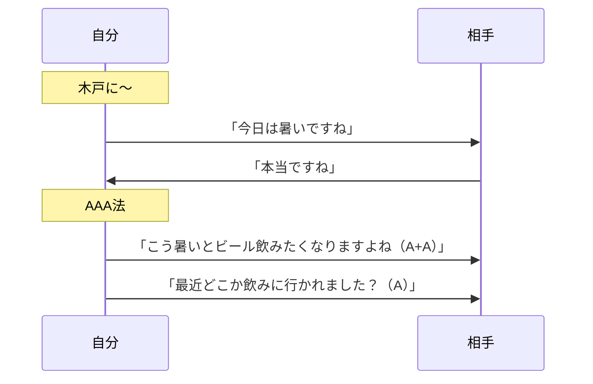
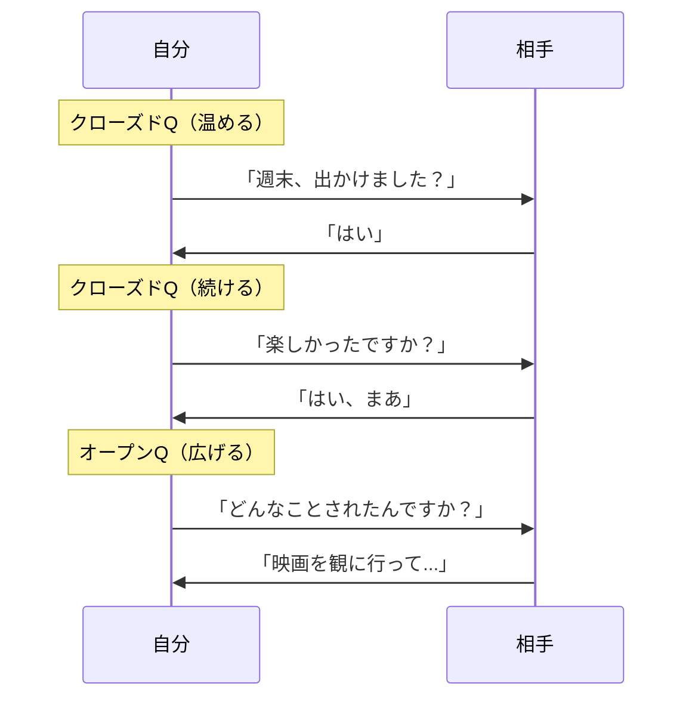
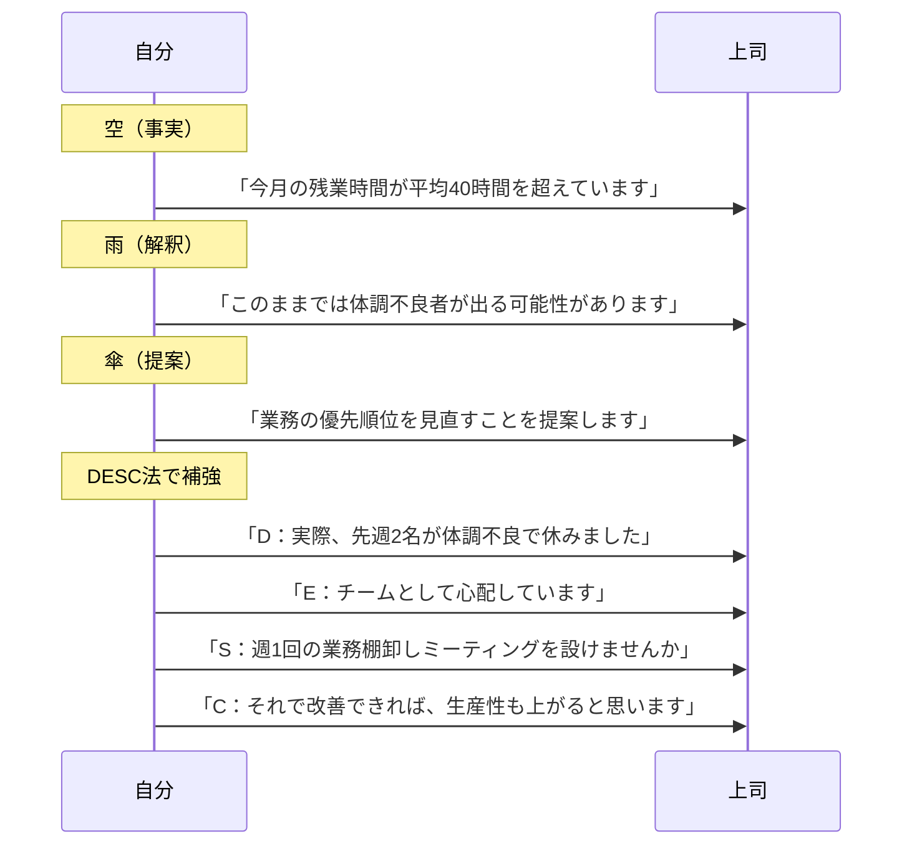
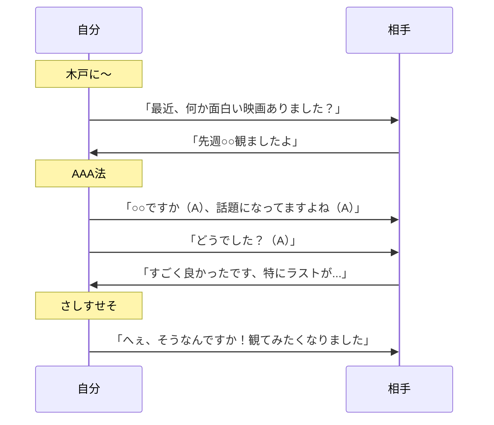
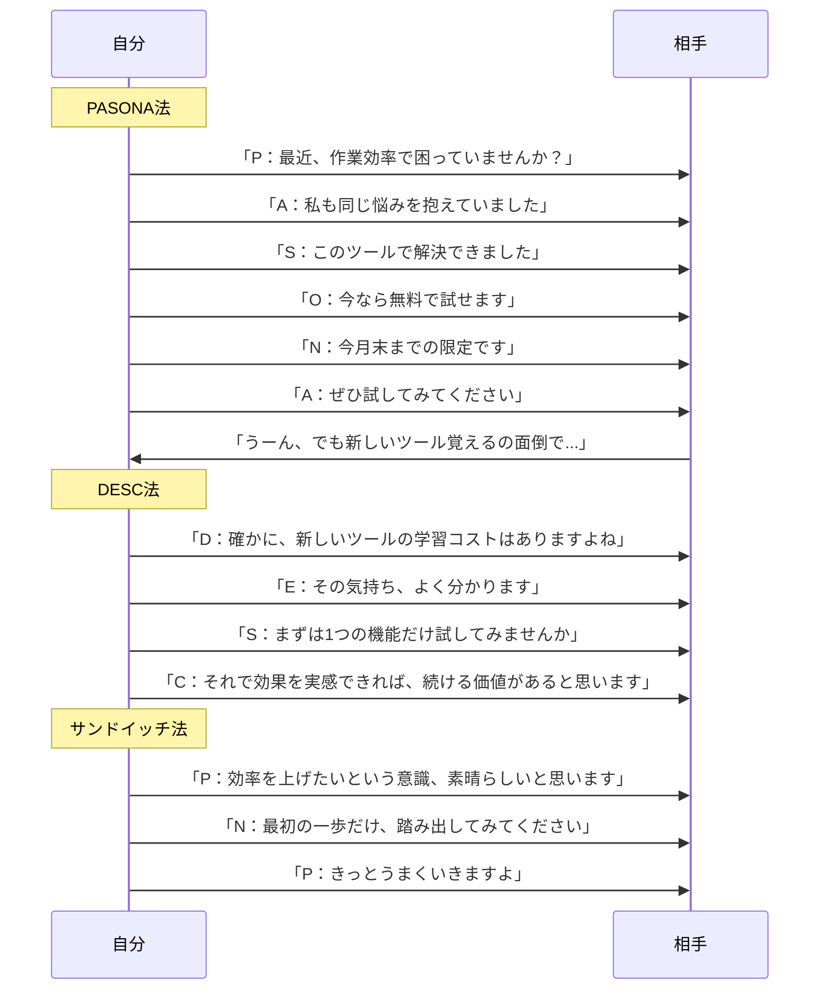
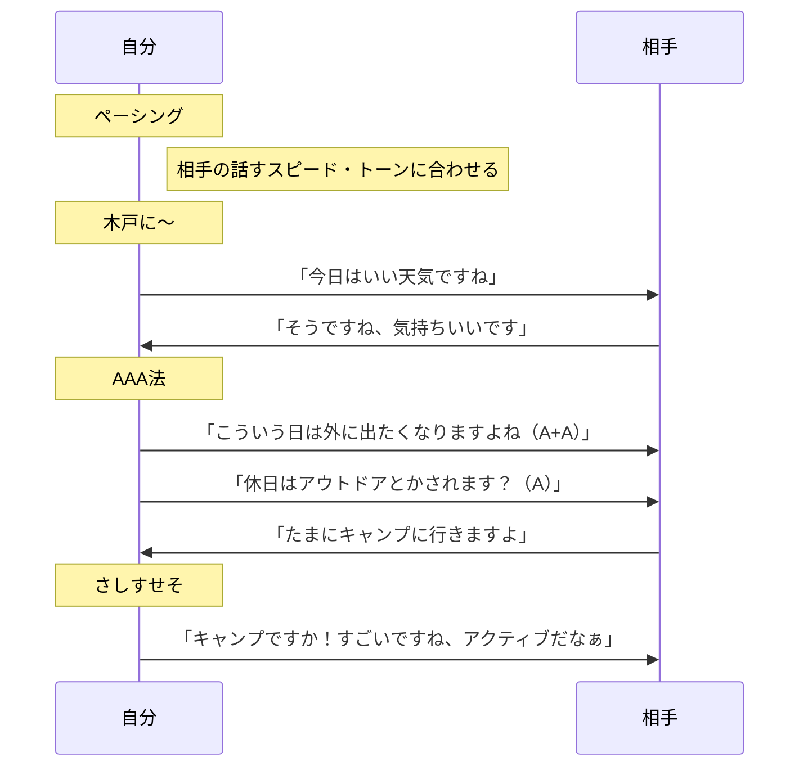
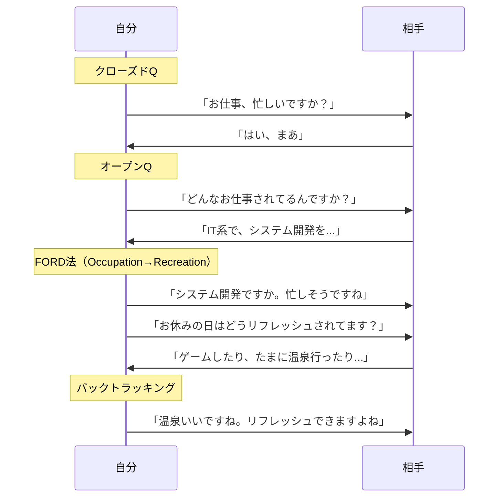
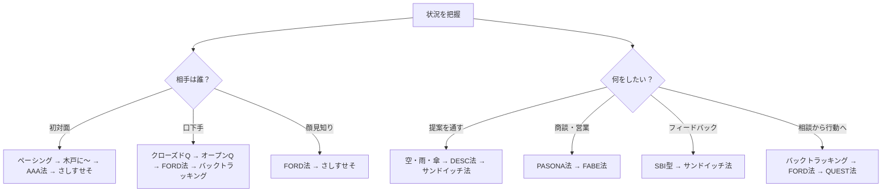

# 付録D：コンボ技集

> ここで紹介するのはあくまで一例です。状況や相手に応じて、自分なりの組み合わせを見つけてください。

## D-1. 概要

フレームワークは単体でも使えるが、組み合わせることで真価を発揮する。

この付録では、二連結から四連結までのコンボ技を紹介する。

## D-2. 二連結コンボ

| No. | 組み合わせ | 流れ | 効果 |
|:---:|:---|:---|:---|
| 1 | 木戸に〜 → AAA法 | 話題を振る → 答え+質問で返す | 会話のラリーが途切れない |
| 2 | FORD法 → さしすせそ | 相手を深掘り → 合間に褒め相槌 | 相手が気持ちよく喋り続ける |
| 3 | オープンQ → バックトラッキング | 広く聞く → オウム返しで受け止める | 聞き上手に見える |
| 4 | クローズドQ → オープンQ | Yes/Noで温める → 慣れたら広げる | 口下手な相手を乗せられる |
| 5 | さしすせそ → 連想ゲーム法 | 褒めて気分上げる → 話題を横に広げる | 会話が無限に続く |
| 6 | ペーシング → FORD法 | テンポ合わせる → 深い話に入る | 自然と親密になる |
| 7 | PREP法 → さしすせそ | 自分の話を端的に → 相手にパス | 話しすぎず好印象 |
| 8 | SDS法 → AAA法 | 要点まとめて話す → 相手に振る | 説明上手+会話上手 |
| 9 | PASONA法 → さしすせそ | 悩み共感→解決提示 → 褒めで締める | 信頼+好感度UP |
| 10 | QUEST法 → さしすせそ | 絞込→共感→教育→刺激 → 褒めで後押し | 自然に相手を動かせる |
| 11 | 空・雨・傘 → DESC法 | 事実→解釈→提案 → 角を立てず主張 | 提案が通りやすい |
| 12 | SBI型 → サンドイッチ法 | 具体的に褒める → 改善点も伝える | フィードバックが刺さる |
| 13 | AIDA法 → AAA法 | 興味引く→欲求刺激 → 質問で巻き込む | 誘いが成功しやすい |
| 14 | バックトラッキング → FORD法 | 受け止める → 深掘りする | 相談役ポジション獲得 |
| 15 | 連想ゲーム法 → PREP法 | 話題ジャンプ → 自分の話を端的に | 話題切れ防止+印象良い |

## D-3. 二連結コンボのシーケンス図

### コンボ1：木戸に〜 → AAA法

### コンボ4：クローズドQ → オープンQ

### コンボ11：空・雨・傘 → DESC法

## D-4. 三連結コンボ

| No. | 組み合わせ | 流れ | 効果 |
|:---:|:---|:---|:---|
| 1 | 木戸に〜 → AAA法 → さしすせそ | 話題振る → ラリー継続 → 褒めで気分UP | 初対面完封コンボ |
| 2 | ペーシング → FORD法 → バックトラッキング | テンポ合わせ → 深掘り → 受け止める | 信頼構築の黄金パターン |
| 3 | クローズドQ → オープンQ → 連想ゲーム法 | 温める → 広げる → 横に繋ぐ | 口下手な相手を乗せ切る |
| 4 | QUEST法 → さしすせそ → AIDA法 | 教育 → 褒める → 行動に誘う | 自然な誘導術 |
| 5 | PASONA法 → DESC法 → サンドイッチ法 | 共感→解決 → 主張 → 褒めで包む | 難しい提案を通す |
| 6 | SDS法 → AAA法 → 連想ゲーム法 | 要点話す → 振る → 話題拡張 | 説明→会話の自然な流れ |
| 7 | 空・雨・傘 → PREP法 → さしすせそ | 事実→提案 → 結論強調 → 褒めで締め | ビジネス雑談の必殺技 |
| 8 | バックトラッキング → FORD法 → QUEST法 | 受け止め → 深掘り → 誘導 | 相談から行動へ導く |

## D-5. 三連結コンボのシーケンス図

### コンボ1：木戸に〜 → AAA法 → さしすせそ

### コンボ5：PASONA法 → DESC法 → サンドイッチ法

## D-6. 四連結コンボ

| No. | 組み合わせ | 流れ | 効果 |
|:---:|:---|:---|:---|
| 1 | ペーシング → 木戸に〜 → AAA法 → さしすせそ | テンポ合わせ → 話題振る → ラリー継続 → 褒めで締め | 初対面マスターコンボ |
| 2 | クローズドQ → オープンQ → FORD法 → バックトラッキング | 温める → 広げる → 深掘り → 受け止める | 口下手な相手を完全攻略 |
| 3 | さしすせそ → QUEST法 → AIDA法 → AAA法 | 褒める → 教育 → 欲求刺激 → 質問で巻き込む | 自然誘導の最終形態 |
| 4 | PASONA法 → 空・雨・傘 → DESC法 → サンドイッチ法 | 共感 → 論理展開 → 主張 → 褒めで包む | 難交渉突破コンボ |
| 5 | ペーシング → バックトラッキング → FORD法 → PREP法 | 同調 → 受け止め → 深掘り → 自分も端的に話す | 信頼構築→対等な関係へ |
| 6 | 連想ゲーム法 → SDS法 → さしすせそ → AAA法 | 話題繋ぐ → 要点説明 → 褒める → 振り返す | 会話無限ループ |
| 7 | 木戸に〜 → FORD法 → QUEST法 → さしすせそ | 広く探る → 深掘り → 誘導 → 褒めで締める | 初対面から行動させる |
| 8 | バックトラッキング → ペーシング → PASONA法 → AIDA法 | 受け止め → 同調 → 共感解決 → 行動誘導 | 相談から成約まで一気通貫 |

## D-7. 四連結コンボのシーケンス図

### コンボ1：ペーシング → 木戸に〜 → AAA法 → さしすせそ

### コンボ2：クローズドQ → オープンQ → FORD法 → バックトラッキング

## D-8. コンボ選択フロー

## D-9. まとめ

コンボの基本は「流れを作る」こと。

- **二連結**：基本の組み合わせ。まずはここから
- **三連結**：状況に応じた応用。使い分けができると強い
- **四連結**：マスタークラス。自然に繋げられれば達人

コンボは暗記するものではない。状況に応じて、自分で組み立てられるようになることが目標だ。

---
