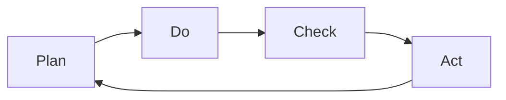
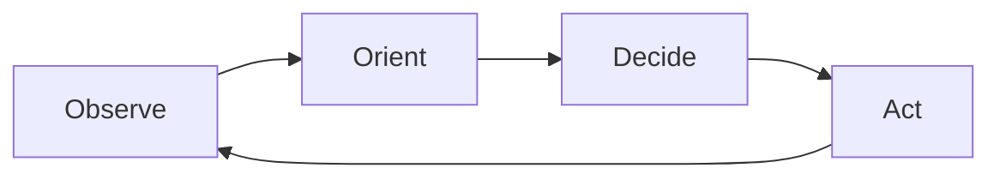
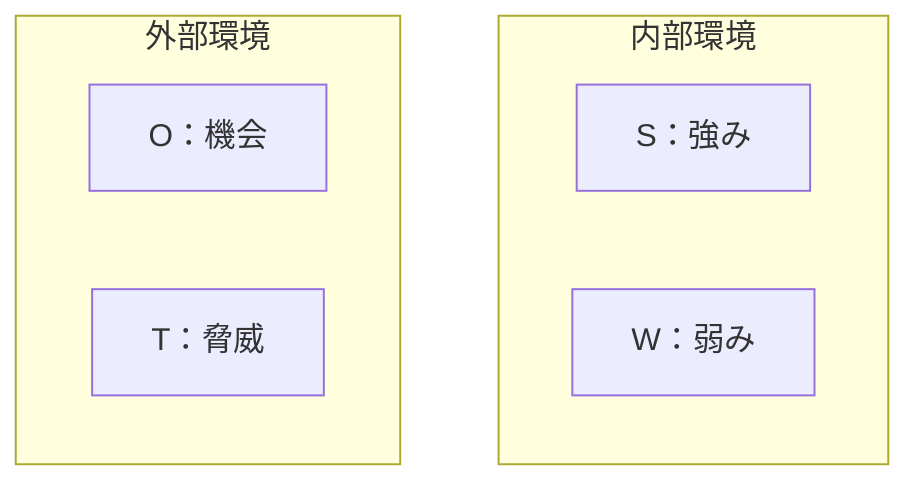
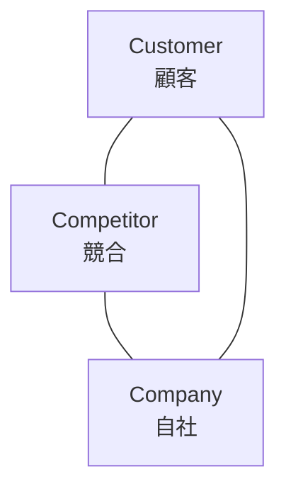
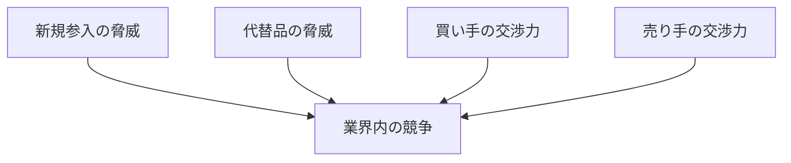
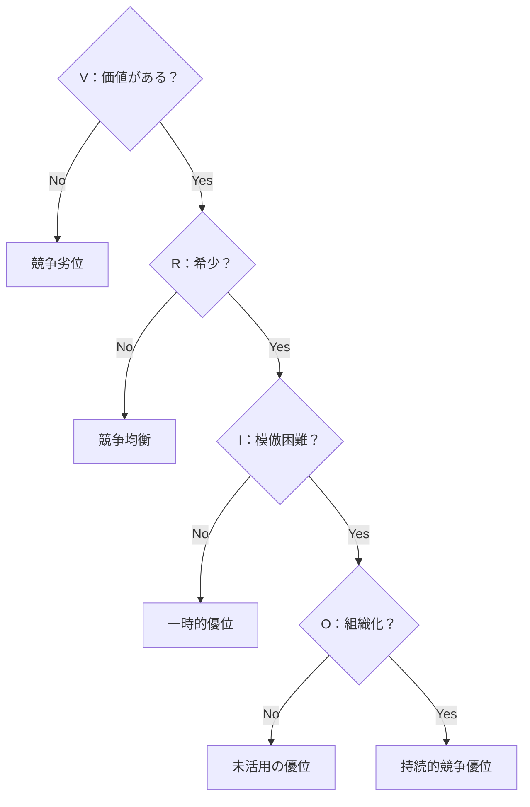

# 第10章：フレームワーク一覧：ビジネス分析・戦略系

## 10-1. 概要

現状を正しく把握し、戦略を立てる。それがビジネス分析である。

感覚で動くと失敗する。フレームワークで構造的に分析することで、見落としを防ぎ、的確な判断ができるようになる。

この章では、現状分析と戦略立案のためのフレームワークを扱う。

## 10-2. フレームワーク一覧

| 名前 | 構造・要素 | 用途 |
|:---|:---|:---|
| PDCA（ピーディーシーエー） | Plan → Do → Check → Act | 業務改善サイクル |
| OODA（ウーダ） | Observe → Orient → Decide → Act | 迅速な意思決定 |
| SWOT（スウォット） | Strengths, Weaknesses, Opportunities, Threats | 現状分析 |
| 3C（スリーシー） | Customer, Competitor, Company | 市場環境分析 |
| 4P（フォーピー） | Product, Price, Place, Promotion | マーケティング戦略 |
| 4C（フォーシー） | Customer, Cost, Convenience, Communication | 顧客視点マーケティング |
| 5F（ファイブフォース） | 競合, 新規参入, 代替品, 買い手, 売り手 | 業界構造分析 |
| STP（エスティーピー） | Segmentation, Targeting, Positioning | マーケティング戦略 |
| PEST（ペスト） | Politics, Economy, Society, Technology | マクロ環境分析 |
| VRIO（ブリオ） | Value, Rarity, Imitability, Organization | 経営資源分析 |

## 10-3. 改善サイクル系

### PDCA

W.エドワーズ・デミングが提唱した、業務改善の基本サイクル。

| 要素 | 英語 | やること | 例 |
|:---:|:---|:---|:---|
| P | Plan | 計画を立てる | 「月間売上10%増を目指す」 |
| D | Do | 実行する | 「新規営業を週5件行う」 |
| C | Check | 結果を確認する | 「実際は8%増だった」 |
| A | Act | 改善して次に活かす | 「アプローチ方法を見直す」 |

### OODA

ジョン・ボイドが提唱した、迅速な意思決定のためのループ。変化の激しい状況向け。

| 要素 | 英語 | やること | 例 |
|:---:|:---|:---|:---|
| O | Observe | 観察する | 「競合が新製品を発表した」 |
| O | Orient | 状況を判断する | 「このままでは顧客を奪われる」 |
| D | Decide | 決断する | 「価格を下げて対抗する」 |
| A | Act | 行動する | 「来週からキャンペーン開始」 |

### PDCAとOODAの違い

| 項目 | PDCA | OODA |
|:---|:---|:---|
| 速度 | じっくり | 素早く |
| 適した状況 | 安定した環境 | 変化の激しい環境 |
| 重視するもの | 計画の精度 | 判断の速さ |

## 10-4. 環境分析系

### SWOT

アルバート・ハンフリーが提唱した、内部環境と外部環境を整理するフレームワーク。

| 要素 | 英語 | 分類 | 内容 |
|:---:|:---|:---|:---|
| S | Strengths | 内部・プラス | 自社の強み |
| W | Weaknesses | 内部・マイナス | 自社の弱み |
| O | Opportunities | 外部・プラス | 外部の機会 |
| T | Threats | 外部・マイナス | 外部の脅威 |

### 3C

大前研一が提唱した、市場環境を3つの視点で分析するフレームワーク。

| 要素 | 英語 | 分析内容 |
|:---:|:---|:---|
| C | Customer | 顧客は誰か、何を求めているか |
| C | Competitor | 競合は誰か、何が強みか |
| C | Company | 自社は何ができるか、強みは何か |

### PEST

フランシス・アギラーが提唱した、マクロ環境を分析するフレームワーク。

| 要素 | 英語 | 分析内容 | 例 |
|:---:|:---|:---|:---|
| P | Politics | 政治的要因 | 法規制、税制変更 |
| E | Economy | 経済的要因 | 景気、為替、金利 |
| S | Society | 社会的要因 | 人口動態、価値観変化 |
| T | Technology | 技術的要因 | 新技術、特許 |

### 5F（ファイブフォース）

マイケル・ポーターが提唱した、業界の競争構造を分析するフレームワーク。

| 要素 | 分析内容 |
|:---|:---|
| 既存競合 | 現在の競合他社との競争の激しさ |
| 新規参入 | 新規参入者の脅威 |
| 代替品 | 代替製品・サービスの脅威 |
| 買い手 | 顧客の交渉力 |
| 売り手 | 供給者の交渉力 |

## 10-5. マーケティング戦略系

### 4P

E.J.マッカーシーが提唱した、マーケティングミックスの基本。

| 要素 | 英語 | 内容 |
|:---:|:---|:---|
| P | Product | 何を売るか |
| P | Price | いくらで売るか |
| P | Place | どこで売るか |
| P | Promotion | どう知らせるか |

### 4C

ロバート・ラウターボーンが提唱した、4Pを顧客視点に置き換えたもの。

| 4P | 4C | 視点の転換 |
|:---|:---|:---|
| Product | Customer Value | 製品 → 顧客価値 |
| Price | Cost | 価格 → 顧客コスト |
| Place | Convenience | 流通 → 利便性 |
| Promotion | Communication | 宣伝 → 対話 |

### STP

フィリップ・コトラーが体系化した、ターゲティングの基本プロセス。

| 要素 | 英語 | やること |
|:---:|:---|:---|
| S | Segmentation | 市場を細分化する |
| T | Targeting | ターゲットを選定する |
| P | Positioning | 自社の立ち位置を決める |

## 10-6. 経営資源分析系

### VRIO

ジェイ・バーニーが提唱した、経営資源の競争優位性を分析するフレームワーク。

| 要素 | 英語 | 問い |
|:---:|:---|:---|
| V | Value | その資源は価値があるか？ |
| R | Rarity | その資源は希少か？ |
| I | Imitability | その資源は模倣困難か？ |
| O | Organization | その資源を活用する組織があるか？ |

## 10-7. 使い分けの基準

| 状況 | 推奨フレームワーク | 理由 |
|:---|:---|:---|
| 業務改善を回したい | PDCA | 基本の改善サイクル |
| 素早く判断したい | OODA | 変化への即応 |
| 自社の現状を把握したい | SWOT | 内部・外部を網羅 |
| 市場を理解したい | 3C | 顧客・競合・自社の関係 |
| マクロ環境を見たい | PEST | 政治・経済・社会・技術 |
| 業界構造を知りたい | 5F | 競争要因の分析 |
| マーケティング戦略を立てたい | 4P / 4C / STP | 戦略の基本要素 |
| 自社の強みを評価したい | VRIO | 競争優位の源泉 |

## 10-8. まとめ

ビジネス分析の基本は「構造的に見る」こと。

- **改善を回す** → PDCA / OODA
- **現状を把握する** → SWOT / 3C / PEST / 5F
- **戦略を立てる** → 4P / 4C / STP
- **資源を評価する** → VRIO

感覚ではなく、フレームワークで考える。それが的確な判断を生む。

---
