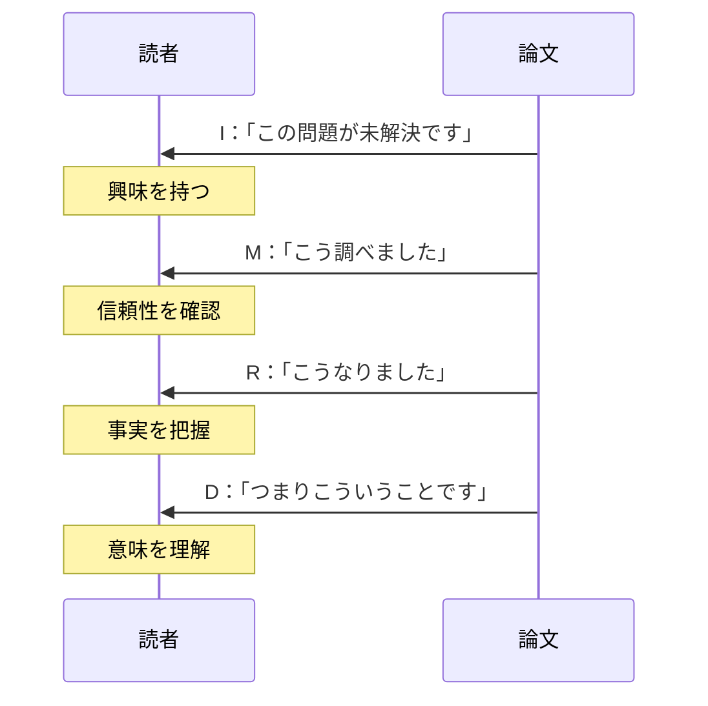
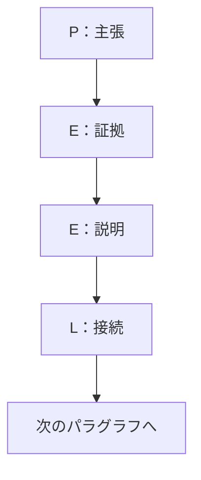
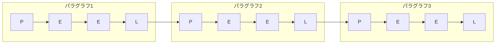
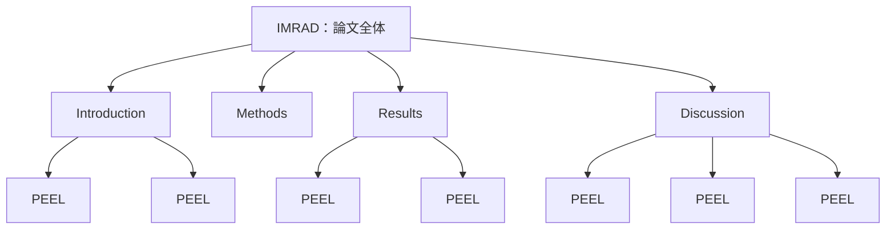
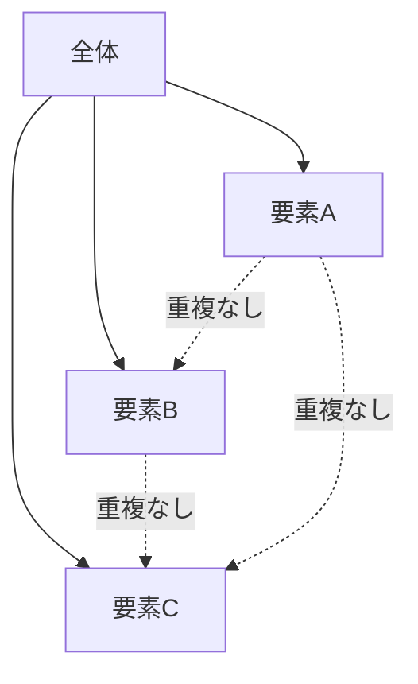
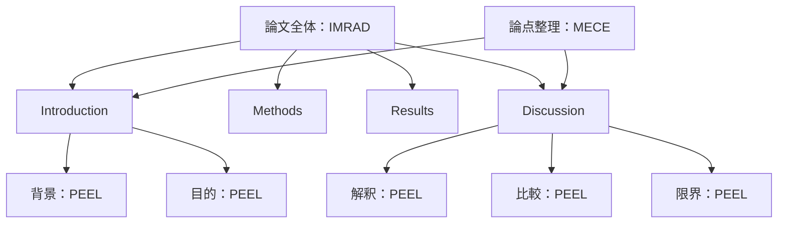

## 第11章：フレームワーク一覧：論文・学術系

### 11-1. 概要

論理を証明する技術。それが学術的な文章である。

「なんとなくそう思う」では通用しない。主張には根拠が必要であり、根拠には構造が必要である。

この章では、論文や学術的な文章を書くためのフレームワークを扱う。

---

### 11-2. フレームワーク一覧

| 名前           | 構造・要素                                             | 用途            |
| :----------- | :------------------------------------------------ | :------------ |
| IMRAD（イムラッド） | Introduction → Methods → Results → And Discussion | 科学論文、調査報告書    |
| PEEL法（ピールほう） | Point → Evidence → Explain → Link                 | 学術的論述、パラグラフ構成 |

---

### 11-3. 各フレームワークの詳細

#### IMRAD

科学論文の国際標準構造。研究の流れをそのまま文章化する。

| 要素  | 英語             | やること | 内容                |
| :-: | :------------- | :--- | :---------------- |
|  I  | Introduction   | 序論   | 研究の背景・目的・問いを述べる   |
|  M  | Methods        | 方法   | どのように調査・実験したかを述べる |
|  R  | Results        | 結果   | 何が分かったかを述べる       |
| A＆D | And Discussion | 考察   | 結果の意味・解釈・限界を議論する  |

##### 各セクションの詳細

| セクション | 含める内容 | 注意点 |
|:---|:---|:---|
| Introduction | 背景、先行研究、研究の目的、仮説 | 広い話題から狭い焦点へ絞る |
| Methods | 対象、手順、分析方法、倫理的配慮 | 再現可能なレベルで詳細に |
| Results | データ、統計結果、図表 | 解釈を入れず事実のみ |
| Discussion | 結果の解釈、先行研究との比較、限界、今後の課題 | 結果を超えた主張をしない |

#### PEEL法

パラグラフ（段落）単位の論述構造。学術的な文章の基本単位。

| 要素 | 英語 | やること | 例 |
|:---:|:---|:---|:---|
| P | Point | 主張を述べる | 「睡眠不足は学業成績に悪影響を与える」 |
| E | Evidence | 証拠を示す | 「Smith(2020)の研究では、6時間未満の睡眠で成績が15%低下した」 |
| E | Explain | 証拠の意味を説明する | 「これは記憶の定着に必要なレム睡眠が不足するためと考えられる」 |
| L | Link | 次に繋げる | 「この知見は、学校の始業時間の議論にも示唆を与える」 |

##### PEEL法の連鎖

論文は複数のPEELパラグラフが連鎖して構成される。

---

### 11-4. IMRADとPEELの関係

IMRADは論文全体の構造、PEELは各セクション内のパラグラフ構造。

---

### 11-5. 補助フレームワーク

論文執筆を支援するその他のフレームワーク。

| 名前         | 用途   | 内容             |
| :--------- | :--- | :------------- |
| MECE（ミーシー） | 論理整理 | 漏れなく、ダブりなく分類する |
| ロジックツリー    | 問題分析 | 階層的に分解して構造化する  |
| イシューツリー    | 課題特定 | 解くべき問いを構造化する   |

#### MECE

Mutually Exclusive, Collectively Exhaustive（相互に排他的、全体として網羅的）。

| 要素 | 英語 | 意味 |
|:---|:---|:---|
| ME | Mutually Exclusive | 各要素が重複していない |
| CE | Collectively Exhaustive | 全体として漏れがない |

**悪い例**：「男性・女性・大人」→ 重複がある（大人の男性はどこ？）

**良い例**：「男性・女性」または「子供・大人」→ MECEになっている

---

### 11-6. 使い分けの基準

| 状況      | 推奨フレームワーク  | 理由          |
| :------ | :--------- | :---------- |
| 科学論文を書く | IMRAD      | 国際標準の構造     |
| レポートを書く | IMRAD（簡易版） | 論理的な流れが作れる  |
| 段落を構成する | PEEL法      | 主張と根拠が明確になる |
| 論点を整理する | MECE       | 漏れとダブりを防げる  |
| 問題を分析する | ロジックツリー    | 構造的に分解できる   |

---

### 11-7. 学術的文章の基本コンボ

**IMRAD + PEEL + MECE**：論文の完全構成

---

### 11-8. まとめ

学術的文章の基本は「主張と根拠の対応」である。

- **論文全体の構造** → IMRAD
- **段落の構造** → PEEL法
- **論理の整理** → MECE

「なぜそう言えるのか」を常に問い、証拠で答える。それが学術的な文章である。

---
