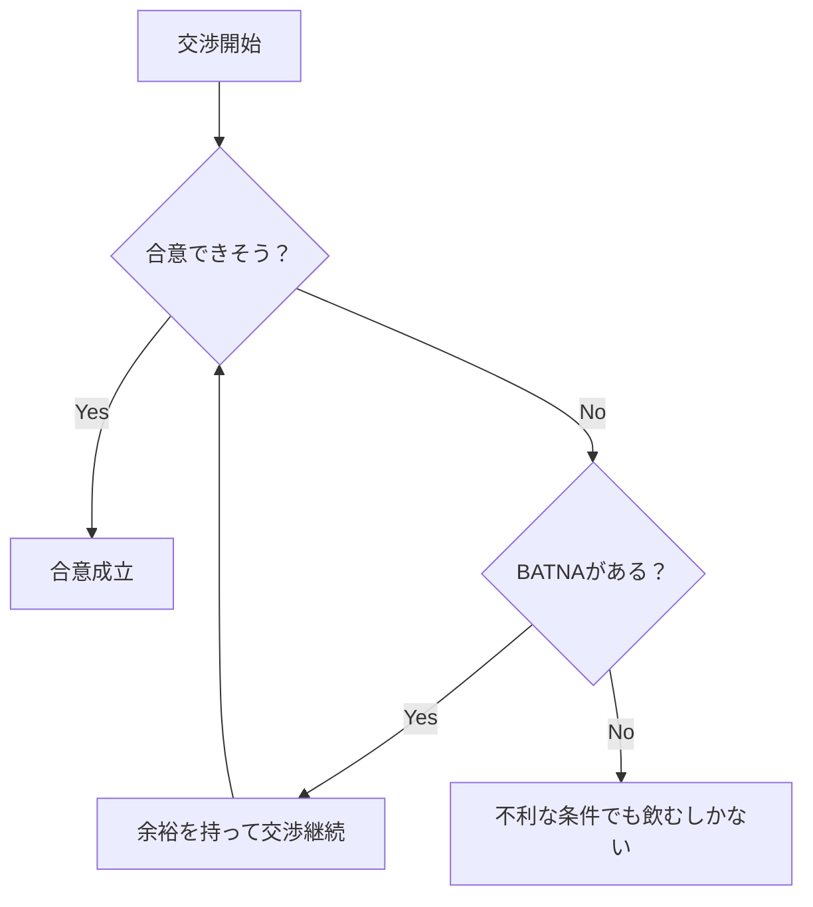
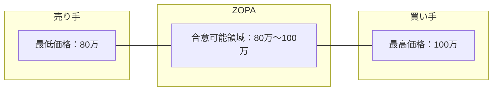
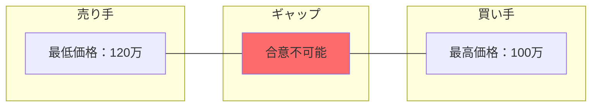
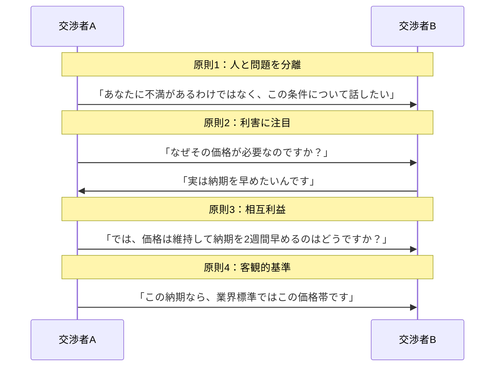
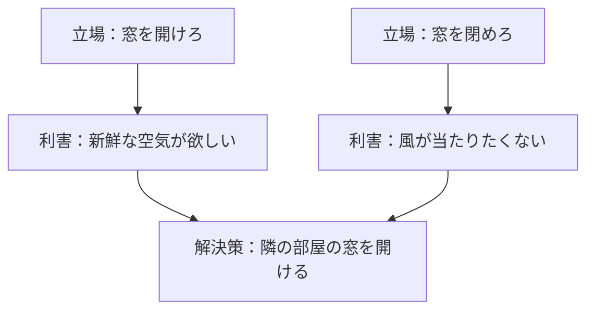
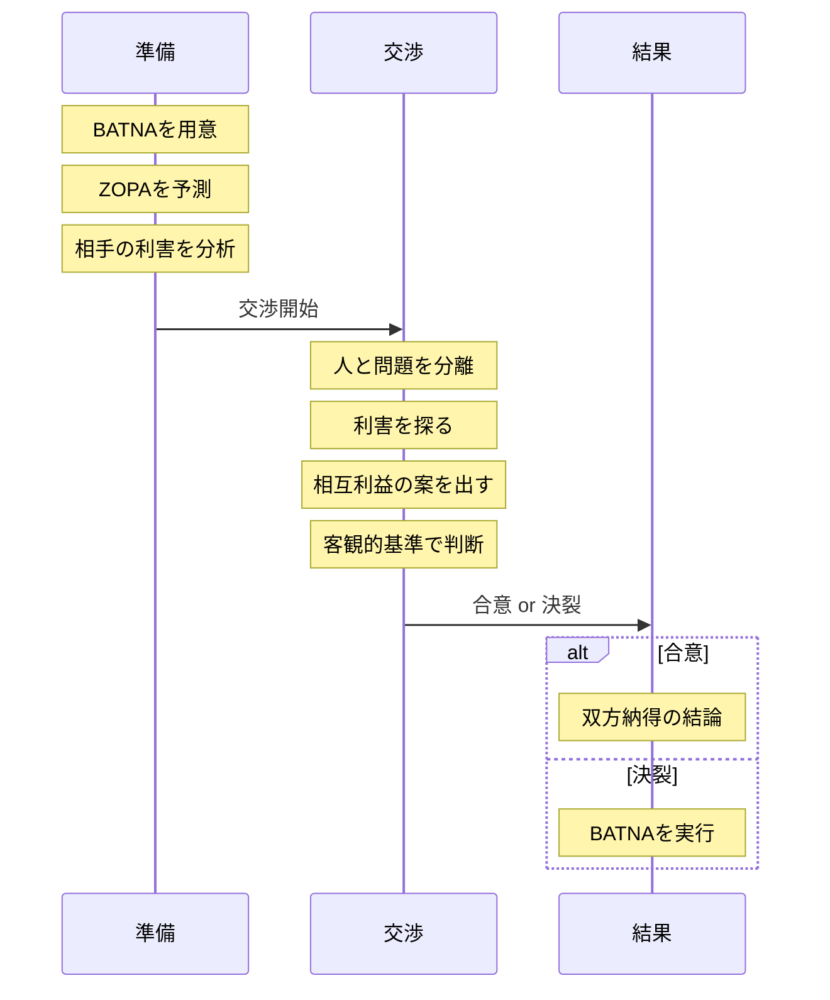

# 第12章：フレームワーク一覧：交渉・対立解消系

## 12-1. 概要

負けないための戦術。それが交渉である。

相手と利害が対立した時、感情論になれば泥沼化する。冷静に「落とし所」を見つけ、双方が納得できる結論に導く技術が必要だ。

この章では、交渉を有利に進め、対立を解消するためのフレームワークを扱う。

## 12-2. フレームワーク一覧

| 名前 | 構造・要素 | 用途 |
|:---|:---|:---|
| BATNA（バトナ） | Best Alternative To a Negotiated Agreement | 契約交渉、賃上げ交渉 |
| ZOPA（ゾーパ） | Zone Of Possible Agreement | 価格交渉、条件闘争 |
| ハーバード流交渉術 | 4原則：人と問題の分離、利害への注目、相互利益、客観的基準 | 揉め事の解決、和平交渉 |

## 12-3. 各フレームワークの詳細

### BATNA

交渉が決裂した時の「最良の代替案」。これを持っているかどうかで、交渉力が決まる。

| 項目 | 内容 |
|:---|:---|
| 正式名称 | Best Alternative To a Negotiated Agreement |
| 日本語 | 交渉決裂時の最良代替案 |
| 核心 | 「決裂してもいい」という余裕を持つこと |

#### BATNAの作り方

| ステップ | やること | 例（転職交渉） |
|:---:|:---|:---|
| 1 | 交渉が決裂した場合の選択肢を全て書き出す | 現職に残る、他社に応募、フリーランス |
| 2 | 各選択肢を評価する | 現職：安定だが成長なし、他社：条件次第 |
| 3 | 最も良い選択肢を特定する | 他社B社のオファー |
| 4 | その選択肢を強化する | B社と条件を詰めておく |

**ポイント**：BATNAが強いほど、交渉で強気に出られる。交渉前の準備が勝敗を決める。

### ZOPA

合意可能領域。自分と相手の条件が重なる範囲のこと。

| 項目 | 内容 |
|:---|:---|
| 正式名称 | Zone Of Possible Agreement |
| 日本語 | 合意可能領域 |
| 核心 | 双方の「これ以上は無理」のラインを見極める |

#### ZOPAが存在しない場合

**ポイント**：ZOPAがなければ、どれだけ交渉しても合意できない。早めに見極めて、撤退するか条件を変えるか判断する。

### ハーバード流交渉術

ハーバード大学の交渉学プロジェクトが開発した、原則立脚型交渉術。

| 原則 | 内容 | やること |
|:---:|:---|:---|
| 1 | 人と問題を切り離す | 「あいつが嫌い」と「この条件は受け入れられない」を分ける |
| 2 | 立場ではなく利害に注目する | 「値下げしろ」ではなく「なぜ安くしたいのか」を探る |
| 3 | 相互利益の案を出す | どちらも得する選択肢を創造する |
| 4 | 客観的基準を用いる | 市場価格、判例、専門家の意見など |

#### 立場と利害の違い

| 項目 | 立場（Position） | 利害（Interest） |
|:---|:---|:---|
| 定義 | 表面的な要求 | 本当に求めているもの |
| 例 | 「窓を開けろ」 | 「新鮮な空気が欲しい」 |
| 解決策 | 対立しやすい | 複数の解決策がありうる |

## 12-4. 交渉の準備チェックリスト

| 項目 | 確認内容 |
|:---|:---|
| 自分のBATNA | 決裂したら何をするか明確か？ |
| 相手のBATNA | 相手が決裂したら何をするか予測できるか？ |
| 自分の留保価格 | これ以下なら決裂、というラインは？ |
| 相手の留保価格 | 相手のラインを予測できるか？ |
| ZOPA | 合意可能領域は存在するか？ |
| 相手の利害 | 相手が本当に求めているものは何か？ |
| 客観的基準 | 根拠となるデータや事例はあるか？ |

## 12-5. 交渉の流れ

## 12-6. 使い分けの基準

| 状況 | 推奨フレームワーク | 理由 |
|:---|:---|:---|
| 交渉前の準備 | BATNA | 余裕を持つための保険 |
| 条件の見極め | ZOPA | 合意可能かどうかの判断 |
| 交渉中の進め方 | ハーバード流 | 感情的にならず利害で解決 |
| 全ての交渉 | 3つ全て併用 | 準備→見極め→実行の流れ |

## 12-7. まとめ

交渉の基本は「準備」と「利害への注目」である。

- **決裂しても困らない準備** → BATNA
- **合意可能かの見極め** → ZOPA
- **感情を排した交渉術** → ハーバード流

「俺にはBATNAがある」──これだけで、メンタルの防御力は10倍になる。

---
