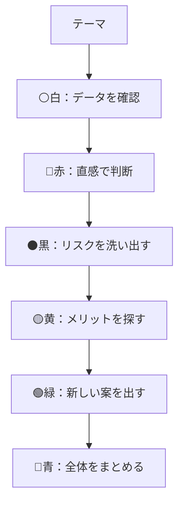
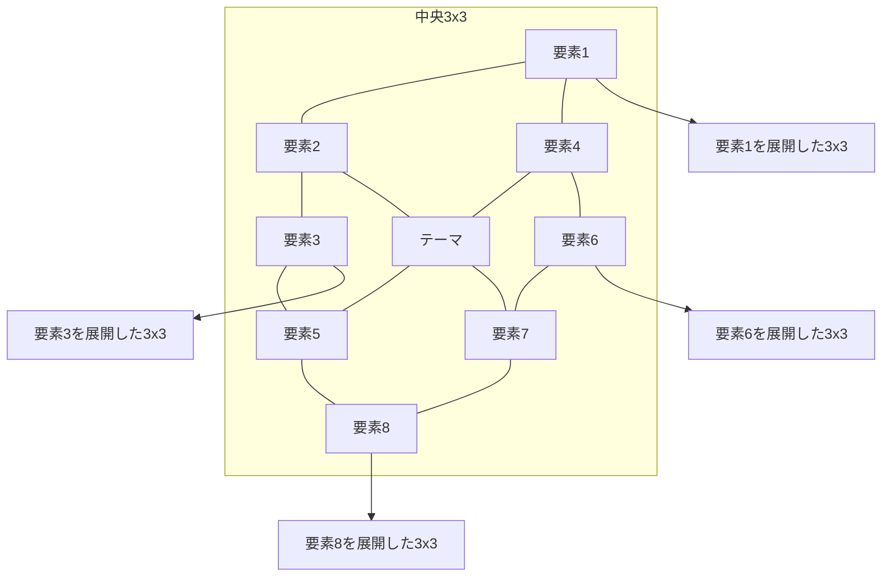
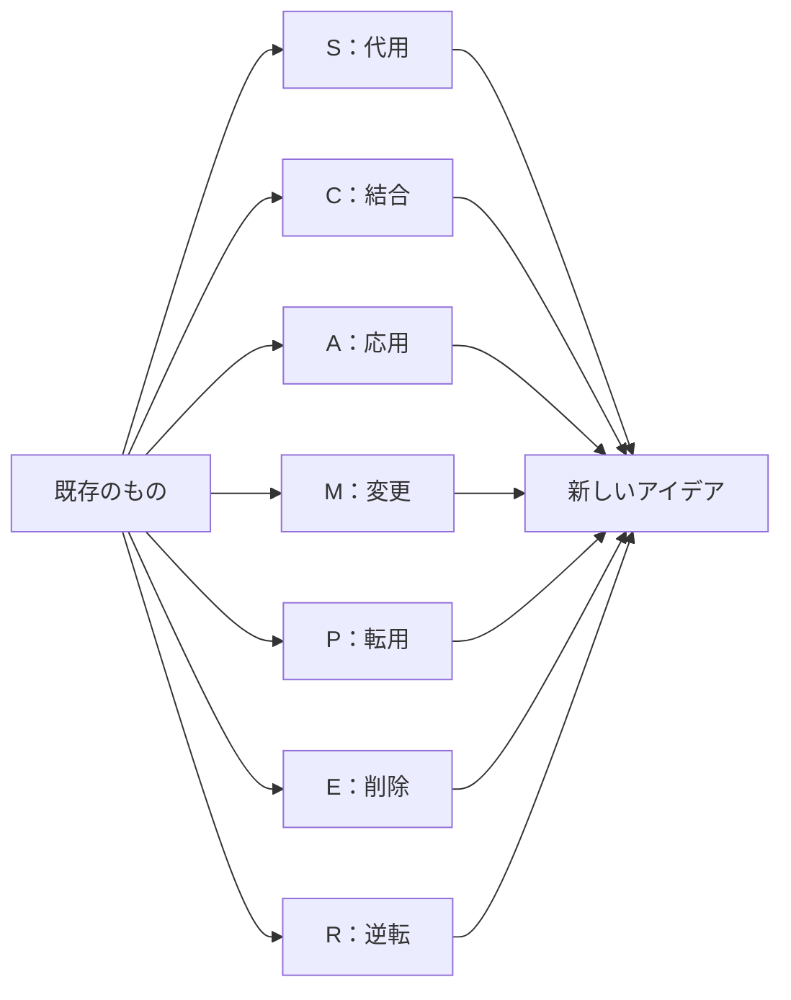
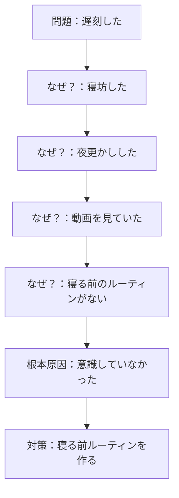
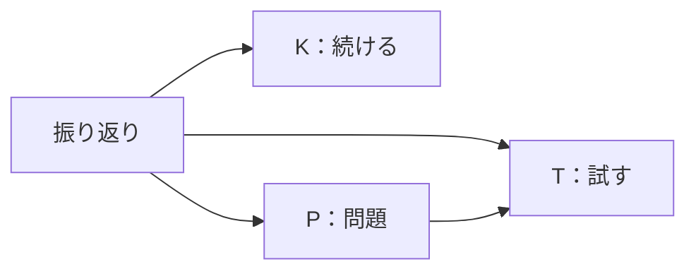
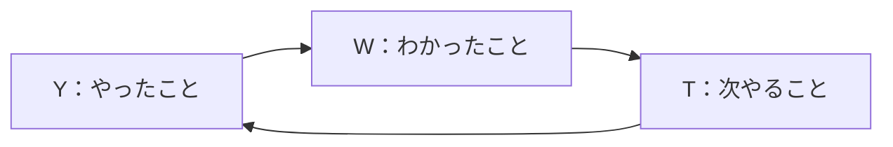
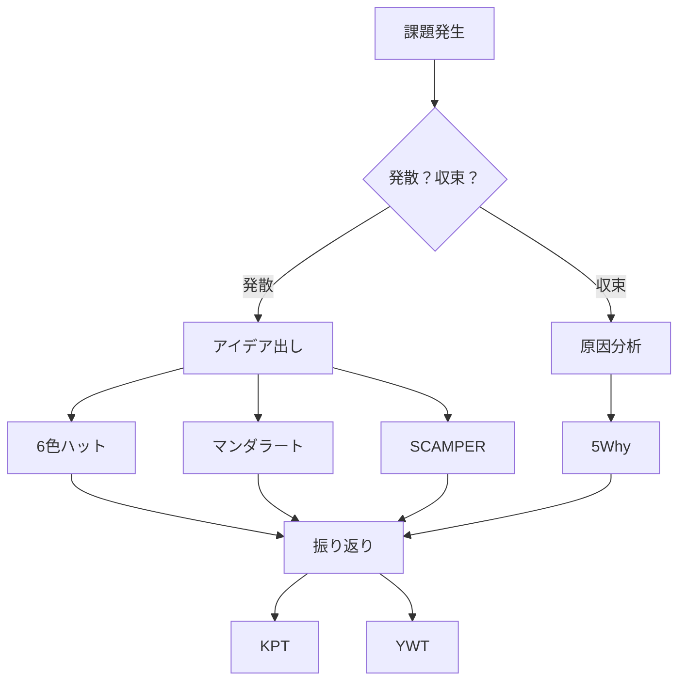

## 第13章：フレームワーク一覧：思考・アイデア出し系

### 13-1. 概要

脳内会議を開く技術。それが思考・アイデア出しである。

一人で考えて煮詰まった時、同じ視点でグルグル回っていても答えは出ない。強制的に「視点」を切り替え、思考を拡散させる技術が必要だ。

この章では、アイデアを生み出し、思考を整理するためのフレームワークを扱う。

---

### 13-2. フレームワーク一覧

| 名前                | 構造・要素                | 用途          |
| :---------------- | :------------------- | :---------- |
| 6色ハット思考法（シックスハット） | 白・赤・黒・黄・緑・青の6つの視点    | ブレスト、一人会議   |
| マンダラート            | 3×3のマス目、中央にテーマ       | アイデア発散、目標設定 |
| SCAMPER（スキャンパー）   | 7つの発想切り口             | アイデア発想、改善   |
| 5Why（ファイブホワイ）     | なぜを5回繰り返す            | 根本原因分析      |
| KPT（ケプト）          | Keep, Problem, Try   | 振り返り        |
| YWT（ワイダブリューティー）   | やったこと, わかったこと, 次やること | 振り返り（日本発）   |

---

### 13-3. 各フレームワークの詳細

#### 6色ハット思考法

エドワード・デ・ボーノが提唱した、6つの視点を強制的に切り替える技法。

| 色 | 視点 | 問い | やること |
|:---:|:---|:---|:---|
| ⚪ 白 | 客観・データ | 事実は何か？ | 数字やデータだけを見る |
| 🔴 赤 | 直感・感情 | どう感じるか？ | 論理を無視して感情で判断する |
| ⚫ 黒 | 批判・リスク | 何が問題か？ | 徹底的にダメ出しする |
| 🟡 黄 | 肯定・利益 | 何が良いか？ | 徹底的に良い点を探す |
| 🟢 緑 | 創造・新案 | 他にないか？ | 新しいアイデアを出す |
| 🔵 青 | 管理・俯瞰 | 全体はどうか？ | プロセス全体を管理する |

**使い方のコツ**：今は「黒い帽子」だから徹底的にダメ出しする、次は「黄色」だから褒める、と明確に切り替える。混ぜない。

#### マンダラート

3×3のマス目を使って、思考を放射状に広げる技法。大谷翔平選手が目標設定に使っていたことで有名。

| 構造 | 内容 |
|:---|:---|
| 中央 | テーマ・目標を書く |
| 周囲8マス | 関連するキーワード・要素を書く |
| 展開 | 各キーワードを中央にした新しい3×3を作る |

##### マンダラートの例（目標：コミュ力向上）

| 雑談力 | 傾聴力 | 質問力 |
|:---:|:---:|:---:|
| 表情 | **コミュ力向上** | 声のトーン |
| 語彙力 | 論理力 | 共感力 |

#### SCAMPER

ボブ・エバールが体系化した、7つの発想切り口。既存のものを変形させてアイデアを出す。

| 文字 | 英語 | 日本語 | 問い |
|:---:|:---|:---|:---|
| S | Substitute | 代用 | 他のもので代用できないか？ |
| C | Combine | 結合 | 何かと組み合わせられないか？ |
| A | Adapt | 応用 | 他の用途に使えないか？ |
| M | Modify | 変更 | 形・色・大きさを変えられないか？ |
| P | Put to other uses | 転用 | 別の使い方はないか？ |
| E | Eliminate | 削除 | 何かを削れないか？ |
| R | Reverse | 逆転 | 逆にしたらどうなるか？ |

##### SCAMPERの例（テーマ：傘）

| 切り口 | アイデア |
|:---|:---|
| Substitute | 布→透明ビニール（周りが見える傘） |
| Combine | 傘＋ライト（夜道で光る傘） |
| Adapt | 日傘の技術を雨傘に（UVカット雨傘） |
| Modify | 巨大化（2人用傘） |
| Put to other uses | 杖としても使える傘 |
| Eliminate | 骨を減らす（軽量傘） |
| Reverse | 逆さに開く（車内で濡れない傘） |

#### 5Why

トヨタ生産方式で有名な、根本原因を探る技法。

| 回数 | 問い | 例 |
|:---:|:---|:---|
| 1回目 | なぜ？ | 「なぜ遅刻した？」→「寝坊した」 |
| 2回目 | なぜ？ | 「なぜ寝坊した？」→「夜更かしした」 |
| 3回目 | なぜ？ | 「なぜ夜更かしした？」→「動画を見ていた」 |
| 4回目 | なぜ？ | 「なぜ動画を見ていた？」→「寝る前のルーティンがない」 |
| 5回目 | なぜ？ | 「なぜルーティンがない？」→「意識していなかった」 |

#### KPT

アジャイル開発由来の振り返りフレームワーク。

| 要素 | 英語 | 問い |
|:---:|:---|:---|
| K | Keep | 続けるべきことは何か？ |
| P | Problem | 問題点は何か？ |
| T | Try | 次に試すことは何か？ |

#### YWT

日本能率協会が開発した、日本発の振り返りフレームワーク。

| 要素  | 日本語    | 問い       |
| :-: | :----- | :------- |
|  Y  | やったこと  | 何をやったか？  |
|  W  | わかったこと | 何がわかったか？ |
|  T  | 次やること  | 次は何をするか？ |

#### KPTとYWTの違い

| 項目      | KPT      | YWT       |
| :------ | :------- | :-------- |
| 起点      | 良い点と問題点  | 事実（やったこと） |
| 向いている場面 | チームの振り返り | 個人の振り返り   |
| 特徴      | 問題解決志向   | 学習志向      |

---

### 13-4. 使い分けの基準

| 状況 | 推奨フレームワーク | 理由 |
|:---|:---|:---|
| 視点を切り替えたい | 6色ハット思考法 | 強制的に視点が変わる |
| アイデアを広げたい | マンダラート | 放射状に発散できる |
| 既存のものを改善したい | SCAMPER | 7つの切り口で変形できる |
| 根本原因を探りたい | 5Why | 本質に辿り着ける |
| チームで振り返りたい | KPT | 問題と改善が明確になる |
| 個人で振り返りたい | YWT | 学びを次に活かせる |

---

### 13-5. 思考の流れ

---

### 13-6. まとめ

思考・アイデア出しの基本は「視点を強制的に切り替える」こと。

- **視点を変えたい** → 6色ハット思考法
- **アイデアを広げたい** → マンダラート
- **既存を改善したい** → SCAMPER
- **根本原因を探りたい** → 5Why
- **振り返りたい** → KPT / YWT

同じ視点でグルグル回っても答えは出ない。強制的に切り替えろ。

---
