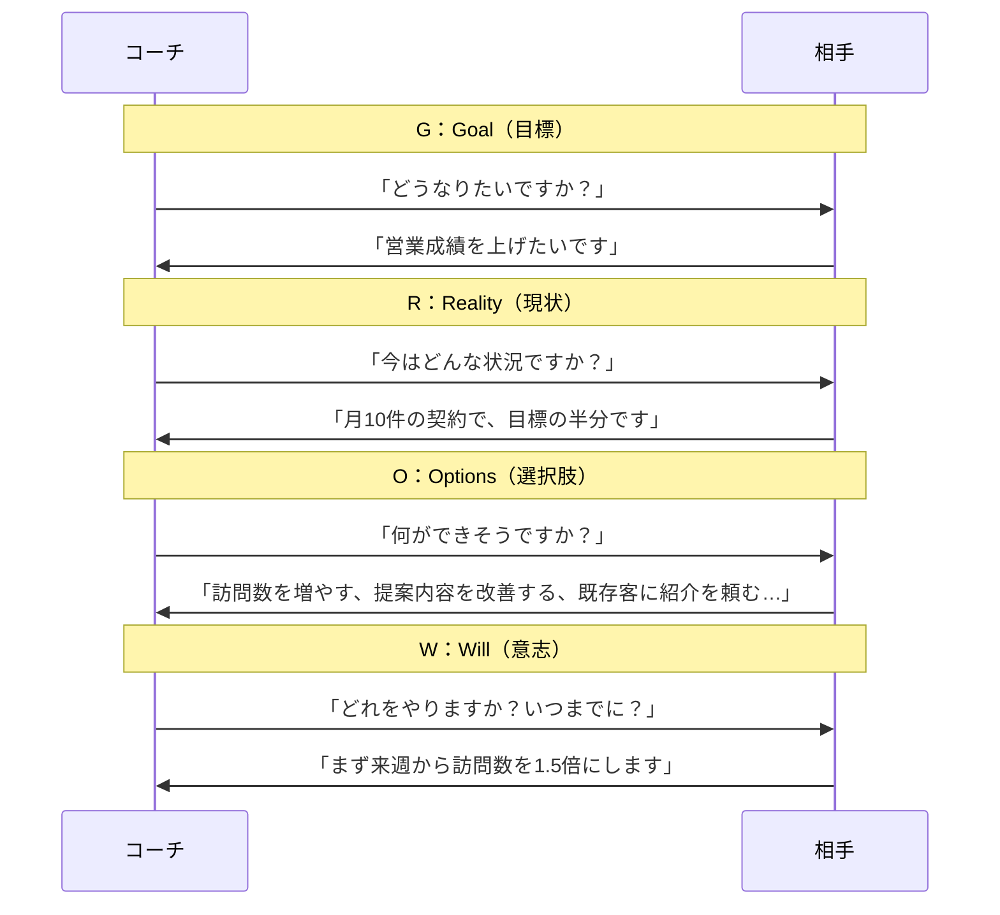
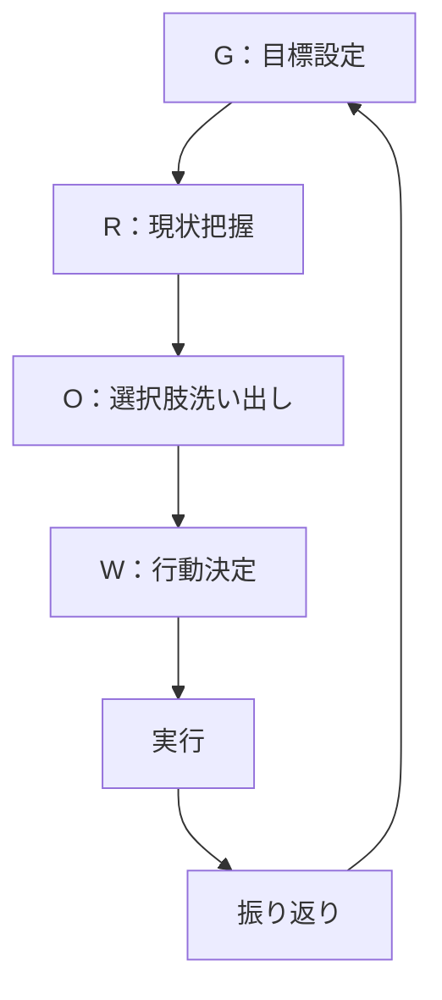
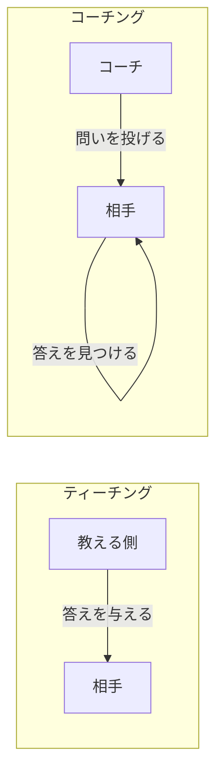
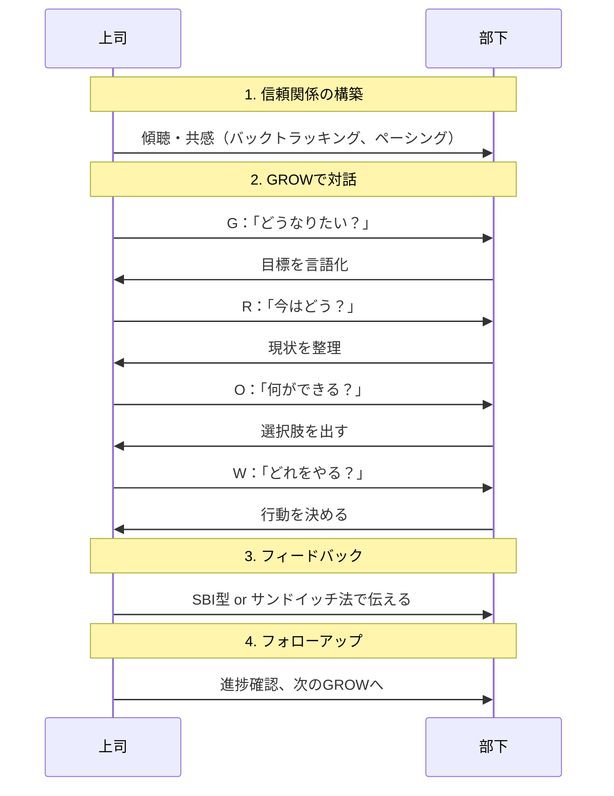
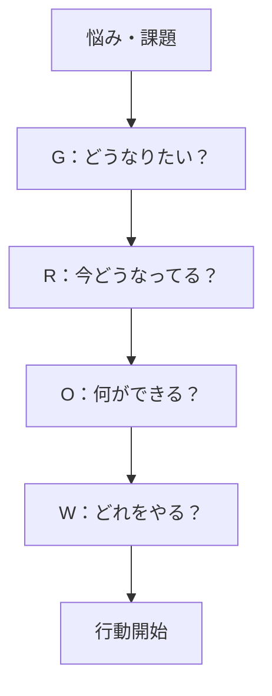
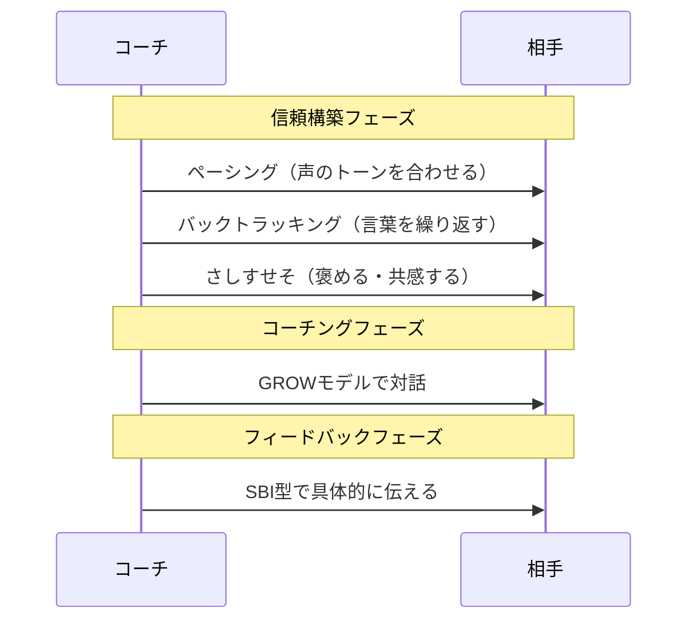

## 第14章：フレームワーク一覧：コーチング・育成系

### 14-1. 概要

相手の答えを引き出す技術。それがコーチングである。

教えるのではなく、問いかける。答えを与えるのではなく、答えに気づかせる。部下や後輩、あるいは自分自身に対して「どうしたいの？」と問うための技術だ。

この章では、相手の成長を促し、行動を引き出すためのフレームワークを扱う。

---

### 14-2. フレームワーク一覧

| 名前              | 構造・要素                           | 用途                  |
| :-------------- | :------------------------------ | :------------------ |
| GROWモデル（グロウモデル） | Goal → Reality → Options → Will | 1on1ミーティング、セルフコーチング |
| SBI型（エスビーアイがた）  | Situation → Behavior → Impact   | フィードバック（第8章でも紹介）    |
| サンドイッチ法         | Positive → Negative → Positive  | 指導、評価面談（第8章でも紹介）    |

---

### 14-3. 各フレームワークの詳細

#### GROWモデル

世界標準のコーチング会話モデル。「で、どうする？」まで確実に落とし込む。

| 要素 | 英語 | 問い | やること |
|:---:|:---|:---|:---|
| G | Goal | どうなりたい？ | 目標を明確にする |
| R | Reality | 今どうなってる？ | 現状を把握する |
| O | Options | 何ができる？ | 選択肢を洗い出す |
| W | Will | どうする？ | 行動を決める |

##### GROWモデルの質問例

| 段階 | 質問例 |
|:---|:---|
| Goal | 「理想の状態は？」「何を達成したい？」「成功したらどうなる？」 |
| Reality | 「今どんな状況？」「何が起きてる？」「これまで何を試した？」 |
| Options | 「他に何ができる？」「もし制約がなかったら？」「誰かに相談できる？」 |
| Will | 「どれをやる？」「いつから始める？」「最初の一歩は？」 |

#### GROWモデルとティーチングの違い

| 項目 | ティーチング | コーチング（GROW） |
|:---|:---|:---|
| 主導権 | 教える側 | 相手 |
| 答え | 教える側が持っている | 相手の中にある |
| 目的 | 知識・スキルの伝達 | 気づきと行動の促進 |
| 適した場面 | 相手が初心者の時 | 相手に経験がある時 |

#### SBI型（復習）

第8章で紹介したが、コーチングでも重要なので再掲。

| 要素 | 英語 | やること | 例 |
|:---:|:---|:---|:---|
| S | Situation | 状況を述べる | 「昨日の会議で」 |
| B | Behavior | 具体的な行動を述べる | 「積極的に発言していたね」 |
| I | Impact | その影響を述べる | 「おかげで議論が活性化した」 |

**ポイント**：人格ではなく行動にフォーカスする。「君は優秀だ」ではなく「この行動がこの結果を生んだ」と伝える。

#### サンドイッチ法（復習）

第8章で紹介したが、育成場面でも重要なので再掲。

| 要素 | やること | 例 |
|:---:|:---|:---|
| Positive | まず褒める | 「資料の構成は分かりやすかった」 |
| Negative | 改善点を伝える | 「ただ、データの出典が不明確だった」 |
| Positive | 励まして締める | 「次も期待してるよ」 |

---

### 14-4. コーチングの流れ

---

### 14-5. セルフコーチング

GROWモデルは自分自身にも使える。

| 段階 | 自分への問い |
|:---|:---|
| Goal | 「自分は何を達成したいのか？」 |
| Reality | 「今の自分はどんな状態か？」 |
| Options | 「自分には何ができるか？」 |
| Will | 「自分は何をするか？いつやるか？」 |

---

### 14-6. GROWモデル + 雑談系フレームワーク

コーチングを始める前に、雑談系フレームワークで信頼関係を築く。

---

### 14-7. 使い分けの基準

| 状況         | 推奨フレームワーク      | 理由             |
| :--------- | :------------- | :------------- |
| 1on1ミーティング | GROWモデル        | 行動まで落とし込める     |
| 部下の成長支援    | GROWモデル + SBI型 | 気づきと具体的フィードバック |
| 評価面談       | サンドイッチ法 + SBI型 | モチベーション維持と具体性  |
| 自己分析       | GROWモデル（セルフ）   | 一人でも使える        |
| 褒める時       | SBI型           | 何が良かったか具体的に伝わる |
| 改善を促す時     | サンドイッチ法        | 角を立てずに伝えられる    |

---

### 14-8. まとめ

コーチング・育成の基本は「答えを与えず、引き出す」こと。

- **行動まで落とし込む** → GROWモデル
- **具体的にフィードバック** → SBI型
- **モチベーションを維持** → サンドイッチ法

教えるのではなく、問いかける。答えは相手の中にある。

---
