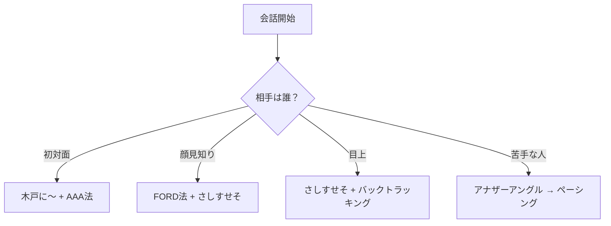
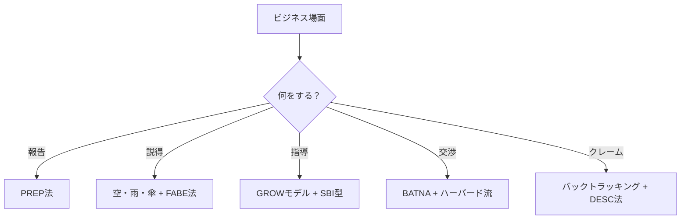
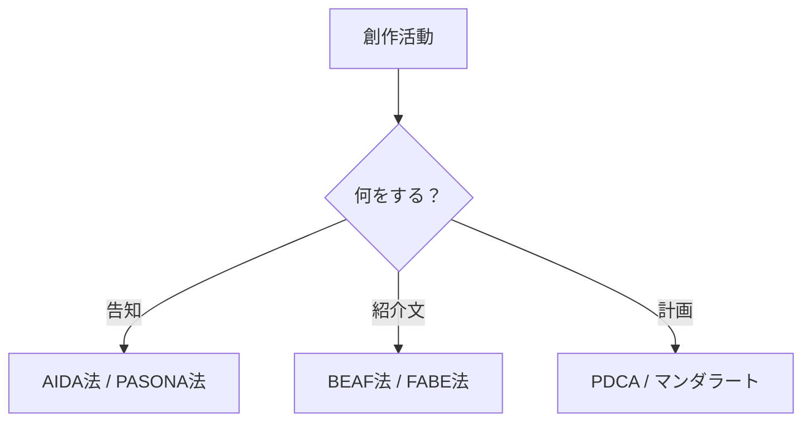
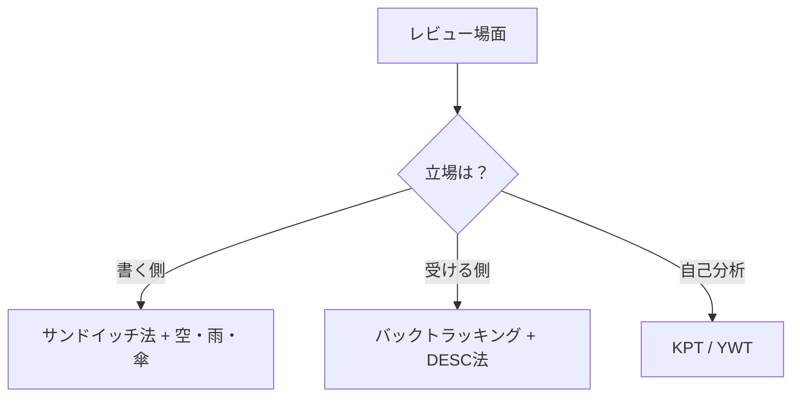
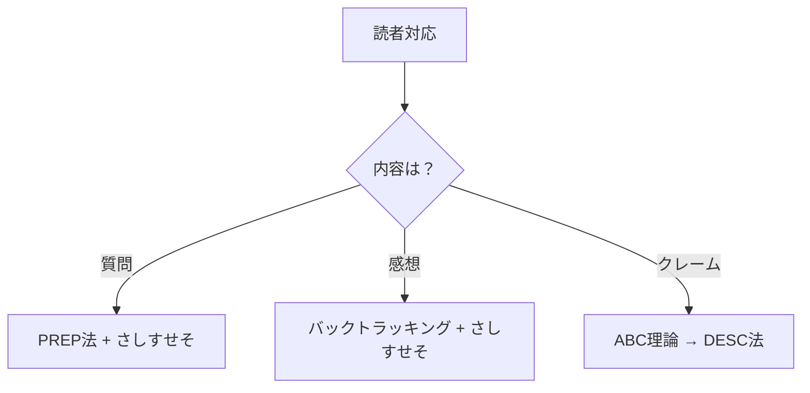
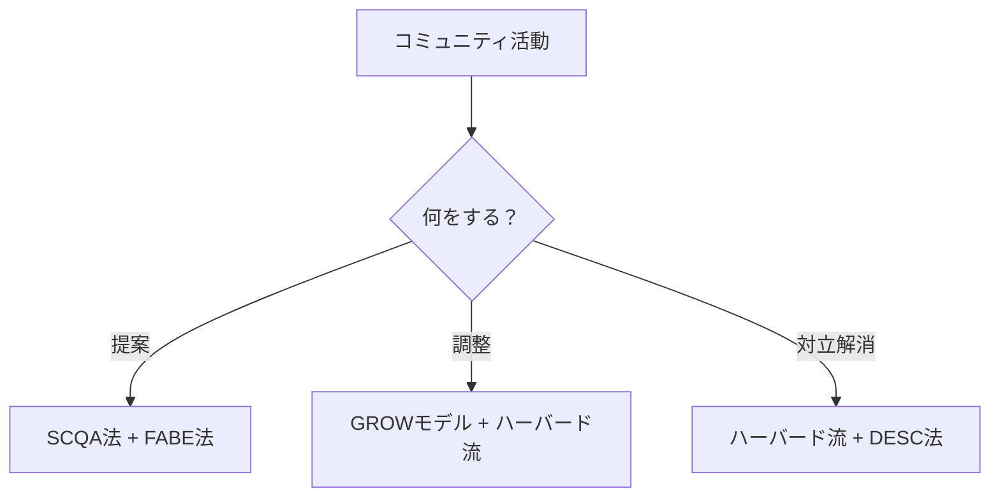
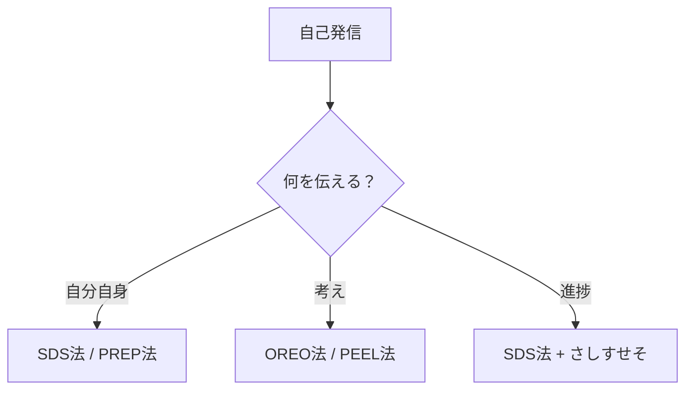
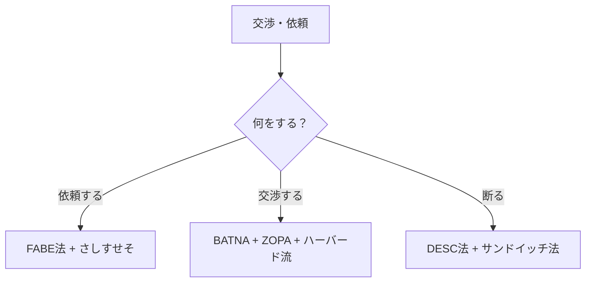

# 第15章：状況リスト

> ここで紹介するのはあくまで一例です。状況や相手に応じて、自分なりの組み合わせを見つけてください。

## 15-1. 概要

フレームワークは「状況」に応じて使い分ける。

この章では、日常で遭遇しうる様々な状況を一覧化する。自分が今どの状況にいるかを把握し、適切なフレームワークを選択するための地図として活用してほしい。

## 15-2. 状況リスト：雑談・会話

| 状況 | 概要 | 5分類 |
|:---|:---|:---|
| 初対面の雑談 | 初めて会う人と話す | Aggressive → Debuff |
| 2回目以降の雑談 | 顔見知りとの会話を深める | Aggressive → Buff |
| 飲み会・パーティ | 複数人での社交場面 | Aggressive → Buff |
| 口下手な相手との会話 | 話さない人を乗せる | Debuff → Buff |
| 目上の人との会話 | 上司・先輩・年配者対応 | Defensive → Buff |
| 愚痴・相談を聞く | 聞き役に徹する場面 | Defensive → Buff |
| 自分の話をする | 自己開示・エピソードトーク | Aggressive |
| 話題が尽きた時 | 沈黙を埋める | Recovery → Aggressive |
| 苦手な相手との会話 | 恐怖・緊張の克服 | Recovery → Defensive |
| 褒める・持ち上げる | 相手の気分を上げる | Buff |

## 15-3. 状況リスト：ビジネス会話

| 状況 | 概要 | 5分類 |
|:---|:---|:---|
| 上司への報告 | 端的に伝える | Aggressive |
| 会議での発言 | 意見を通す | Aggressive → Debuff |
| 部下への指導 | フィードバック | Aggressive → Buff |
| 商談・営業 | 買わせる・契約を取る | Aggressive → Debuff → Buff |
| プレゼン | 人前で説明する | Aggressive |
| クレーム対応 | 怒ってる人を鎮める | Defensive → Buff |
| 交渉 | 条件を調整する | Debuff → Defensive |
| 依頼を断る | 角を立てずに辞退する | Defensive |

## 15-4. 状況リスト：創作・公開

| 状況         | 概要             | 5分類        |
| :--------- | :------------- | :--------- |
| 作品の公開告知    | 新作や更新を読者に知らせる  | Aggressive |
| あらすじ・紹介文作成 | 作品の魅力を端的に伝える   | Aggressive |
| 公開スケジュール設計 | いつ・どの順で出すか計画する | Buff（自己準備） |
| シリーズ展開の説明  | 複数作品の関係性を伝える   | Aggressive |

※ここでのBuffは「場を温める」だけでなく、「自分自身の準備を整える＝自己へのBuff」という拡張的な意味で使用しています。

## 15-5. 状況リスト：レビュー・批評

| 状況         | 概要          | 5分類               |
| :--------- | :---------- | :---------------- |
| 他者作品へのレビュー | 感想・評価を伝える   | Aggressive → Buff |
| 批評への返信     | 自作への指摘に応答する | Defensive → Buff  |
| 自作の自己分析    | 振り返りと改善点抽出  | Buff（自己準備）        |

## 15-6. 状況リスト：読者対応

| 状況 | 概要 | 5分類 |
|:---|:---|:---|
| 質問への回答 | 読者からの疑問に答える | Defensive → Buff |
| 感想への返信 | コメントにリアクションする | Defensive → Buff |
| クレーム対応 | 不満・批判への対処 | Defensive → Recovery |

## 15-7. 状況リスト：コミュニティ

| 状況 | 概要 | 5分類 |
|:---|:---|:---|
| 企画の提案 | 合作・イベント等を持ちかける | Aggressive → Debuff |
| 共同制作の調整 | 役割分担・方向性のすり合わせ | Debuff → Buff |
| 意見の対立解消 | 創作観の違いを調整する | Defensive → Debuff |

## 15-8. 状況リスト：自己発信

| 状況 | 概要 | 5分類 |
|:---|:---|:---|
| 自己紹介・プロフィール | 自分を知ってもらう | Aggressive |
| 創作論・エッセイ | 考えや哲学を発信する | Aggressive |
| 活動報告 | 進捗や近況を伝える | Aggressive → Buff |

## 15-9. 状況リスト：交渉・依頼

| 状況 | 概要 | 5分類 |
|:---|:---|:---|
| コラボ依頼 | 他者に協力を求める | Aggressive → Buff |
| 条件交渉 | 報酬・納期等を調整する | Debuff → Defensive |
| 断り方 | 依頼を角を立てずに辞退する | Defensive → Buff |

## 15-10. 状況×5分類マトリクス

| 状況 | Aggressive | Defensive | Recovery | Buff | Debuff |
|:---|:---:|:---:|:---:|:---:|:---:|
| 初対面の雑談 | ◎ | ○ | △ | ○ | ◎ |
| 上司への報告 | ◎ | △ | × | ○ | × |
| 商談・営業 | ◎ | ○ | △ | ◎ | ◎ |
| クレーム対応 | × | ◎ | ○ | ◎ | △ |
| 他者作品へのレビュー | ◎ | × | × | ◎ | × |
| 批評への返信 | △ | ◎ | ○ | ◎ | × |
| 企画の提案 | ◎ | △ | × | ○ | ◎ |
| 条件交渉 | ○ | ◎ | △ | ○ | ◎ |
| 苦手な相手との会話 | △ | ○ | ◎ | ○ | △ |

凡例：◎最適 / ○有効 / △使える / ×不向き

## 15-11. まとめ

状況を把握し、5分類で考える。

1. **今、自分はどの状況にいるか？**
2. **Aggressive / Defensive / Recovery / Buff / Debuff のどれが必要か？**
3. **その分類に属するフレームワークを選ぶ**

状況リストは地図である。迷ったらここに戻ってこい。

---
