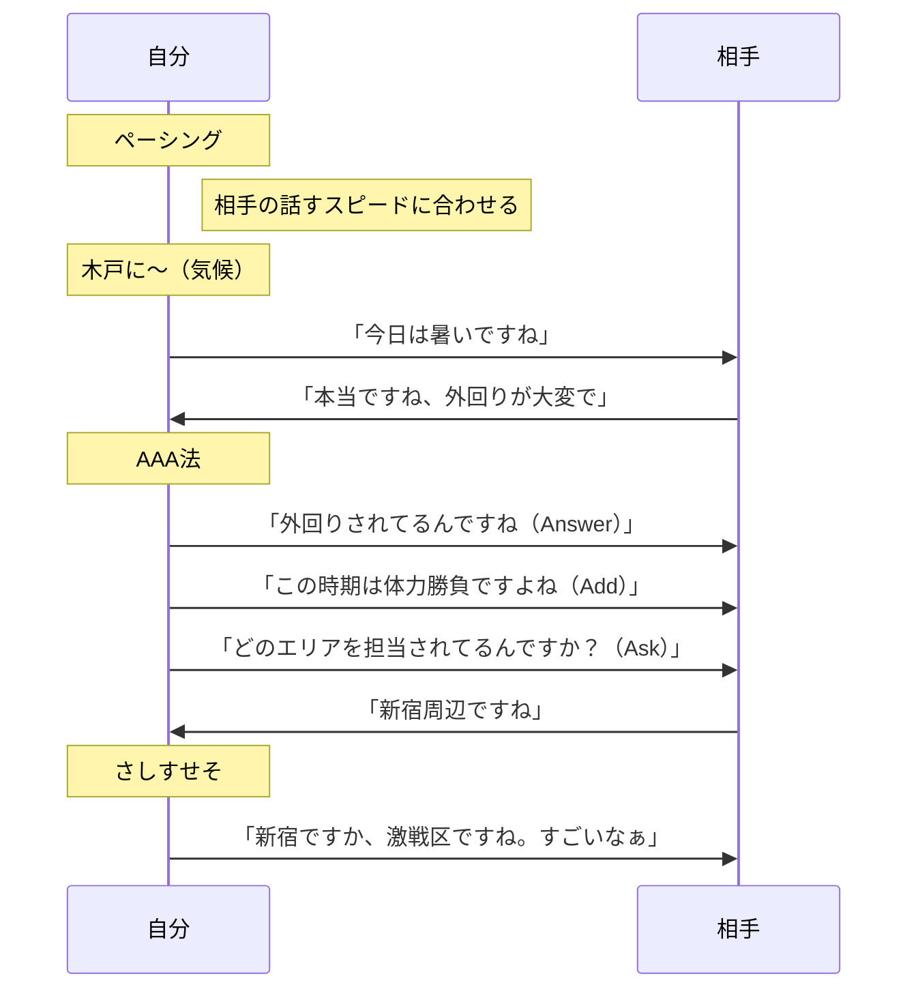
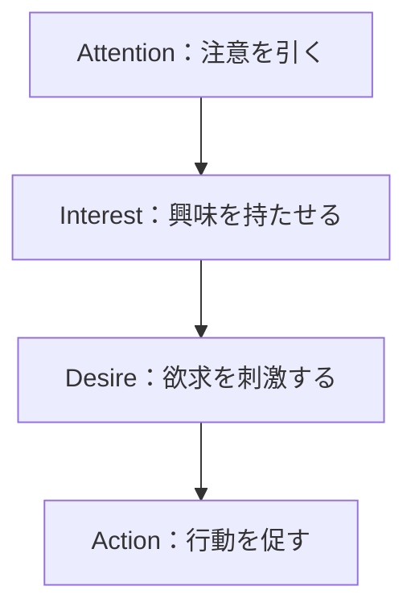
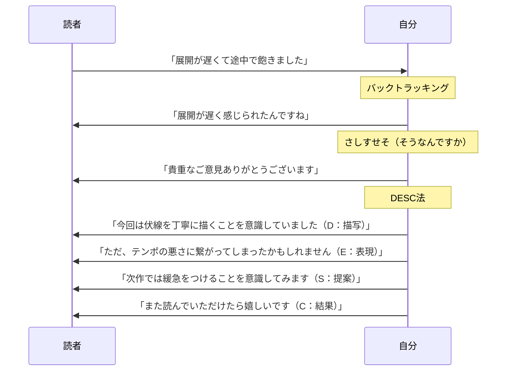
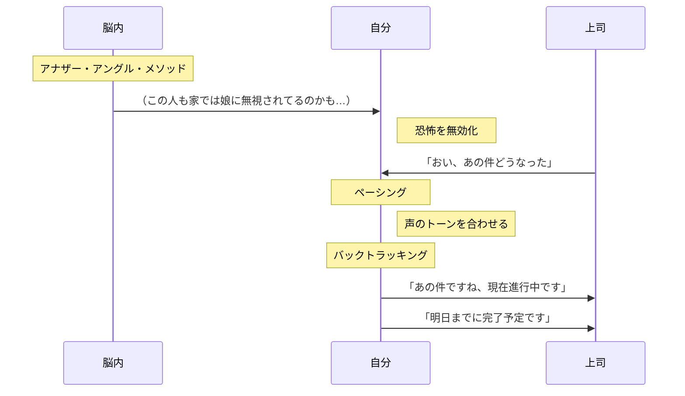
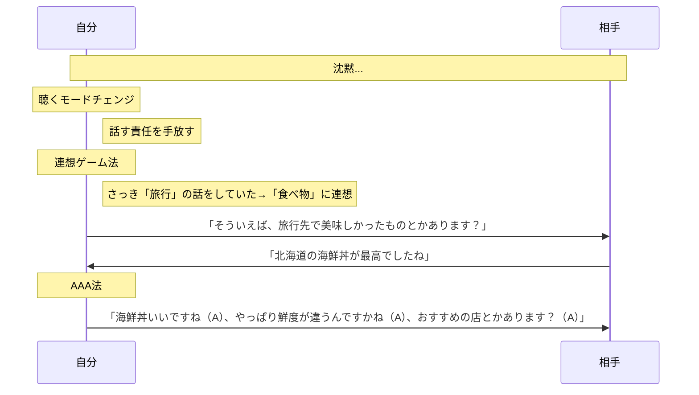
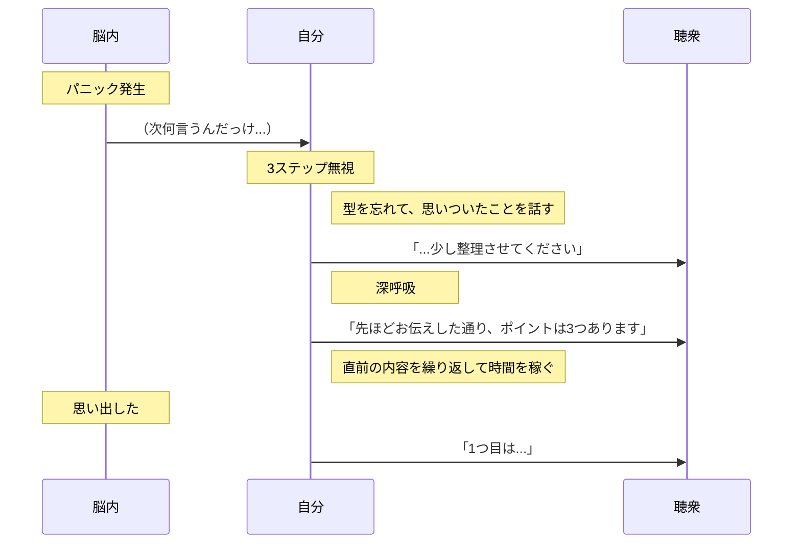
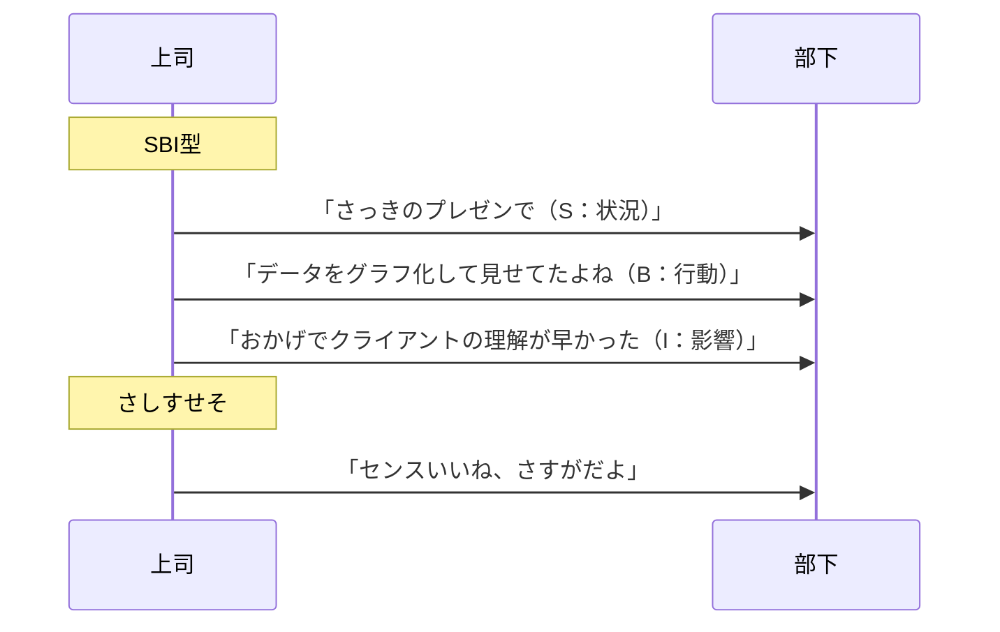
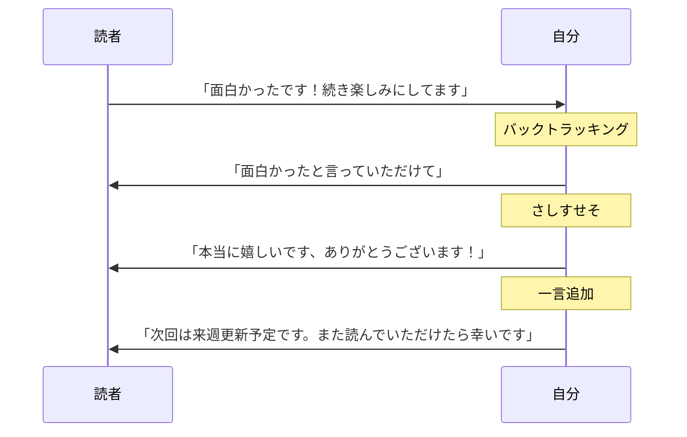
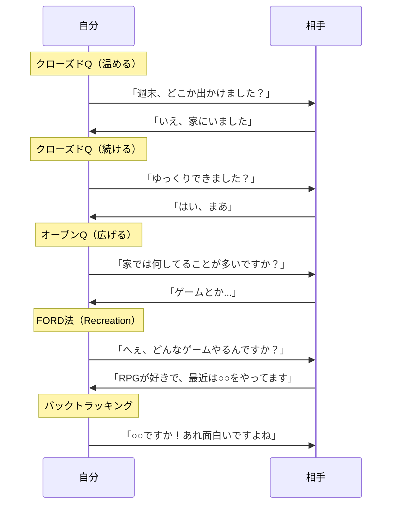
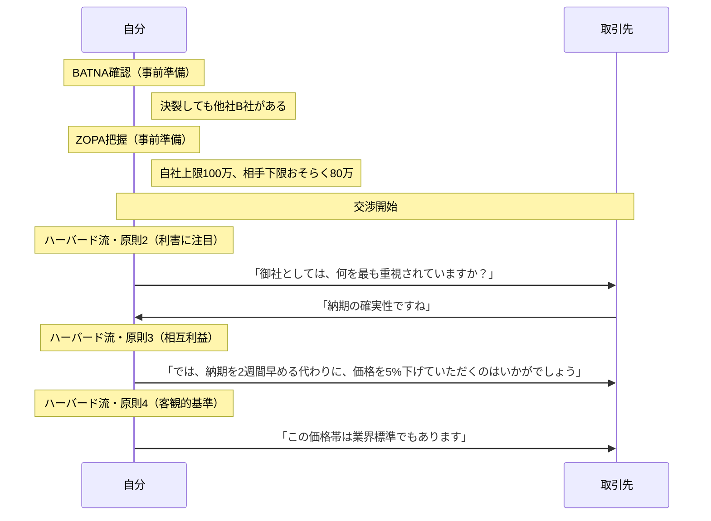

# 第16章：実例集

> ここで紹介するのはあくまで一例です。状況や相手に応じて、自分なりの組み合わせを見つけてください。

## 16-1. 概要

フレームワークは知っているだけでは使えない。実際の場面でどう組み合わせるかが重要だ。

この章では、5分類それぞれについて具体的な使用例を示す。

## 16-2. Aggressive（自分から仕掛ける）の実例

### 実例A-1：初対面の雑談

| 項目 | 内容 |
|:---|:---|
| 状況 | 仕事の懇親会で、初めて会う人と話すことになった |
| 目的 | 自然に会話を始め、良い印象を残す |
| コンボ | ペーシング → 木戸に〜 → AAA法 → さしすせそ |

### 実例A-2：作品の公開告知

| 項目 | 内容 |
|:---|:---|
| 状況 | Web小説の新作を公開する |
| 目的 | 読者の興味を引き、読んでもらう |
| コンボ | AIDA法 |

| 要素 | 例文 |
|:---|:---|
| Attention | 「"死んだはずの幼馴染が、10年後に現れた。"」 |
| Interest | 「記憶を失った彼女は、なぜ自分の名前だけを覚えていたのか──」 |
| Desire | 「切なくも温かい再会の物語。あなたも、忘れられない人がいませんか？」 |
| Action | 「第1話はこちら→【リンク】」 |

## 16-3. Defensive（相手の球を返す）の実例

### 実例D-1：批評への返信

| 項目 | 内容 |
|:---|:---|
| 状況 | 自作の小説に「展開が遅い」という批評が来た |
| 目的 | 角を立てずに受け止め、関係を維持する |
| コンボ | バックトラッキング → さしすせそ → DESC法 |

### 実例D-2：苦手な上司との会話

| 項目 | 内容 |
|:---|:---|
| 状況 | いつも高圧的な上司に話しかけられた |
| 目的 | 萎縮せずに対応する |
| コンボ | アナザー・アングル・メソッド → ペーシング → バックトラッキング |

## 16-4. Recovery（立て直す）の実例

### 実例R-1：話題が尽きた時

| 項目 | 内容 |
|:---|:---|
| 状況 | 会話が途切れて沈黙が続いている |
| 目的 | 自然に会話を再開する |
| コンボ | 聴くモードチェンジ → 連想ゲーム法 → AAA法 |

### 実例R-2：頭が真っ白になった時

| 項目 | 内容 |
|:---|:---|
| 状況 | プレゼン中に次に何を言うか忘れた |
| 目的 | パニックにならず、立て直す |
| コンボ | 3ステップ無視 → 深呼吸 → 直前の内容を繰り返す |

## 16-5. Buff（一言添える）の実例

### 実例B-1：部下を褒める

| 項目 | 内容 |
|:---|:---|
| 状況 | 部下が良いプレゼンをした |
| 目的 | 具体的に褒めて、モチベーションを上げる |
| コンボ | SBI型 + さしすせそ |

### 実例B-2：感想への返信

| 項目 | 内容 |
|:---|:---|
| 状況 | 読者から「面白かったです」とコメントが来た |
| 目的 | 感謝を伝え、関係を深める |
| コンボ | バックトラッキング → さしすせそ → 一言追加 |

## 16-6. Debuff（相手を動かす）の実例

### 実例De-1：口下手な相手から話を引き出す

| 項目 | 内容 |
|:---|:---|
| 状況 | あまり話さない同僚と二人きりになった |
| 目的 | 相手に話してもらう |
| コンボ | クローズドQ → オープンQ → FORD法 → バックトラッキング |

### 実例De-2：交渉で優位に立つ

| 項目 | 内容 |
|:---|:---|
| 状況 | 取引先と価格交渉をする |
| 目的 | 自社に有利な条件を引き出す |
| コンボ | BATNA確認 → ZOPA把握 → ハーバード流 |

## 16-7. まとめ

実例から学ぶべきは「流れ」である。

- **Aggressive**：自分から仕掛け、会話を始める
- **Defensive**：相手の球を受け止め、返す
- **Recovery**：困った時に立て直す
- **Buff**：一言添えて、場を温める
- **Debuff**：質問で相手を動かす

5分類を意識すれば、どんな状況でも対応できる。

---
