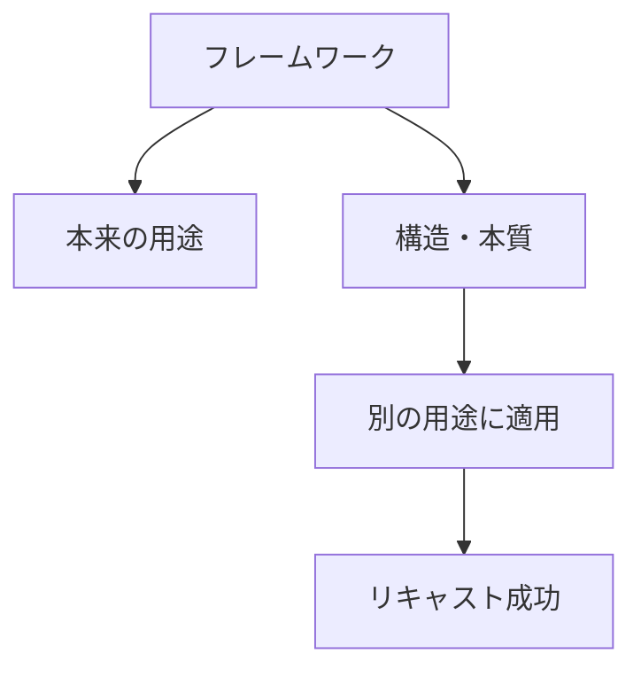
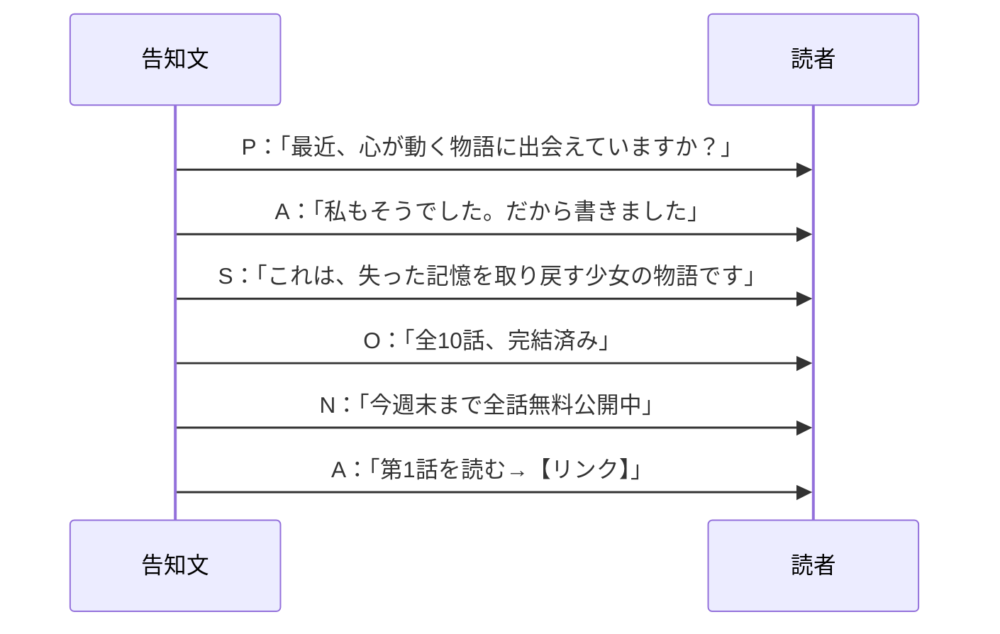
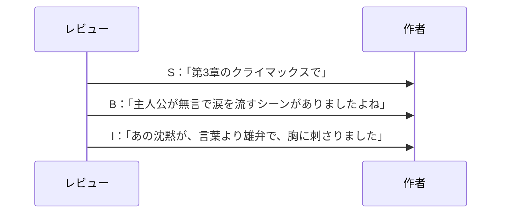
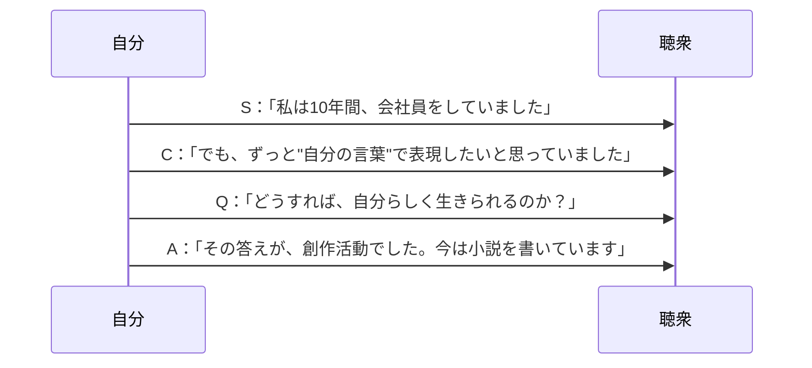
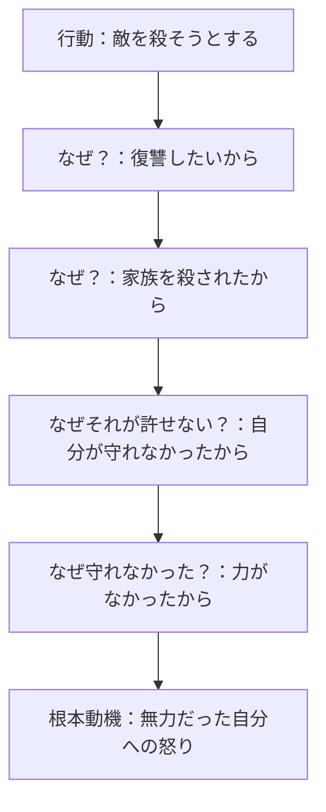
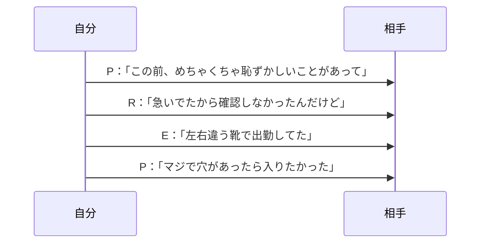
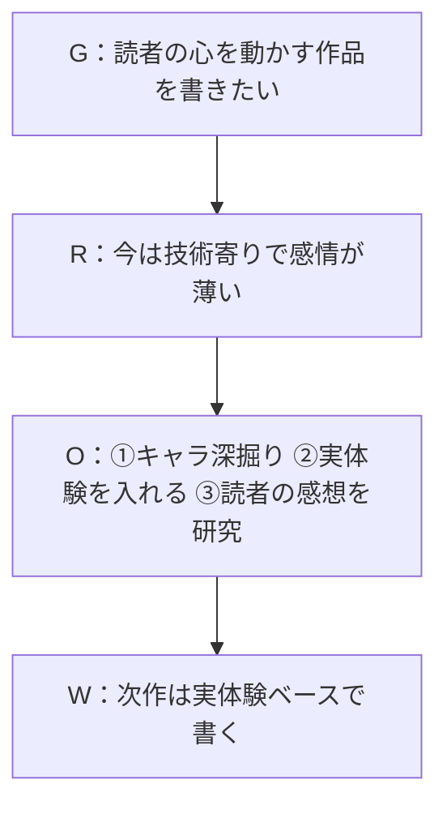
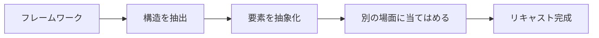

## 第17章：リキャスト事例

> ここで紹介するのはあくまで一例です。状況や相手に応じて、自分なりの組み合わせを見つけてください。

### 17-1. 概要

リキャスト（Recast）とは、フレームワークを本来の用途とは異なる場面で使う技術である。

営業用のフレームワークを創作に、ビジネス用のフレームワークを雑談に──用途を「役割を変えて再配置」することで、フレームワークの活用範囲は無限に広がる。

---

### 17-2. リキャストの基本原則

| 原則    | 内容                            |
| :---- | :---------------------------- |
| 本質を見る | フレームワークの「構造」を理解し、表面的な用途に囚われない |
| 目的で選ぶ | 「何を達成したいか」から逆算して選ぶ            |
| 試行錯誤  | 合わなければ別のフレームワークを試す            |

---

### 17-3. リキャスト事例集

#### 事例1：PASONA法を創作告知に

| 項目 | 内容 |
|:---|:---|
| フレームワーク | PASONA法 |
| 本来の用途 | セールスレター、LP |
| リキャスト先 | Web小説の公開告知 |

| 要素 | 本来の使い方 | リキャスト後 |
|:---|:---|:---|
| Problem | 顧客の悩みを提起 | 読者の「退屈」「刺激がない」を提起 |
| Affinity | 共感を示す | 「私も同じでした」と作者の体験を共有 |
| Solution | 商品を提示 | 作品を提示 |
| Offer | 具体的な提案 | 「第1話はこちら」とリンク |
| Narrowing | 限定性 | 「今だけ全話無料」「期間限定公開」 |
| Action | 行動を促す | 「今すぐ読む」 |

#### 事例2：SBI型をレビューに

| 項目 | 内容 |
|:---|:---|
| フレームワーク | SBI型 |
| 本来の用途 | 部下へのフィードバック |
| リキャスト先 | 他者作品へのレビュー |

| 要素 | 本来の使い方 | リキャスト後 |
|:---|:---|:---|
| Situation | 業務の状況 | 作品のどの場面か |
| Behavior | 部下の行動 | 作品の具体的な表現・描写 |
| Impact | 業務への影響 | 読者としてどう感じたか |

#### 事例3：SCQA法を自己紹介に

| 項目 | 内容 |
|:---|:---|
| フレームワーク | SCQA法 |
| 本来の用途 | プレゼン冒頭、提案書 |
| リキャスト先 | 自己紹介 |

| 要素 | 本来の使い方 | リキャスト後 |
|:---|:---|:---|
| Situation | ビジネスの状況 | 自分の経歴・背景 |
| Complication | 課題・問題 | 自分が直面した困難 |
| Question | 問いかけ | その困難からの問い |
| Answer | 解決策 | 今の自分・活動 |

#### 事例4：5Whyを創作に

| 項目 | 内容 |
|:---|:---|
| フレームワーク | 5Why |
| 本来の用途 | 根本原因分析 |
| リキャスト先 | キャラクターの動機深掘り |

| 回数 | 本来の使い方 | リキャスト後 |
|:---|:---|:---|
| 1回目 | 問題の直接原因 | キャラの表面的な行動理由 |
| 2〜4回目 | 原因の原因 | 行動の背景にある感情・過去 |
| 5回目 | 根本原因 | キャラの核心的な動機・トラウマ |

#### 事例5：PREP法を雑談に

| 項目 | 内容 |
|:---|:---|
| フレームワーク | PREP法 |
| 本来の用途 | 報告書、プレゼン |
| リキャスト先 | 雑談でのエピソードトーク |

| 要素 | 本来の使い方 | リキャスト後 |
|:---|:---|:---|
| Point | 結論 | オチ・言いたいこと |
| Reason | 理由 | なぜその話をするか |
| Example | 具体例 | エピソードの詳細 |
| Point | 結論再掲 | オチを繰り返す |

#### 事例6：GROWモデルを自己分析に

| 項目 | 内容 |
|:---|:---|
| フレームワーク | GROWモデル |
| 本来の用途 | コーチング、1on1 |
| リキャスト先 | 創作の方向性を決める自己分析 |

| 要素 | 本来の使い方 | リキャスト後 |
|:---|:---|:---|
| Goal | 相手の目標 | 自分が創作で達成したいこと |
| Reality | 相手の現状 | 今の自分の創作状況 |
| Options | 選択肢 | 取りうる創作の方向性 |
| Will | 行動決定 | 次に書く作品・テーマ |

---

### 17-4. リキャスト発想法

新しいリキャストを見つけるための問い。

| 問い                  | 例                                        |
| :------------------ | :--------------------------------------- |
| このフレームワークの「構造」は何か？  | PASONA法＝「問題→共感→解決→行動」の流れ                 |
| その構造は、他のどんな場面で使えるか？ | 問題提起→共感→解決策提示＝相談への回答にも使える                |
| 各要素を別の言葉に置き換えると？    | Problem→読者の悩み、Solution→作品、Action→読むという行動 |

---

### 17-5. リキャスト早見表

| フレームワーク | 本来の用途       | リキャスト先の例     |
| :------ | :---------- | :----------- |
| PASONA法 | セールスレター     | 創作告知、相談への回答  |
| SBI型    | 部下へのフィードバック | 作品レビュー、感想    |
| SCQA法   | プレゼン冒頭      | 自己紹介、作品のあらすじ |
| 5Why    | 根本原因分析      | キャラクターの動機深掘り |
| PREP法   | 報告書         | 雑談のエピソードトーク  |
| GROWモデル | コーチング       | 創作の自己分析      |
| AIDA法   | 広告          | SNS投稿、作品紹介   |
| SWOT    | 経営分析        | 自分の強み・弱みの整理  |
| BATNA   | 交渉          | 人間関係の選択肢確保   |

---

### 17-6. まとめ

リキャストの本質は「構造の転用」である。

- フレームワークの「用途」ではなく「構造」を見る
- 構造を抽象化し、別の場面に当てはめる
- 合わなければ別のフレームワークを試す

フレームワークは道具だ。本来の使い方に縛られる必要はない。

---
