# 第18章：トランスプラント事例

> ここで紹介するのはあくまで一例です。状況や相手に応じて、自分なりの組み合わせを見つけてください。

## 18-1. 概要

トランスプラント（Transplant）とは、フレームワークの一部要素だけを切り取り、別のフレームワークに組み込む技術である。

リキャストが「フレームワーク全体を別の用途で使う」のに対し、トランスプラントは「パーツ単位で移植する」。より細かく、より柔軟な運用が可能になる。

## 18-2. トランスプラントの基本原則

| 原則 | 内容 |
|:---|:---|
| パーツを見る | フレームワークを「分解可能な要素の集合」として捉える |
| 足りないものを補う | 既存のフレームワークに「欲しい要素」を移植する |
| 相性を考える | 移植元と移植先の構造的な相性を確認する |

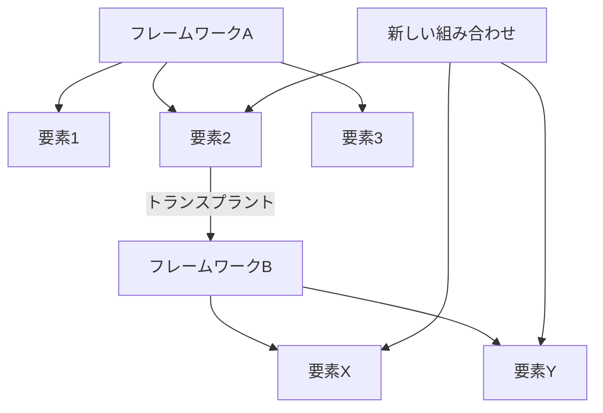

## 18-3. トランスプラント事例集

### 事例1：BEAFのBenefitをサンドイッチ法に

| 項目 | 内容 |
|:---|:---|
| 移植元 | BEAF法のBenefit（得られる未来） |
| 移植先 | サンドイッチ法 |
| 目的 | レビューで「この作品を読むと何が得られるか」を伝える |

| 元の構造 | トランスプラント後 |
|:---|:---|
| Positive → Negative → Positive | Positive（Benefit込み）→ Negative → Positive |

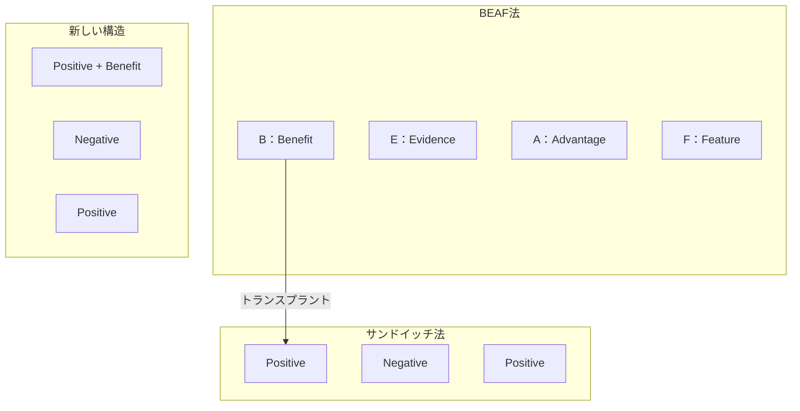

#### 実際の使用例

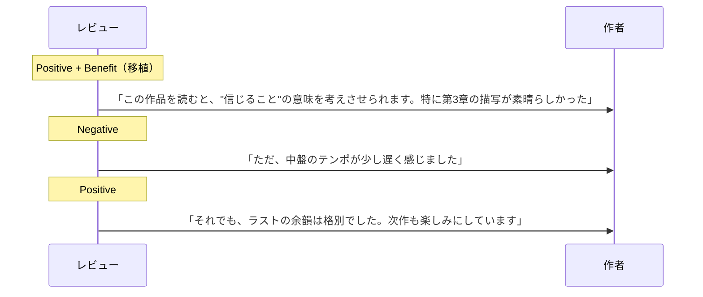

### 事例2：PASONAのAffinityをPREP法に

| 項目 | 内容 |
|:---|:---|
| 移植元 | PASONA法のAffinity（共感） |
| 移植先 | PREP法 |
| 目的 | 報告・説明に「共感」を加え、相手の納得感を高める |

| 元の構造 | トランスプラント後 |
|:---|:---|
| Point → Reason → Example → Point | Point → Affinity → Reason → Example → Point |

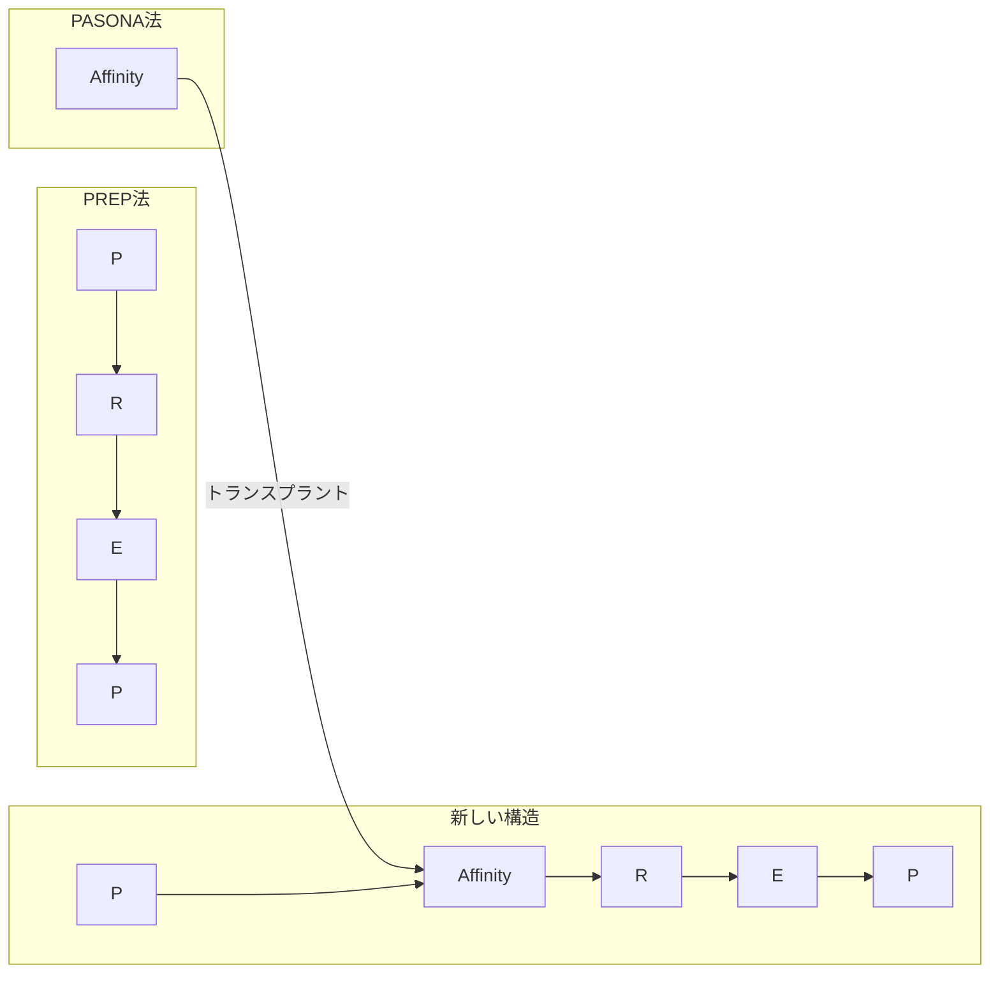

#### 実際の使用例

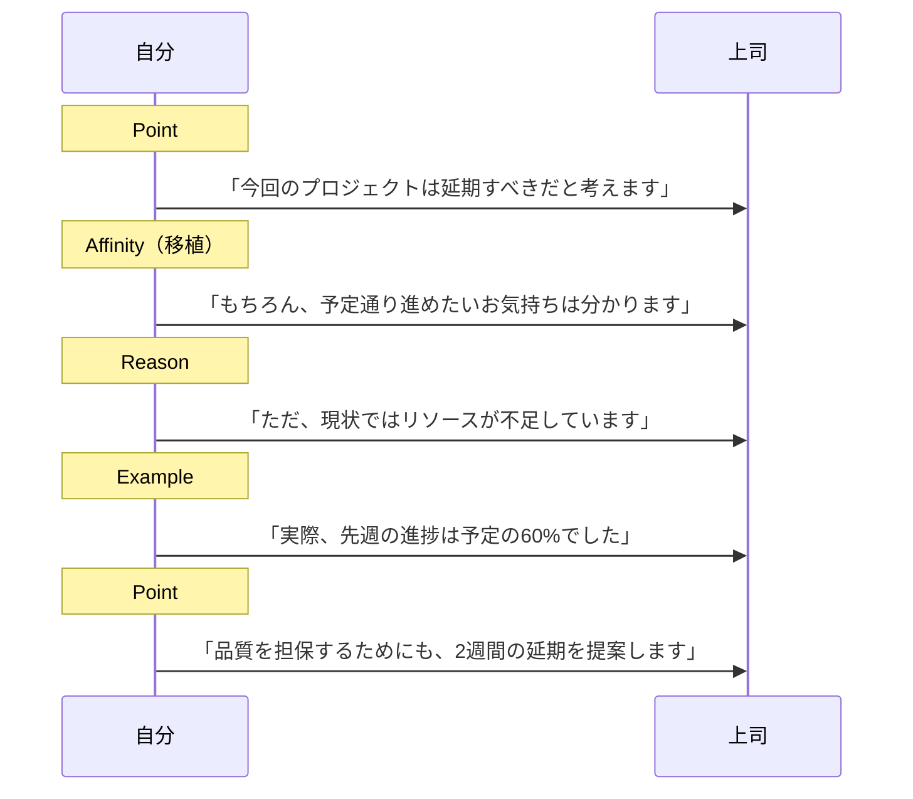

### 事例3：5WhyのWhyをGROWモデルに

| 項目 | 内容 |
|:---|:---|
| 移植元 | 5Whyの「なぜ？」という深掘り |
| 移植先 | GROWモデルのReality |
| 目的 | 現状把握をより深くする |

| 元の構造 | トランスプラント後 |
|:---|:---|
| Goal → Reality → Options → Will | Goal → Reality（5Why式深掘り）→ Options → Will |

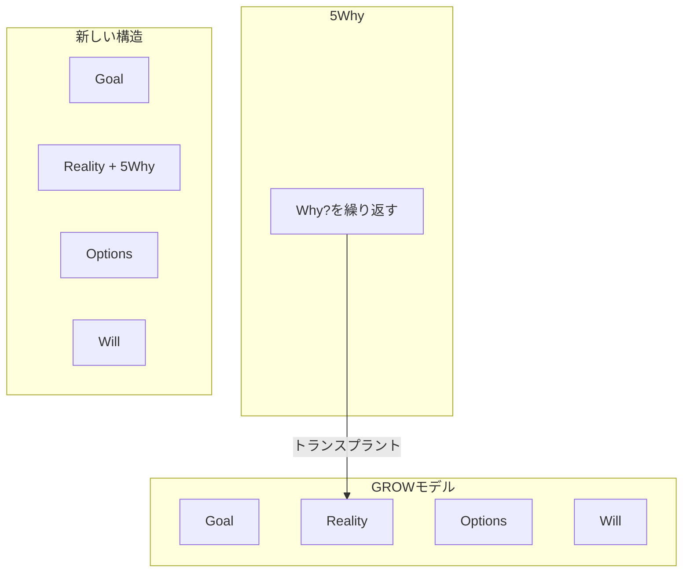

#### 実際の使用例

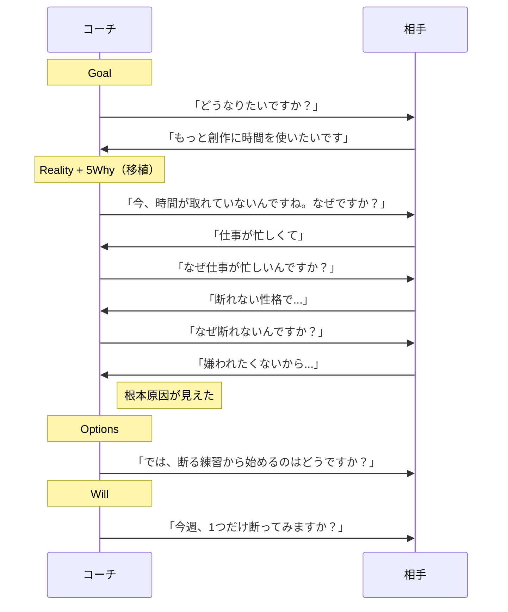

### 事例4：さしすせそのリアクションをDESC法に

| 項目 | 内容 |
|:---|:---|
| 移植元 | さしすせそ（褒め・共感のリアクション） |
| 移植先 | DESC法 |
| 目的 | 主張の前に場を温め、相手の防御を下げる |

| 元の構造 | トランスプラント後 |
|:---|:---|
| Describe → Express → Suggest → Consequence | さしすせそ → Describe → Express → Suggest → Consequence |

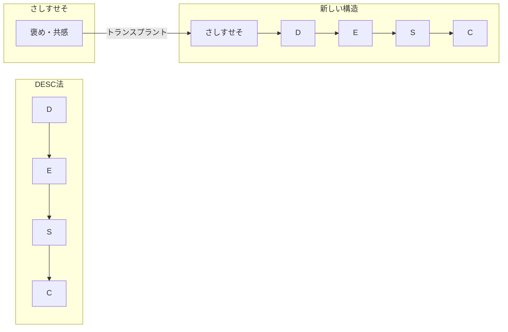

#### 実際の使用例

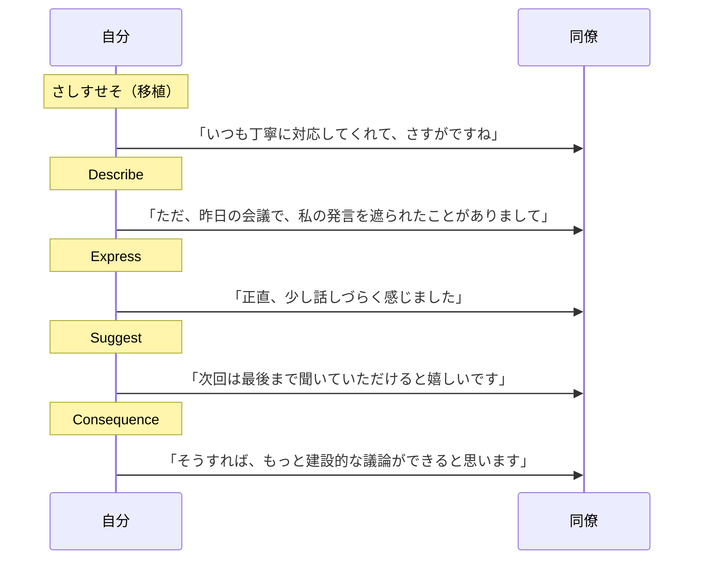

### 事例5：AIDAのAttentionを木戸に〜に

| 項目 | 内容 |
|:---|:---|
| 移植元 | AIDA法のAttention（注意を引く） |
| 移植先 | 木戸に立ち掛けし衣食住 |
| 目的 | 雑談の入りをよりインパクトのあるものにする |

| 元の構造 | トランスプラント後 |
|:---|:---|
| 話題を選んで振る | Attention（引きのある入り）→ 話題展開 |

#### 実際の使用例

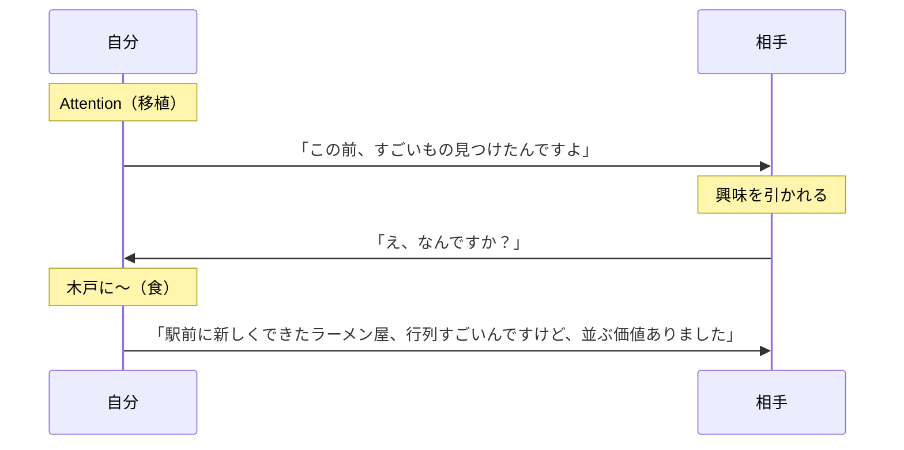

### 事例6：SCQAのComplicationをサンドイッチ法に

| 項目 | 内容 |
|:---|:---|
| 移植元 | SCQA法のComplication（複雑化・課題提示） |
| 移植先 | サンドイッチ法のNegative |
| 目的 | 指摘を「課題」として提示し、攻撃的に聞こえないようにする |

| 元の構造 | トランスプラント後 |
|:---|:---|
| Positive → Negative → Positive | Positive → Complication（課題として提示）→ Positive |

#### 実際の使用例

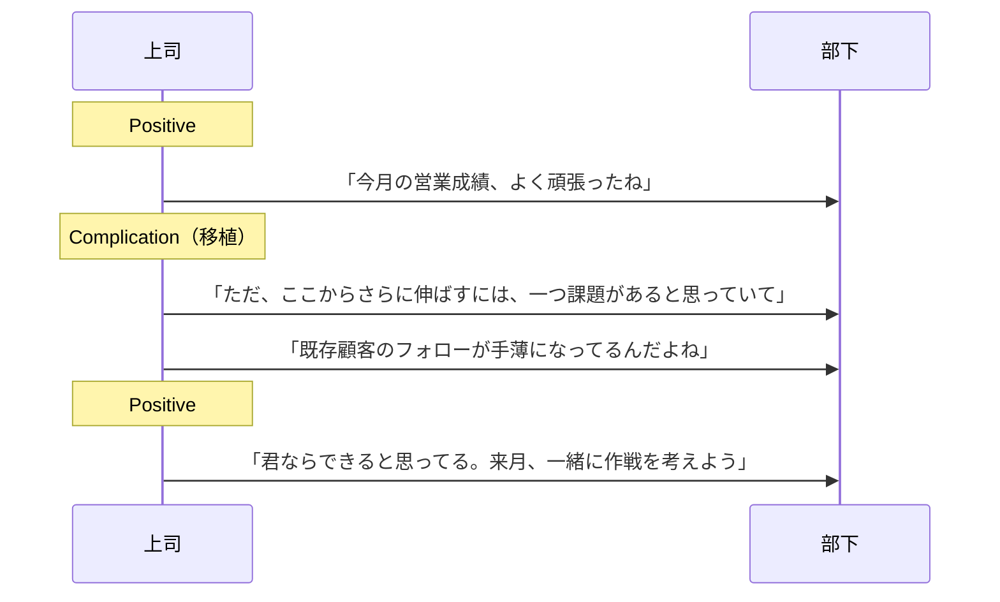

## 18-4. トランスプラント発想法

新しいトランスプラントを見つけるための問い。

| 問い | 例 |
|:---|:---|
| このフレームワークに足りない要素は何か？ | PREP法には「共感」がない |
| その要素を持っているフレームワークはどれか？ | PASONA法のAffinity |
| どこに移植すれば自然か？ | PointとReasonの間 |

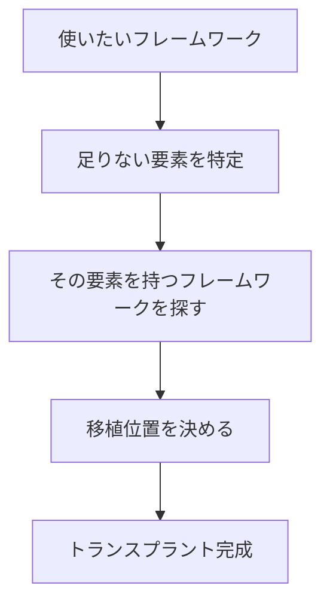

## 18-5. トランスプラント早見表

| 移植元 | 移植する要素 | 移植先の例 | 効果 |
|:---|:---|:---|:---|
| BEAF法 | Benefit | サンドイッチ法 | レビューに「得られるもの」を追加 |
| PASONA法 | Affinity | PREP法 | 報告に「共感」を追加 |
| 5Why | Why?の深掘り | GROWモデル | 現状把握を深くする |
| さしすせそ | 褒め・共感 | DESC法 | 主張の前に場を温める |
| AIDA法 | Attention | 木戸に〜 | 雑談の入りにインパクト |
| SCQA法 | Complication | サンドイッチ法 | 指摘を「課題」として提示 |
| SBI型 | Impact | PREP法 | 報告に「影響」を追加 |
| FORD法 | Dreams | GROWモデル | Goal設定を深める |

## 18-6. リキャストとトランスプラントの違い

| 項目 | リキャスト | トランスプラント |
|:---|:---|:---|
| 対象 | フレームワーク全体 | フレームワークの一部要素 |
| 操作 | 用途を変える | 要素を移植する |
| 比喩 | 道具を別の仕事に使う | 部品を別の機械に組み込む |
| 柔軟性 | 中程度 | 高い |
| 難易度 | 低い | やや高い |

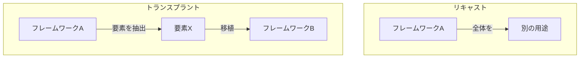

## 18-7. まとめ

トランスプラントの本質は「要素の移植」である。

- フレームワークを「分解可能な要素の集合」として見る
- 足りない要素を他のフレームワークから借りてくる
- 移植位置を考え、自然な流れを作る

フレームワークは固定された型ではない。パーツを組み替えて、自分だけの型を作れ。

---
