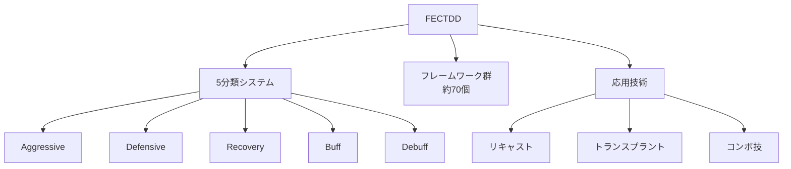

## 第1章：フェクテッドとは

### 1-1. 概要

**FECTDD（フェクテッド）** は、対話設計技術体系である。

会話は「センス」ではなく「技術」で攻略できる──この思想のもと、あらゆるコミュニケーション場面を分析・設計するためのフレームワーク群を体系化したものである。

---

### 1-2. 名称定義

| 項目  | 内容|
| :-- | :------------- |
| 名称  | FECTDD（フェクテッド）|
| 分類  | 対話設計技術体系|

#### 構成要素

| 文字  | 英語| 日本語  | 意味|
| :-: | :----------------------- | :--- | :-------- |
|  F  | Framing（フレーミング）| 枠組み| 枠組みを作る|
|  E  | Engineering（エンジニアリング）| 工学| 技術として設計する |
|  C  | Communication（コミュニケーション）| 意思疎通 | 意思疎通する|
|  T  | Talk（トーク）| 話す| 話す|
|  D  | Design（デザイン）| 設計| 設計する|
|  D  | Dialogue（ダイアローグ）| 対話| 対話する|

---

### 1-3. キャッチコピー

#### メインコピー

**「センスじゃない。技術だ。」**

#### サブコピー

**「あなたが会話が下手だと悩む必要はない。誰もが会話の本質を知らないのだから」**

---

### 1-4. ターゲット

コミュニケーションを徹底的に分析・解剖し、陽キャ・陰キャ・コミュ障・話上手・話下手などなど、あらゆる人々を救うための独自体系。

---

### 1-5. 専門用語

フェクテッドでは、フレームワークを柔軟に運用するための専門用語を定義している。

| 用語 | 意味 | 使用例 |
|:---|:---|:---|
| リキャスト（Recast） | 本来と違う用途でフレームワークを使う | 「PASONAを創作告知用にリキャストした」 |
| トランスプラント（Transplant） | フレームワークの一部要素を切り取り、別のフレームワークに組み込む | 「BEAFのBenefit部分だけトランスプラントしてサンドイッチ法に組み込んだ」 |

---

### 1-6. 全体構造

---

### 1-7. 本資料の使い方

1. **第2章**で5分類システムを理解する
2. **第3章**でまず恐怖を消す技術を学ぶ
3. **第4〜14章**で必要なフレームワークを参照する
4. **第15〜18章**で実際の使用例を確認する
5. **付録**で詳細情報を参照する

---