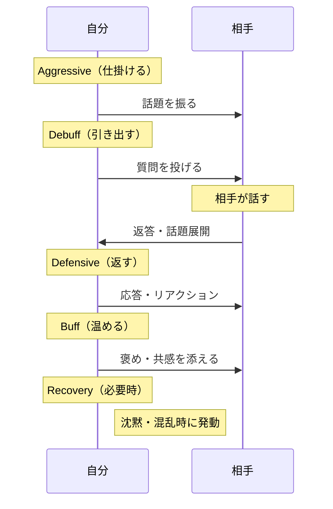
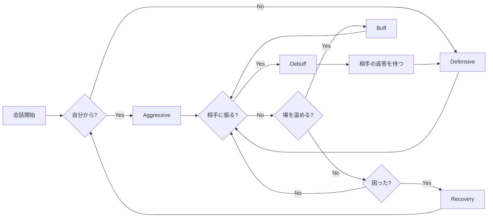

## 第2章：5分類システム

### 2-1. 概要

フェクテッドでは、全てのフレームワークと技術を5つのカテゴリに分類する。これはRPGの戦闘システムに着想を得た分類法であり、「今、自分は何をすべきか」を直感的に判断できるようになっている。

---

### 2-2. 5分類の定義

| 分類         | 読み方     | 意味       | 具体的な行動           |
| :--------- | :------ | :------- | :--------------- |
| Aggressive | アグレッシブ  | 自分から仕掛ける | 話題を振る、話を始める、提案する |
| Defensive  | ディフェンシブ | 相手の球を返す  | 振られた話題に応答する、反応する |
| Recovery   | リカバリー   | 立て直す     | 沈黙・混乱・パニックから復帰する |
| Buff       | バフ      | 一言添える    | 褒め、共感、後押しで場を温める  |
| Debuff     | デバフ     | 相手を動かす   | 質問、問いかけで相手から引き出す |

※本資料におけるBuff・Debuffは、RPGの原義（Buff＝味方強化、Debuff＝敵弱体化）とは異なる独自定義です。会話における役割を直感的に表現するため、ゲーム用語の「味方を支援する」「相手に作用する」というニュアンスを借りて再定義しています。

---

### 2-3. 会話における5分類の流れ

---

### 2-4. 各分類の役割と代表的フレームワーク

#### Aggressive（アグレッシブ）──自分から仕掛ける

会話の起点を作る。待っていても何も始まらない。

| 用途   | 代表的フレームワーク              |
| :--- | :---------------------- |
| 話題生成 | 木戸に立ち掛けし衣食住、FORD法、適度に整理 |
| 会話継続 | AAA法、オープンクエスチョン、連想ゲーム法  |
| 伝達   | PREP法、SDS法、5W1H         |
| 提案   | 空・雨・傘、SCQA法             |

#### Defensive（ディフェンシブ）──相手の球を返す

振られた話題に対して、適切に応答する。

| 用途     | 代表的フレームワーク                  |
| :----- | :-------------------------- |
| リアクション | さしすせそ、バックトラッキング、ペーシング       |
| 防御     | アナザー・アングル・メソッド、笑顔想像法、キャラ変換法 |

#### Recovery（リカバリー）──立て直す

会話が止まった時、頭が真っ白になった時に発動する。

| 用途    | 代表的フレームワーク                |
| :---- | :------------------------ |
| 回復    | ジャーナリング、聴くモードチェンジ、3ステップ無視 |
| 目標再設定 | WOOPの法則                   |

#### Buff（バフ）──一言添える

場の空気を良くし、相手の気分を上げる。

| 用途  | 代表的フレームワーク      |
| :-- | :-------------- |
| 褒め  | さしすせそ           |
| 共感  | バックトラッキング、ペーシング |
| 後押し | サンドイッチ法         |

#### Debuff（デバフ）──相手を動かす

質問や問いかけで、相手から言葉を引き出す。

| 用途   | 代表的フレームワーク             |
| :--- | :--------------------- |
| 質問   | オープンクエスチョン、クローズドクエスチョン |
| 引き出し | FORD法、GROW法            |
| 交渉優位 | BATNA、ZOPA、DESC法       |

---

### 2-5. 5分類の使い分け

---

### 2-6. まとめ

5分類は「今、自分は何をすべきか」を瞬時に判断するための羅針盤である。

- 始めるなら **Aggressive**
- 返すなら **Defensive**
- 引き出すなら **Debuff**
- 温めるなら **Buff**
- 困ったら **Recovery**

この5つを意識するだけで、会話の迷子にならなくなる。

---
