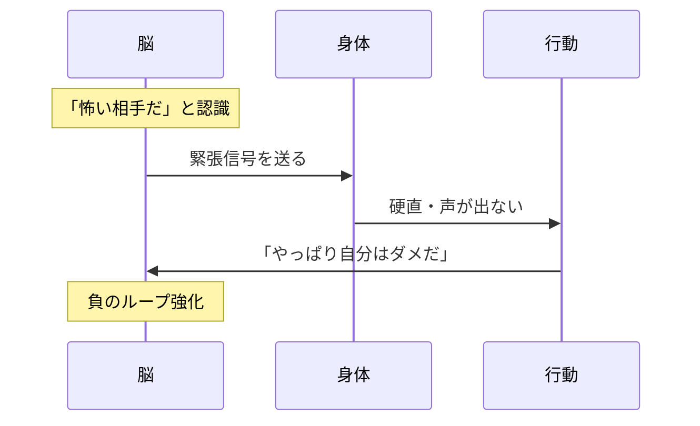
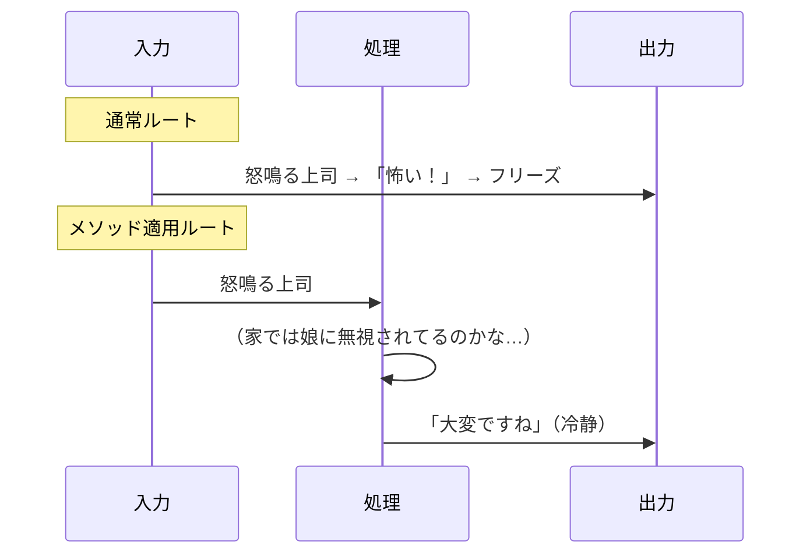
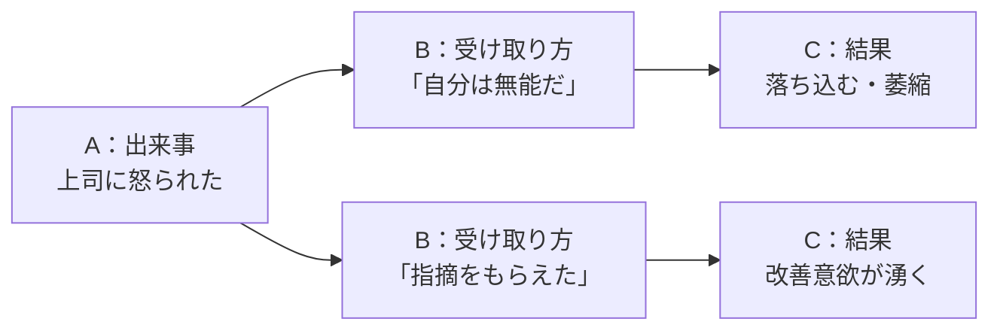
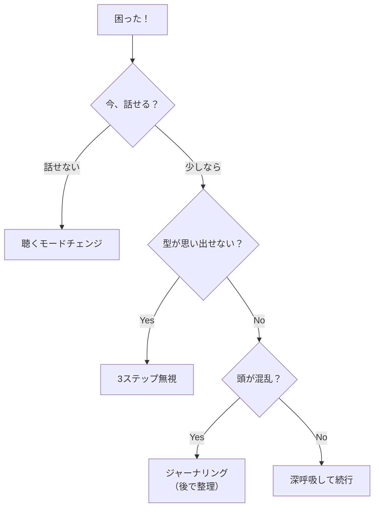

## 第3章：まず恐怖を消す

### 3-1. 概要

フレームワークを学ぶ前に、まずやるべきことがある。**恐怖を消すこと**だ。

どれだけ優れた技術を知っていても、相手を前にして萎縮してしまえば何も出てこない。コミュ障の本質は「話し方を知らない」ことではなく、「怖くて動けない」ことにある。

この章では、恐怖を無効化し、パニックから回復するための技術を扱う。

---

### 3-2. 恐怖のメカニズム

このループを断ち切るには、**「怖い相手だ」という認識そのものを書き換える**必要がある。

---

### 3-3. メンタル防衛系技術

苦手な相手と対峙した時、脳内で相手の「設定」を書き換えて恐怖を無効化する技術群。

| 技術名            | やること                                 | 効果・メカニズム                             |
| :------------- | :----------------------------------- | :----------------------------------- |
| アナザー・アングル・メソッド | 苦手な相手を「別の角度」から観察し、勝手に「いい人エピソード」を妄想する | 「嫌な奴」という単一視点を強制解除し、脳内の「敵対モード」を解除する   |
| 笑顔想像法          | 無愛想な相手の顔に、脳内で無理やり「満面の笑顔」を合成する        | 「コイツも笑えば普通の人間だ」と認識し、萎縮を解除する          |
| バックグラウンド妄想     | 相手の「学生時代」や「家庭でのパパの顔」を勝手に想像する         | 目の前の「怖い上司」を「どこにでもいるおじさん」に格下げする       |
| キャラ変換法         | 相手を「声優」や「動物」に見立てる（例：吠えてるチワワだと思い込む）   | 相手の攻撃性を「愛嬌」や「演技」として処理し、ダメージを無効化する    |
| 脱・一流志向         | 「うまく話そう」「爪痕を残そう」という目標設定を捨てる          | ハードルを下げることで、ワーキングメモリを会話そのものに回せるようになる |

#### アナザー・アングル・メソッドの動作原理

これは相手を変えるのではなく、**自分のレンダリング（描画）設定を変える**技術である。

---

### 3-4. 認知ハック系技術

ストレスや不安を感じた時、自分の脳内プログラムをデバッグするための技術群。

| 技術名     | 構造・要素                                                            | 用途           | 特徴                                                             |
| :------ | :--------------------------------------------------------------- | :----------- | :------------------------------------------------------------- |
| ABC理論   | A：Activating event（出来事）→ B：Belief（受け取り方）→ C：Consequence（感情・結果）   | ストレス対処、怒りの制御 | 「出来事（A）」が直接「怒り（C）」を生むのではなく、間に「思い込み（B）」があることに気づく。Bを書き換えれば世界が変わる |
| WOOPの法則 | W：Wish（願い）→ O：Outcome（最高の結果）→ O：Obstacle（障害）→ P：Plan（If-Thenプラン） | 目標達成、悪癖の矯正   | 夢を見るだけでなく、あえて「障害」を可視化し、対策をセットにする現実的な願望実現法                      |

#### ABC理論の動作原理

同じ出来事でも、Bを書き換えるだけでCが変わる。

---

### 3-5. 回復系技術

会話中にパニックになったり、脳がフリーズした時の復旧技術群。

| 技術名 | やること | 効果・メカニズム |
|:---|:---|:---|
| ジャーナリング | 不安や混乱を紙に書き出す | 脳内のワーキングメモリを解放し、客観視することでパニックを鎮める |
| 3ステップ無視 | 「結論→理由→具体例」などの型をあえて無視し、思いついた順に話す | 「型通りに話さなきゃ」というプレッシャーによるフリーズを防ぐ |
| 聴くモードチェンジ | 自分が話すのを諦め、徹底的に「インタビュアー」になりきる | 「話す責任」を放棄することで、精神的負荷を最小限にする |

#### 回復技術の選択フロー

---

### 3-6. 最強の防御装備：BATNA

交渉や会話でビビってしまうのは、「この話がまとまらなかったら終わる」と思っているからだ。

しかし、懐に**BATNA（Best Alternative To a Negotiated Agreement）** を持っていれば、余裕が生まれる。

| 用語    | 読み方 | 意味                |
| :---- | :-- | :---------------- |
| BATNA | バトナ | 交渉が決裂した時の「最良の代替案」 |

交渉前に「もし決裂したらどうするか（プランB）」を用意しておく技術。これがあると「決裂してもいいや」と強気になれる。

**「俺にはBATNAがある」**

これだけで、メンタルの防御力は10倍になる。

---

### 3-7. まとめ

技術を学ぶ前に、まず恐怖を消せ。

- **メンタル防衛**：相手の見え方を書き換える
- **認知ハック**：自分の受け取り方を書き換える
- **回復**：フリーズしたら逃げ道を使う
- **BATNA**：最悪のケースを想定して余裕を持つ

恐怖が消えれば、フレームワークは自然と使えるようになる。

---
