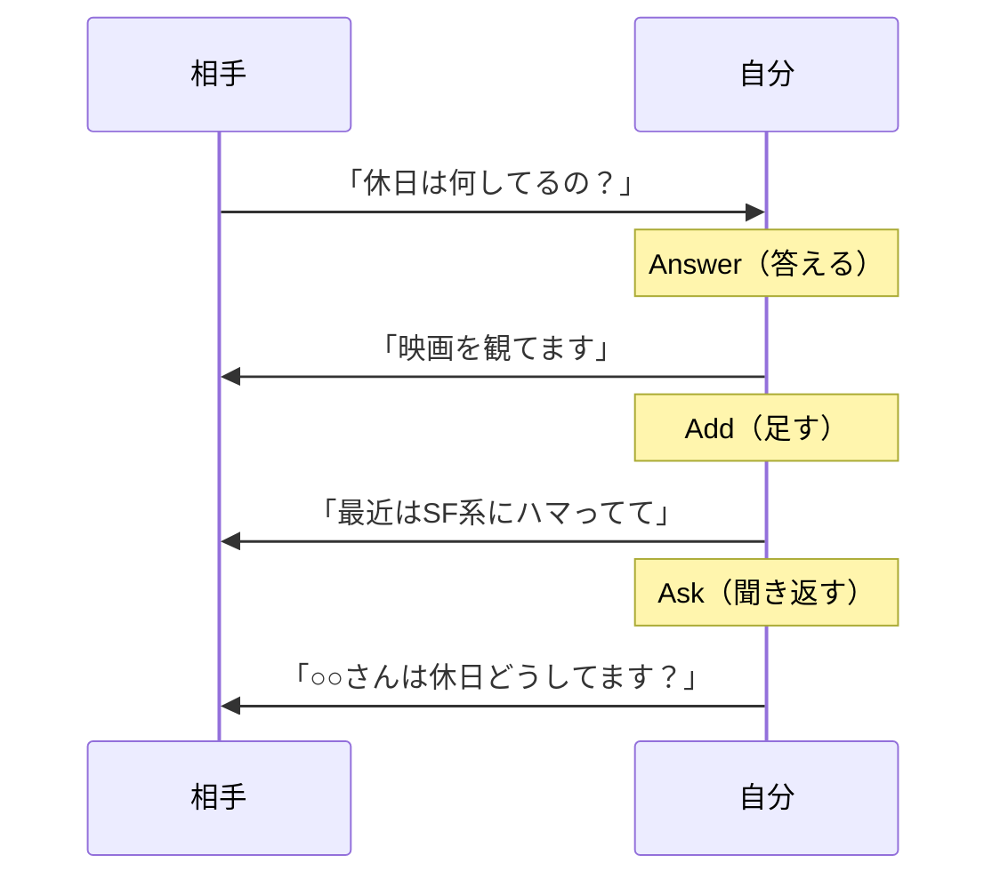
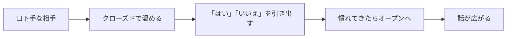
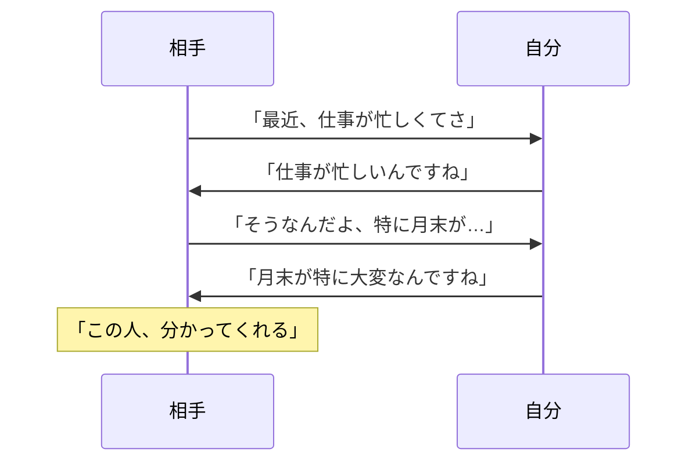
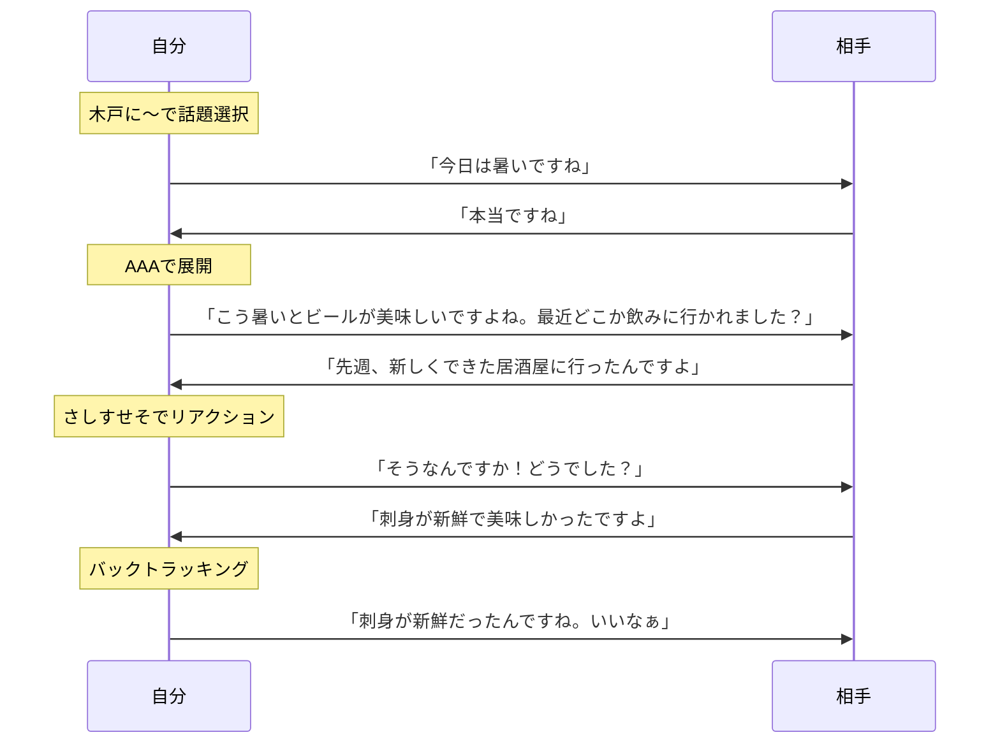

# 第4章：フレームワーク一覧：雑談系

## 4-1. 概要

雑談は全ての会話の基盤である。ビジネスも恋愛も、まずは雑談から始まる。

この章では、話題の選び方、会話の続け方、リアクションの取り方を扱う。

## 4-2. 話題選び

「何を話せばいいか分からない」を解決するフレームワーク群。

| 名前 | 構造・要素 | 用途 |
|:---|:---|:---|
| 木戸に立ち掛けし衣食住（きどにたちかけしいしょくじゅう） | 気候、道楽、ニュース、旅、知人、家族、健康、仕事、衣、食、住 | 初対面、飲み会、営業 |
| 適度に整理（てきどにせいり） | テレビ・天気、気候、道楽、ニュース、生活・健康、田舎、旅行 | 婚活、合コン、パーティ |
| FORD法（フォードほう） | Family（家族）、Occupation（仕事）、Recreation（趣味）、Dreams（夢） | 2回目以降、関係深化 |
| ジケニョウ | 時間・時期、景気、ニュース、養生 | 年配者、経営者向け |

### 木戸に立ち掛けし衣食住の要素

| 文字 | 話題 | 例 |
|:---:|:---|:---|
| 木（き） | 気候・天気 | 「今日は暑いですね」 |
| 戸（ど） | 道楽・趣味 | 「休日は何されてますか？」 |
| に | ニュース | 「最近のあのニュース見ました？」 |
| 立（た） | 旅 | 「旅行とか行かれますか？」 |
| ち | 知人 | 「○○さんとはどこで？」 |
| 掛（か） | 家族 | 「ご家族は何人ですか？」 |
| け | 健康 | 「お体の調子はいかがですか？」 |
| し | 仕事 | 「お仕事は何を？」 |
| 衣（い） | 衣服 | 「その服、素敵ですね」 |
| 食（しょく） | 食べ物 | 「この辺で美味しい店あります？」 |
| 住（じゅう） | 住まい | 「どちらにお住まいですか？」 |

### FORD法の要素

| 文字 | 英語 | 話題 | 例 |
|:---:|:---|:---|:---|
| F | Family | 家族 | 「ご兄弟は？」「お子さんは？」 |
| O | Occupation | 仕事 | 「どんなお仕事を？」「やりがいは？」 |
| R | Recreation | 趣味・娯楽 | 「趣味は何ですか？」「休日は？」 |
| D | Dreams | 夢・目標 | 「将来やりたいことは？」「目標は？」 |

### ジケニョウの要素

|文字|話題|例|
|---|---|---|
|ジ|時間・時期|「もうすぐ年末ですね」|
|ケ|景気|「最近の景気はどうですか？」|
|ニ|ニュース|「最近のニュース見ました？」|
|ヨウ|養生（健康）|「お体の調子はいかがですか？」|

## 4-3. 会話継続・展開

話題を振った後、会話を途切れさせないためのフレームワーク群。

| 名前 | 構造・要素 | 用途 |
|:---|:---|:---|
| AAA法（トリプルエーほう） | Answer（答える）→ Add（足す）→ Ask（聞き返す） | 質問への返し方 |
| オープンクエスチョン | 5W1Hで聞く（Who, What, When, Where, Why, How） | 話を広げたい時 |
| クローズドクエスチョン | Yes/Noで答えさせる | 口下手な相手への導入 |
| 連想ゲーム法 | 言葉尻から関連話題へジャンプ | 話題が尽きた時 |

### AAA法の流れ

### オープン vs クローズド

| 種類 | 特徴 | 例 | 使い所 |
|:---|:---|:---|:---|
| オープン | 自由に答えられる | 「どう思いますか？」 | 話を広げたい時 |
| クローズド | Yes/Noで答えられる | 「好きですか？」 | 口下手な相手、導入時 |

## 4-4. リアクション・傾聴

相手の話を受け止め、気持ちよく話させるためのフレームワーク群。

| 名前 | 構造・要素 | 用途 |
|:---|:---|:---|
| さしすせそ | さすが、知らなかった、すごい、センスいい、そうなんですか | 目上の人、自慢話 |
| バックトラッキング | 相手の言葉をそのまま繰り返す | 相談、愚痴を聞く時 |
| ペーシング | 声のトーン、速さ、呼吸を合わせる | 初対面、信頼構築 |

### さしすせその要素

| 文字 | 言葉 | 効果 |
|:---:|:---|:---|
| さ | 「さすがですね」 | 相手を立てる |
| し | 「知らなかったです」 | 相手を先生にする |
| す | 「すごいですね」 | 素直に感嘆する |
| せ | 「センスいいですね」 | 選択を褒める |
| そ | 「そうなんですか」 | 興味を示す |

### バックトラッキングの流れ

## 4-5. 雑談の基本コンボ

## 4-6. まとめ

雑談の基本は3ステップ。

1. **話題を選ぶ**（木戸に〜、FORD法）
2. **会話を続ける**（AAA法、オープン/クローズド）
3. **リアクションする**（さしすせそ、バックトラッキング）

この3つを回すだけで、雑談は無限に続く。

---
