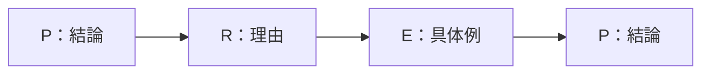
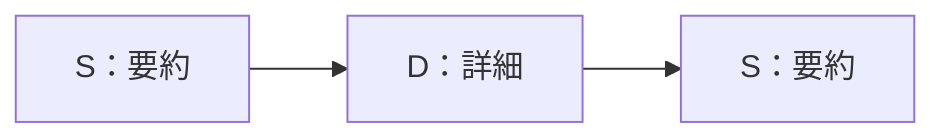
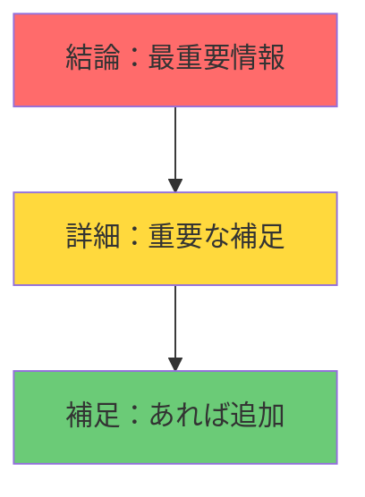
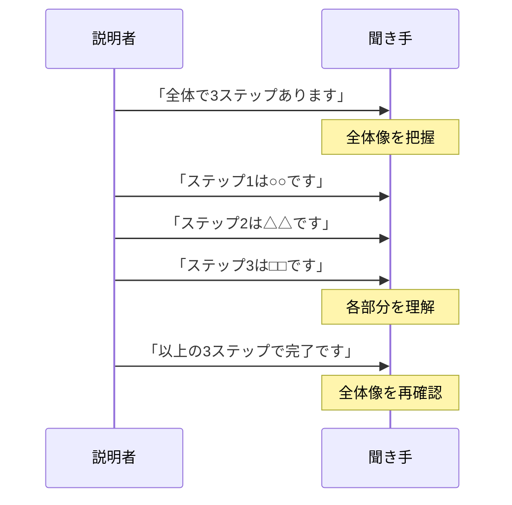
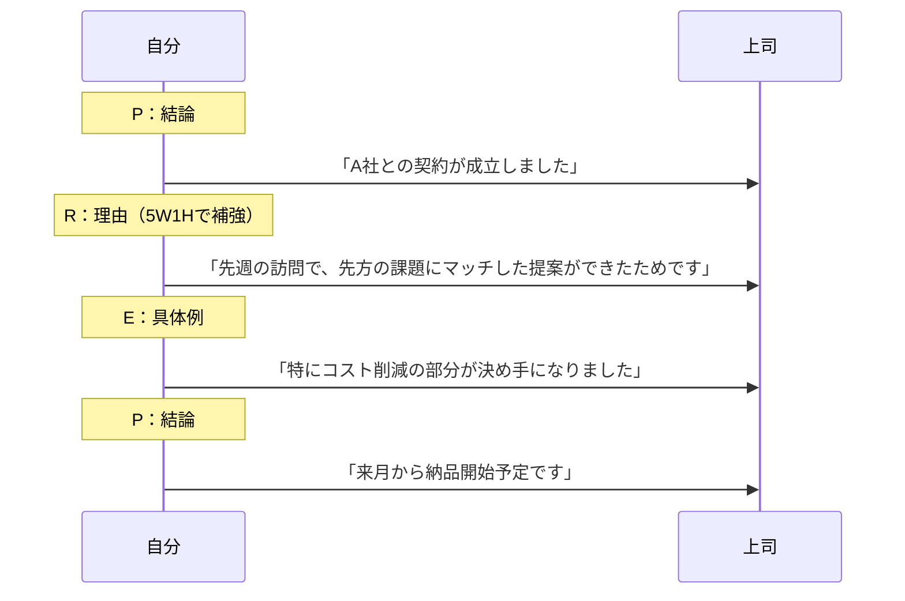

## 第5章：フレームワーク一覧：報告・説明系

### 5-1. 概要

仕事の基本は「伝えること」である。どれだけ良い仕事をしても、伝わらなければ評価されない。

この章では、情報を正確に、分かりやすく伝えるためのフレームワークを扱う。

---

### 5-2. フレームワーク一覧

| 名前                 | 構造・要素                                          | 用途              |
| :----------------- | :--------------------------------------------- | :-------------- |
| PREP法（プレップほう）      | Point（結論）→ Reason（理由）→ Example（具体例）→ Point（結論） | 報告書、メール、プレゼン    |
| SDS法（エスディーエスほう）    | Summary（要約）→ Details（詳細）→ Summary（要約）          | ニュース、自己紹介、進捗報告  |
| 逆三角形法（ぎゃくさんかくけいほう） | 結論 → 詳細 → 補足                                   | プレスリリース、社内広報    |
| ホールパート法            | Whole（全体）→ Part（部分）→ Whole（全体）                 | 手順書、マニュアル、レクチャー |
| 5W1H（ごだぶりゅーいちえいち）  | Who, What, When, Where, Why, How               | 情報網羅、報道、報告      |

---

### 5-3. 各フレームワークの詳細

#### PREP法

最も汎用性の高い伝達フレームワーク。結論を先に言い、理由と具体例で補強し、結論で締める。

| 要素  | 英語      | やること     | 例                      |
| :-: | :------ | :------- | :--------------------- |
|  P  | Point   | 結論を述べる   | 「A案を推奨します」             |
|  R  | Reason  | 理由を説明する  | 「コストが30%削減できるからです」     |
|  E  | Example | 具体例を挙げる  | 「実際、B社では同様の施策で成功しています」 |
|  P  | Point   | 結論を再度述べる | 「以上の理由から、A案を推奨します」     |

#### SDS法

要約で挟むシンプルな構造。短い報告や自己紹介に最適。

| 要素  | 英語      | やること     | 例                                |
| :-: | :------ | :------- | :------------------------------- |
|  S  | Summary | 要約を述べる   | 「プロジェクトは順調です」                    |
|  D  | Details | 詳細を説明する  | 「先週までにフェーズ1が完了し、現在フェーズ2に着手しています」 |
|  S  | Summary | 要約を再度述べる | 「予定通り、来月末に完了見込みです」               |

#### 逆三角形法

新聞記事の書き方。最も重要な情報を最初に置き、後になるほど補足情報になる。

| 層 | 内容 | 例 |
|:---:|:---|:---|
| 結論 | 最も重要な情報 | 「新製品を来月発売します」 |
| 詳細 | 重要な補足 | 「価格は5万円、3色展開です」 |
| 補足 | あれば追加 | 「開発には2年を要しました」 |

#### ホールパート法

全体像を先に見せてから、部分を説明する。マニュアルや教育に最適。

| 要素 | 英語 | やること | 例 |
|:---:|:---|:---|:---|
| Whole | 全体 | 全体像を示す | 「この作業は3ステップで完了します」 |
| Part | 部分 | 各部分を説明する | 「まずステップ1は…、次にステップ2は…」 |
| Whole | 全体 | 全体像を再確認する | 「以上の3ステップで完了です」 |

#### 5W1H

情報を漏れなく伝えるためのチェックリスト。

|  要素   | 英語    | 問い   | 例            |
| :---: | :---- | :--- | :----------- |
|  Who  | 誰が    | 主体は？ | 「営業部が」       |
| What  | 何を    | 内容は？ | 「新規顧客を獲得した」  |
| When  | いつ    | 時期は？ | 「先週」         |
| Where | どこで   | 場所は？ | 「大阪で」        |
|  Why  | なぜ    | 理由は？ | 「展示会に出展したから」 |
|  How  | どうやって | 方法は？ | 「デモを実施して」    |

---

### 5-4. 使い分けの基準

| 状況      | 推奨フレームワーク | 理由                 |
| :------ | :-------- | :----------------- |
| 上司への報告  | PREP法     | 結論ファーストで時間を奪わない    |
| 自己紹介    | SDS法      | 短く印象に残る            |
| プレスリリース | 逆三角形法     | 読み手が途中で離脱しても要点が伝わる |
| マニュアル作成 | ホールパート法   | 全体像を把握してから詳細に入れる   |
| 情報共有    | 5W1H      | 漏れなく伝えられる          |

---

### 5-5. 報告の基本コンボ

上司への報告で最も使えるコンボ：**PREP法 + 5W1H**

---

### 5-6. まとめ

報告・説明の基本は「結論ファースト」。

- **短く伝えたい** → SDS法
- **説得力を持たせたい** → PREP法
- **漏れなく伝えたい** → 5W1H
- **手順を教えたい** → ホールパート法
- **記事を書きたい** → 逆三角形法

相手の時間を奪わない。それが報告・説明の鉄則である。

---
