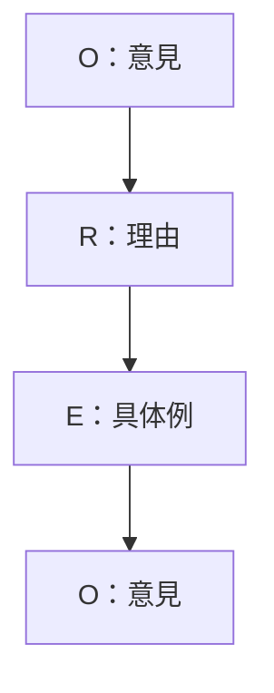
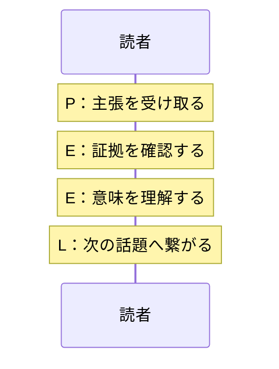
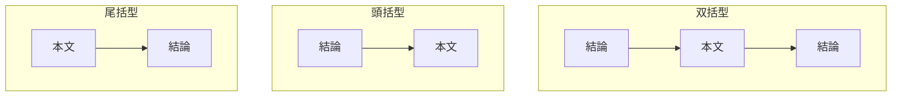
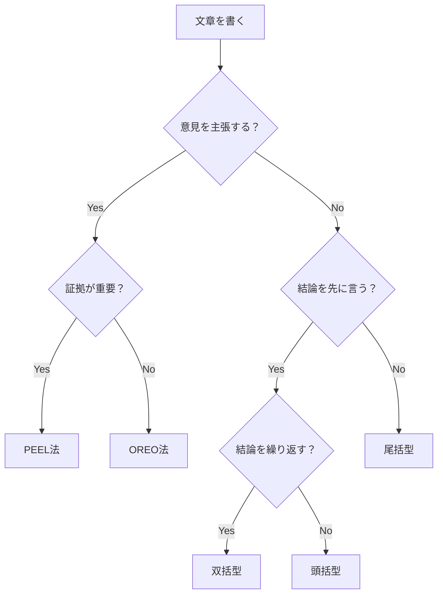

# 第6章：フレームワーク一覧：文書構成系

## 6-1. 概要

文章には「型」がある。型を知っていれば、何を書くべきか迷わない。

この章では、文章の組み立て方の型を扱う。報告・説明系が「話す」ための型だとすれば、こちらは「書く」ための型である。

## 6-2. フレームワーク一覧

| 名前 | 構造・要素 | 用途 |
|:---|:---|:---|
| OREO法（オレオほう） | Opinion（意見）→ Reason（理由）→ Example（具体例）→ Opinion（意見） | 意見文、小論文 |
| PEEL法（ピールほう） | Point（主張）→ Evidence（証拠）→ Explain（説明）→ Link（繋げる） | 学術的論述 |
| TEEL法（ティールほう） | Topic（主題）→ Explain（説明）→ Evidence（証拠）→ Link（繋げる） | エッセイ、論文 |
| 双括型（そうかつがた） | 結論 → 本文 → 結論 | ビジネス文書 |
| 頭括型（とうかつがた） | 結論 → 本文 | 報告書 |
| 尾括型（びかつがた） | 本文 → 結論 | 物語的文書 |

## 6-3. 各フレームワークの詳細

### OREO法

お菓子のオレオのように、意見でサンドイッチする構造。意見文の基本形。

| 要素 | 英語 | やること | 例 |
|:---:|:---|:---|:---|
| O | Opinion | 意見を述べる | 「リモートワークを推進すべきだ」 |
| R | Reason | 理由を説明する | 「通勤時間の削減で生産性が上がるからだ」 |
| E | Example | 具体例を挙げる | 「実際、当社の試験導入では残業が20%減少した」 |
| O | Opinion | 意見を再度述べる | 「したがって、リモートワークを推進すべきである」 |

### PEEL法

学術的な論述に適した構造。証拠を示し、その意味を説明する。

| 要素 | 英語 | やること | 例 |
|:---:|:---|:---|:---|
| P | Point | 主張を述べる | 「睡眠不足は判断力を低下させる」 |
| E | Evidence | 証拠を示す | 「○○大学の研究によると、6時間未満の睡眠で判断ミスが40%増加した」 |
| E | Explain | 証拠の意味を説明する | 「これは脳の前頭葉の機能低下が原因と考えられる」 |
| L | Link | 次に繋げる | 「この知見は、労働時間規制の議論にも示唆を与える」 |

### TEEL法

PEEL法と似ているが、主題（Topic）から始まる。エッセイ向け。

| 要素 | 英語 | やること | 例 |
|:---:|:---|:---|:---|
| T | Topic | 主題を提示する | 「現代社会において、SNSは諸刃の剣である」 |
| E | Explain | 説明する | 「情報発信が容易になった一方、誹謗中傷も増加している」 |
| E | Evidence | 証拠を示す | 「総務省の調査では、SNS利用者の30%がトラブルを経験している」 |
| L | Link | 結論に繋げる | 「リテラシー教育の重要性がここにある」 |

### 括型（かつがた）シリーズ

結論をどこに置くかで3種類に分かれる。

| 型 | 構造 | 特徴 | 用途 |
|:---|:---|:---|:---|
| 双括型 | 結論→本文→結論 | 結論を強調できる | ビジネス文書、提案書 |
| 頭括型 | 結論→本文 | 最も効率的 | 報告書、メール |
| 尾括型 | 本文→結論 | 読者を引き込む | 物語、スピーチ |

## 6-4. PREP法との違い

PREP法と文書構成系フレームワークは似ているが、用途が異なる。

| フレームワーク | 主な用途 | 特徴 |
|:---|:---|:---|
| PREP法 | 口頭報告、短い説明 | 話すための型 |
| OREO法 | 意見文、小論文 | 書くための型（意見重視） |
| PEEL法 | 学術論述 | 書くための型（証拠重視） |

## 6-5. 使い分けの基準

| 状況 | 推奨フレームワーク | 理由 |
|:---|:---|:---|
| 意見を述べたい | OREO法 | 意見を明確に主張できる |
| 学術的に書きたい | PEEL法 | 証拠と説明のバランスが良い |
| エッセイを書きたい | TEEL法 | 主題から自然に展開できる |
| ビジネス文書 | 双括型 | 結論が強調される |
| 報告メール | 頭括型 | 効率的に伝わる |
| ストーリー性を持たせたい | 尾括型 | 読者を引き込める |

## 6-6. 文書構成の選択フロー

## 6-7. まとめ

文章の型を知れば、構成に迷わない。

- **意見を書く** → OREO法
- **証拠を示す** → PEEL法
- **エッセイ** → TEEL法
- **効率重視** → 頭括型
- **強調したい** → 双括型
- **引き込みたい** → 尾括型

型は制約ではなく、武器である。

---
