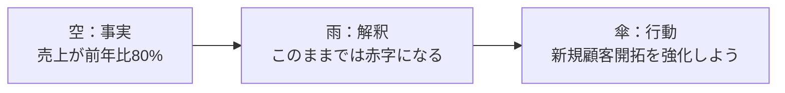
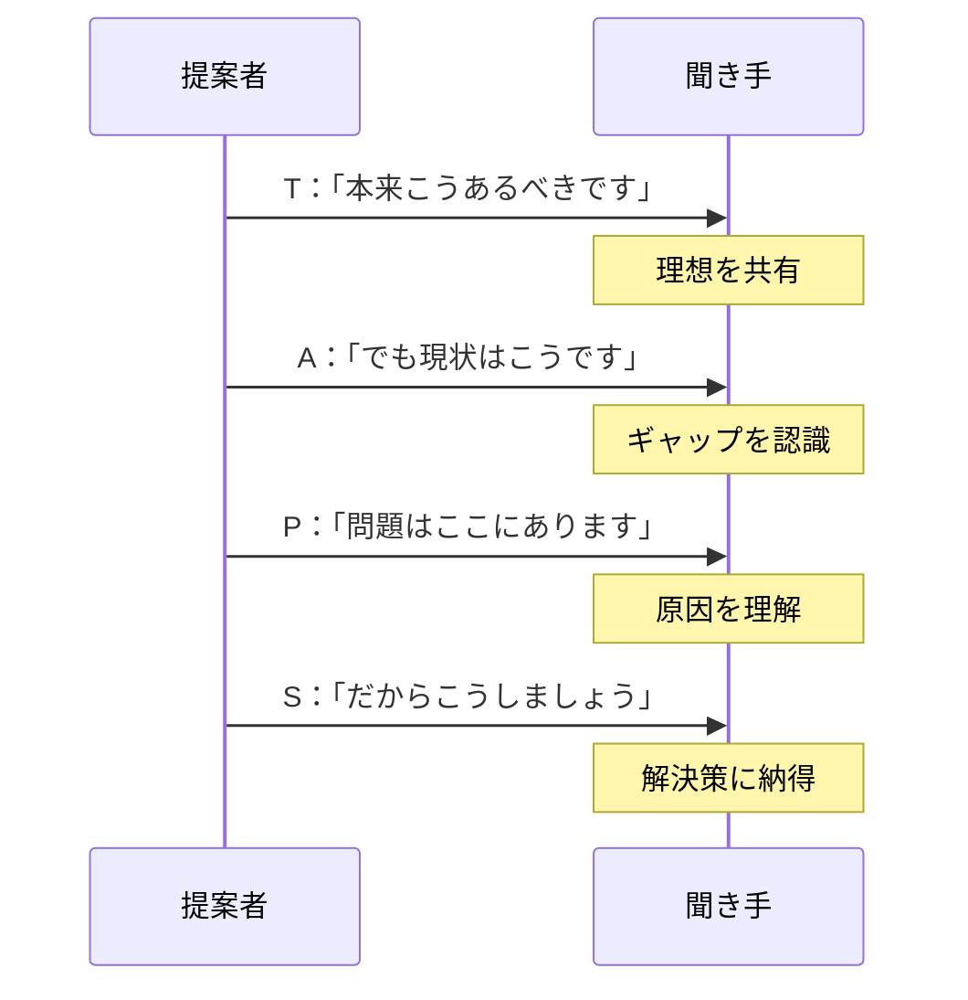
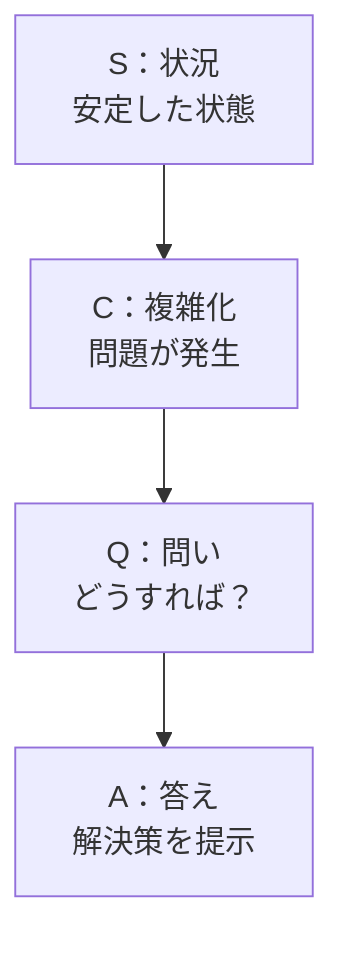
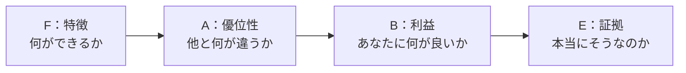
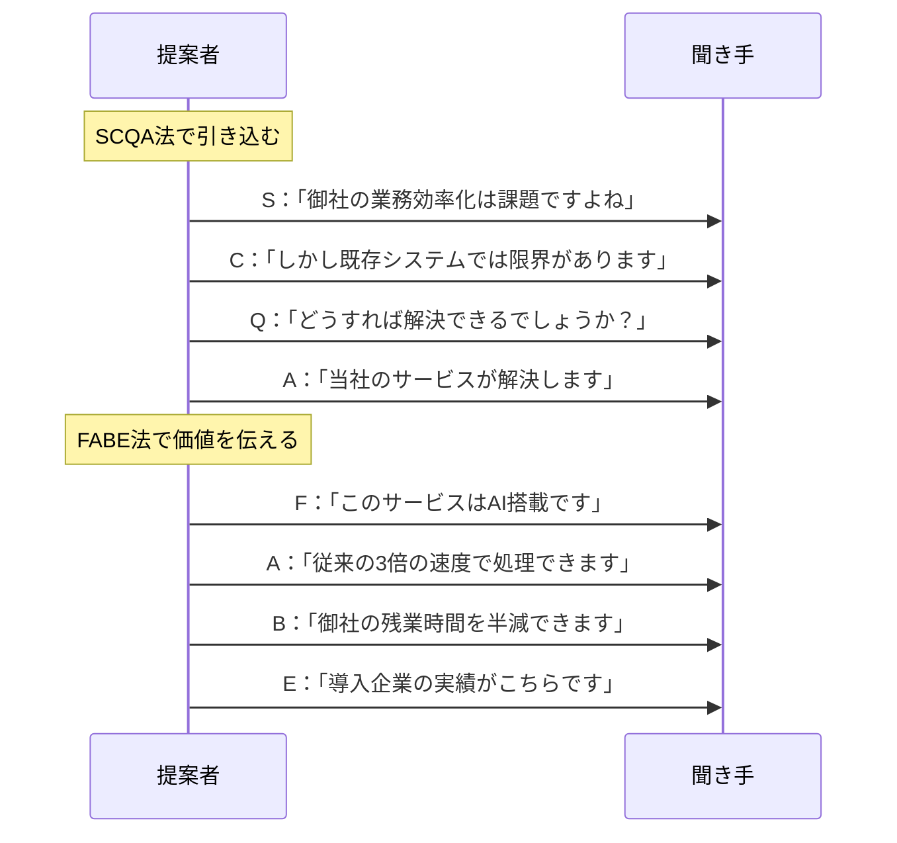

## 第7章：フレームワーク一覧：提案・説得系

### 7-1. 概要

「Yes」と言わせる技術。それが提案・説得である。

論理だけでは人は動かない。事実と解釈と行動を繋げ、相手が「なるほど、それならやろう」と思える道筋を作る必要がある。

この章では、提案を通すためのフレームワークを扱う。

---

### 7-2. フレームワーク一覧

| 名前                 | 構造・要素                                                      | 用途               |
| :----------------- | :--------------------------------------------------------- | :--------------- |
| 空・雨・傘（そら・あめ・かさ）    | 空（事実）→ 雨（解釈）→ 傘（行動）                                        | コンサル資料、意思決定      |
| TAPS法（タップスほう）      | To be（理想）→ As is（現状）→ Problem（問題）→ Solution（解決策）           | 改善提案書、企画書        |
| SCQA法（エスシーキューエーほう） | Situation（状況）→ Complication（複雑化）→ Question（問い）→ Answer（答え） | プレゼン冒頭、ストーリーテリング |
| FABE法（ファブほう）       | Feature（特徴）→ Advantage（優位性）→ Benefit（利益）→ Evidence（証拠）     | 商品プレゼン、営業資料      |

---

### 7-3. 各フレームワークの詳細

#### 空・雨・傘

マッキンゼー発祥の思考法。事実から行動までを一直線に繋げる。

| 要素  | 意味  | やること        | 例            |
| :-: | :-- | :---------- | :----------- |
|  空  | 事実  | 客観的事実を述べる   | 「空を見たら曇っている」 |
|  雨  | 解釈  | 事実から予測する    | 「雨が降りそうだ」    |
|  傘  | 行動  | 取るべき行動を提案する | 「傘を持っていこう」   |

**ポイント**：空と雨の繋がりが弱いと、傘（提案）が唐突に見える。解釈の論理を丁寧に説明することが重要。

#### TAPS法

理想と現状のギャップを見せて、解決策を提示する。改善提案の王道。

| 要素 | 英語 | やること | 例 |
|:---:|:---|:---|:---|
| T | To be | 理想の姿を示す | 「本来、月間100件の受注が目標です」 |
| A | As is | 現状を示す | 「しかし現状は60件にとどまっています」 |
| P | Problem | 問題を明確にする | 「原因は営業リソースの不足です」 |
| S | Solution | 解決策を提示する | 「外部委託で20件分を補填することを提案します」 |

#### SCQA法

バーバラ・ミントの「ピラミッド原則」に基づく構造。プレゼンの冒頭で聞き手を引き込む。

| 要素 | 英語 | やること | 例 |
|:---:|:---|:---|:---|
| S | Situation | 状況を説明する | 「当社は業界3位のシェアを持っています」 |
| C | Complication | 複雑化・課題を提示する | 「しかし、新規参入企業に追い上げられています」 |
| Q | Question | 問いを立てる | 「どうすればシェアを維持できるでしょうか？」 |
| A | Answer | 答えを示す | 「差別化戦略への転換を提案します」 |

**ポイント**：Complicationで「このままではマズい」と思わせることで、Answerへの期待が高まる。

#### FABE法

商品やサービスの価値を伝えるためのフレームワーク。営業・プレゼンに最適。

| 要素 | 英語 | やること | 例 |
|:---:|:---|:---|:---|
| F | Feature | 特徴を説明する | 「このソフトはクラウド型です」 |
| A | Advantage | 優位性を説明する | 「だからインストール不要で、どこからでもアクセスできます」 |
| B | Benefit | 顧客にとっての利益を説明する | 「御社の営業担当は外出先でもリアルタイムに情報更新できます」 |
| E | Evidence | 証拠を示す | 「導入企業では営業効率が30%向上しています」 |

---

### 7-4. 使い分けの基準

| 状況            | 推奨フレームワーク     | 理由             |
| :------------ | :------------ | :------------- |
| 改善提案を通したい     | 空・雨・傘 / TAPS法 | 事実→解釈→行動の流れが明確 |
| プレゼン冒頭で引き込みたい | SCQA法         | 問題提起で興味を引ける    |
| 商品・サービスを売りたい  | FABE法         | 顧客利益を明確に伝えられる  |
| 短時間で説得したい     | 空・雨・傘         | シンプルで覚えやすい     |

---

### 7-5. 提案・説得の基本コンボ

**SCQA法 → FABE法**：引き込んでから価値を伝える

---

### 7-6. まとめ

提案・説得の基本は「相手の頭の中に道を作る」こと。

- **事実から行動へ** → 空・雨・傘
- **理想と現状のギャップ** → TAPS法
- **問いで引き込む** → SCQA法
- **価値を伝える** → FABE法

論理の道筋があれば、相手は自然と「Yes」に辿り着く。

---
