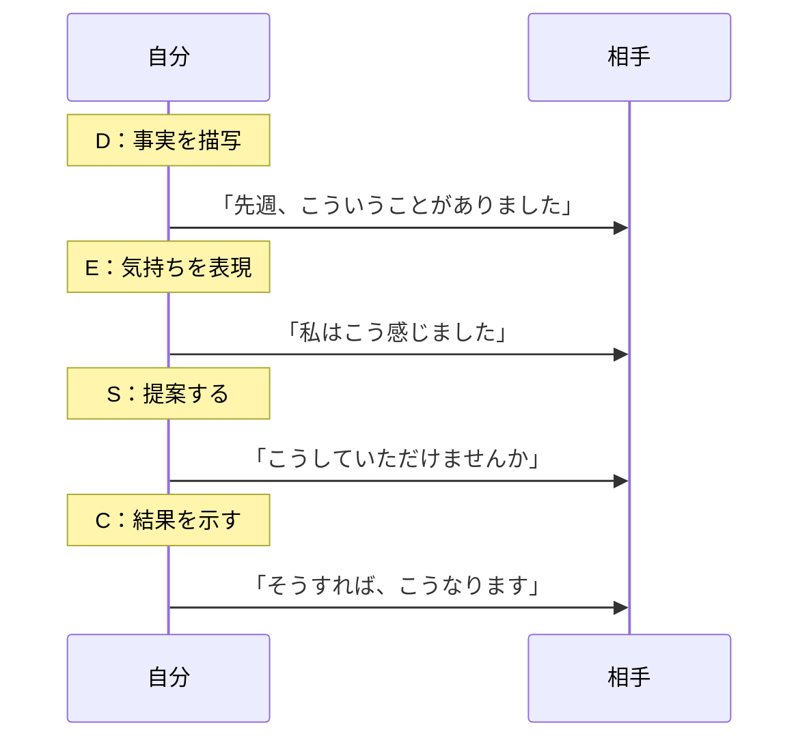
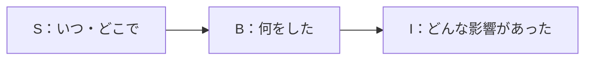
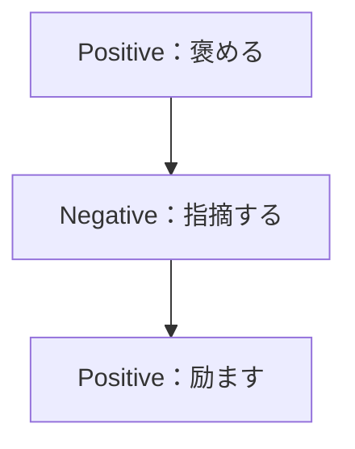
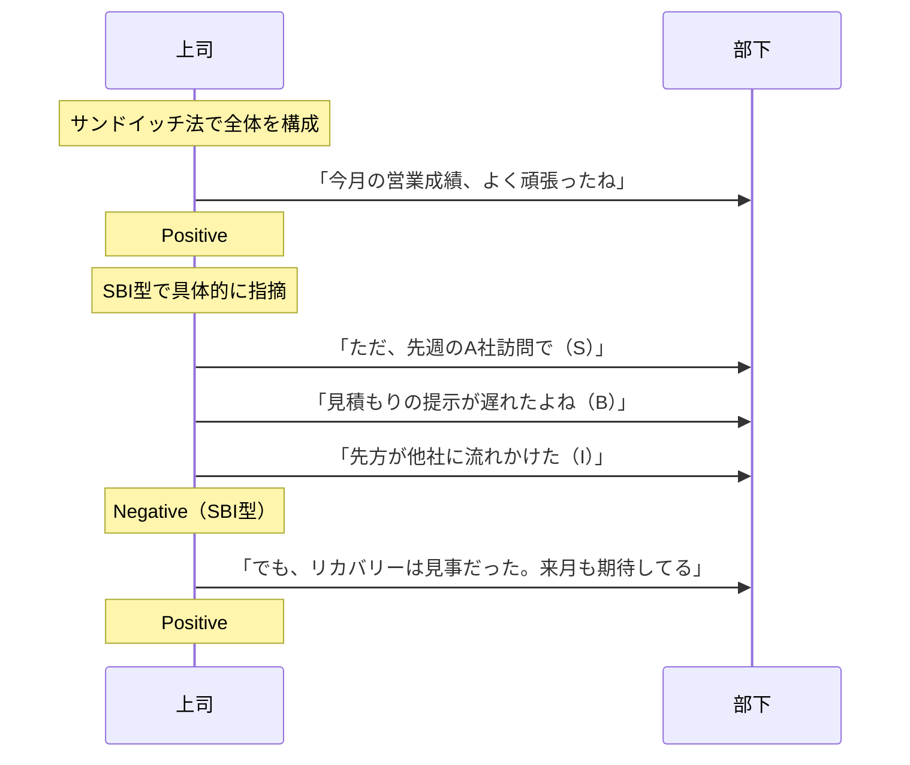
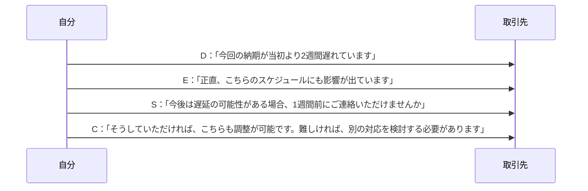

## 第8章：フレームワーク一覧：マネジメント・交渉系

### 8-1. 概要

人間関係を動かす技術。それがマネジメントと交渉である。

部下へのフィードバック、上司への要望、取引先との条件交渉──どれも「相手を動かす」という点で共通している。

この章では、角を立てずに主張を通し、人を育てるためのフレームワークを扱う。

---

### 8-2. フレームワーク一覧

| 名前             | 構造・要素                                                   | 用途          |
| :------------- | :------------------------------------------------------ | :---------- |
| DESC法（デスクほう）   | Describe（描写）→ Express（表現）→ Suggest（提案）→ Consequence（結果） | 交渉、要望、主張    |
| SBI型（エスビーアイがた） | Situation（状況）→ Behavior（行動）→ Impact（影響）                 | 部下へのフィードバック |
| サンドイッチ法        | Positive（褒め）→ Negative（指摘）→ Positive（励まし）               | 指導、評価面談     |

---

### 8-3. 各フレームワークの詳細

#### DESC法

アサーション（自己主張）理論に基づく交渉術。感情的にならず、論理的に主張を通す。

| 要素 | 英語 | やること | 例 |
|:---:|:---|:---|:---|
| D | Describe | 事実を客観的に描写する | 「先週の会議で、私の発言が途中で遮られました」 |
| E | Express | 自分の気持ちを表現する | 「正直、意見を聞いてもらえていないと感じました」 |
| S | Suggest | 提案・要望を述べる | 「次回は最後まで話を聞いていただけると嬉しいです」 |
| C | Consequence | 結果・選択肢を示す | 「そうしていただければ、より建設的な議論ができると思います」 |

**ポイント**：Describeで事実だけを述べることで、相手が防御的にならない。感情はExpressで分離して伝える。

#### SBI型

Center for Creative Leadership発祥のフィードバック技法。具体的で、相手が受け入れやすい。

| 要素 | 英語 | やること | 例（褒める場合） | 例（指摘する場合） |
|:---:|:---|:---|:---|:---|
| S | Situation | 状況を述べる | 「昨日のプレゼンで」 | 「今朝の会議で」 |
| B | Behavior | 具体的な行動を述べる | 「データを図解して説明していたね」 | 「資料の準備が間に合っていなかったね」 |
| I | Impact | その影響を述べる | 「おかげでクライアントの理解が深まった」 | 「議論が進まず、時間をロスした」 |

**ポイント**：「あなたは○○だ」という人格評価ではなく、「この行動がこの影響を生んだ」という事実ベースで伝える。

#### サンドイッチ法

批判を褒め言葉で挟む技法。相手のモチベーションを維持しながら改善点を伝える。

| 要素 | やること | 例 |
|:---:|:---|:---|
| Positive | まず褒める | 「資料の構成はとても分かりやすかったよ」 |
| Negative | 改善点を伝える | 「ただ、データの出典が不明確だったから、次回は明記してほしい」 |
| Positive | 励まして締める | 「全体的には良い出来だった。次も期待してるよ」 |

**注意点**：使いすぎると「また褒めてから何か言うんでしょ」とパターンを読まれる。SBI型と併用すると効果的。

---

### 8-4. 使い分けの基準

| 状況 | 推奨フレームワーク | 理由 |
|:---|:---|:---|
| 上司・同僚への要望 | DESC法 | 感情と事実を分離して伝えられる |
| 部下へのフィードバック | SBI型 | 具体的で受け入れやすい |
| 評価面談 | サンドイッチ法 | モチベーションを維持できる |
| クレーム対応 | DESC法 | 冷静に状況を整理できる |
| 褒める時 | SBI型 | 何が良かったか具体的に伝わる |

---

### 8-5. フィードバックの流れ

---

### 8-6. DESC法の応用：交渉場面

**ポイント**：Consequenceで「良い結果」と「別の選択肢」の両方を示すことで、相手に選ばせる形になる。

---

### 8-7. まとめ

マネジメント・交渉の基本は「事実と感情を分離する」こと。

- **主張を通したい** → DESC法
- **具体的にフィードバックしたい** → SBI型
- **モチベーションを維持したい** → サンドイッチ法

感情的にならず、事実ベースで伝える。それが人を動かす技術である。

---
