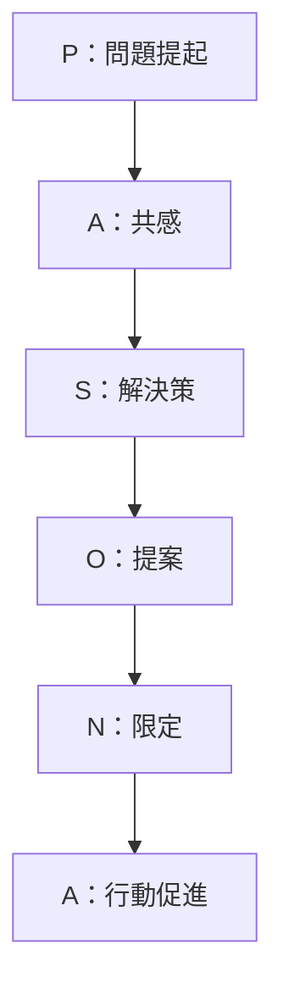
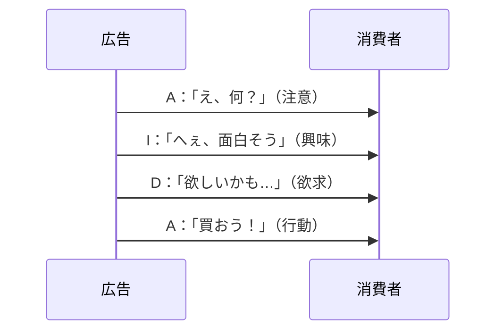
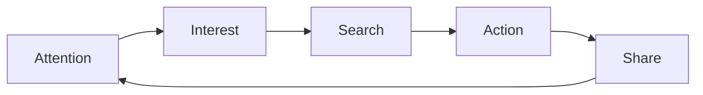
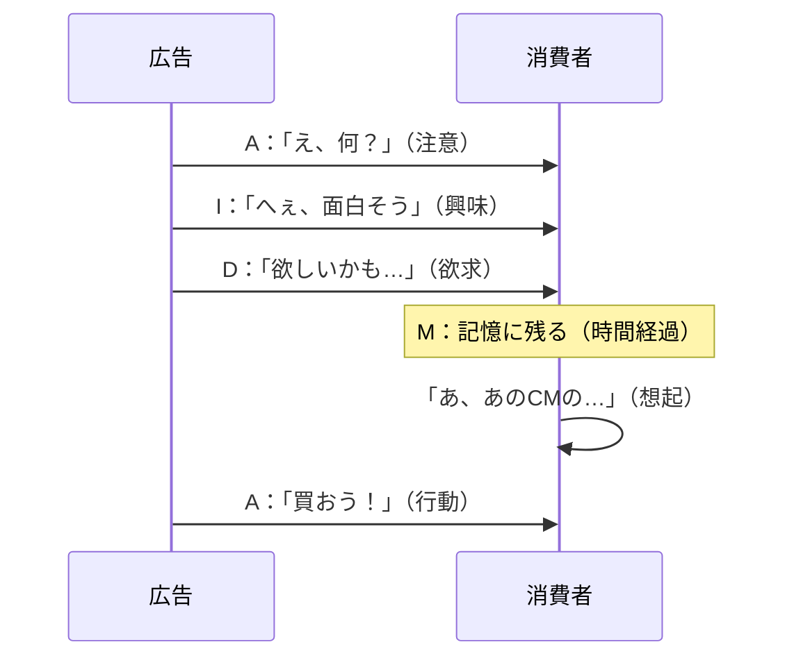
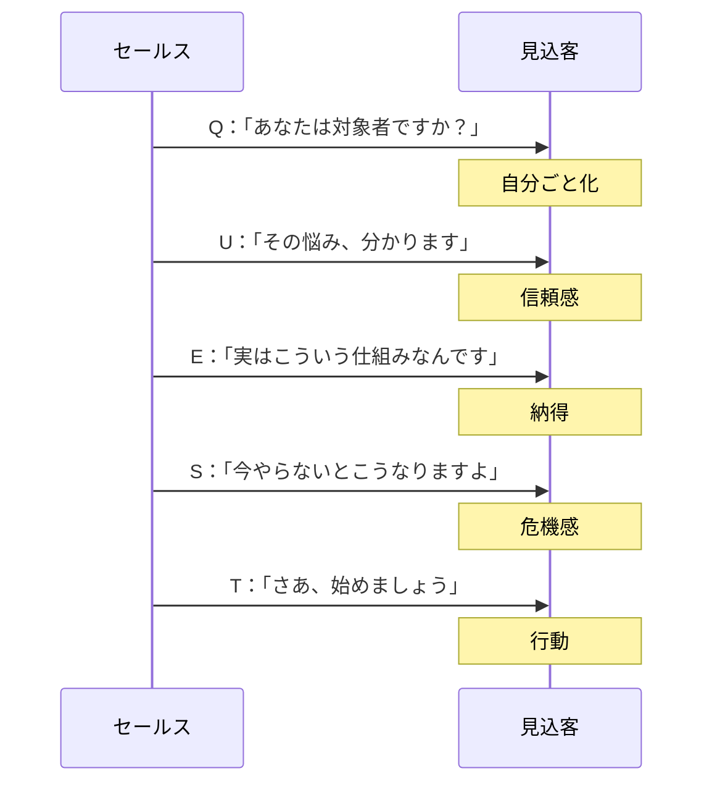
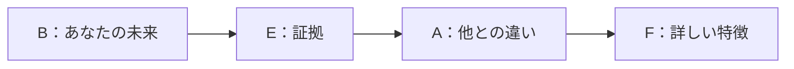
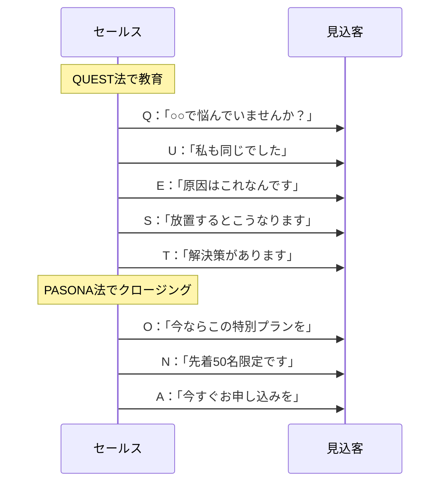

# 第9章：フレームワーク一覧：セールス・マーケティング系

## 9-1. 概要

買わせる技術。行動させる技術。それがセールス・マーケティングである。

人は論理では動かない。感情で動き、論理で正当化する。この章では、相手の感情を動かし、行動へと導くフレームワークを扱う。

## 9-2. フレームワーク一覧

| 名前             | 構造・要素                                                      | 用途             |
| :------------- | :--------------------------------------------------------- | :------------- |
| PASONA法（パソナほう） | Problem → Affinity → Solution → Offer → Narrowing → Action | セールスレター、LP     |
| AIDA法（アイダほう）   | Attention → Interest → Desire → Action                     | チラシ、DM、広告      |
| AISAS法（アイサスほう） | Attention → Interest → Search → Action → Share             | Webマーケティング、SNS |
| QUEST法（クエストほう） | Qualify → Understand → Educate → Stimulate → Transition    | LP、教育系商材       |
| BEAF法（ビーフほう）   | Benefit → Evidence → Advantage → Feature                   | ECサイト商品説明      |
| AIDMA（アイドマ）    | Attention → Interest → Desire → Memory → Action            | マス広告、テレビCM     |

## 9-3. 各フレームワークの詳細

### PASONA法

神田昌典氏が提唱した、日本発のセールスライティングの型。感情を揺さぶり、行動へ導く。

| 要素 | 英語 | やること | 例 |
|:---:|:---|:---|:---|
| P | Problem | 悩み・問題を提起する | 「毎朝、起きるのがつらくないですか？」 |
| A | Affinity | 共感を示す | 「私もそうでした。何をやっても疲れが取れなくて…」 |
| S | Solution | 解決策を提示する | 「そんな私を変えたのが、この睡眠改善プログラムです」 |
| O | Offer | 具体的な提案をする | 「今なら30日間のお試しプランをご用意しています」 |
| N | Narrowing | 限定性を出す | 「ただし、今月は先着100名様限定です」 |
| A | Action | 行動を促す | 「今すぐお申し込みください」 |

### AIDA法

1898年にE.S.ルイスが提唱した、広告の古典的フレームワーク。

| 要素 | 英語 | やること | 例 |
|:---:|:---|:---|:---|
| A | Attention | 注意を引く | 「衝撃！たった3日で5kg減」 |
| I | Interest | 興味を持たせる | 「その秘密は、朝の10分にありました」 |
| D | Desire | 欲求を刺激する | 「あなたも、理想の体型を手に入れませんか？」 |
| A | Action | 行動を促す | 「詳しくはこちらをクリック」 |

### AISAS法

電通が提唱した、インターネット時代の購買行動モデル。検索と共有が加わった。

| 要素 | 英語 | やること | 例 |
|:---:|:---|:---|:---|
| A | Attention | 注意を引く | SNS広告で目に留まる |
| I | Interest | 興味を持たせる | 「これ良さそう」と思わせる |
| S | Search | 検索させる | Google、口コミサイトで調べる |
| A | Action | 行動させる | 購入・申込み |
| S | Share | 共有させる | SNSで感想を投稿 |

**ポイント**：Shareが次のAttentionを生む循環構造。口コミが新たな顧客を呼ぶ。

### AIDMA

サミュエル・ローランド・ホールが提唱した、マス広告時代の購買行動モデル。AIDAにMemory（記憶）が加わった。

|要素|英語|やること|例|
|---|---|---|---|
|A|Attention|注意を引く|テレビCMで目に留まる|
|I|Interest|興味を持たせる|「面白そう」と思わせる|
|D|Desire|欲求を刺激する|「欲しい」と感じさせる|
|M|Memory|記憶に残す|繰り返しの露出で定着させる|
|A|Action|行動させる|店頭で購入する|

**ポイント**：AIDA法との違いはMemory（記憶）の有無。テレビCMのように接触から購買までに時間差がある場合、記憶に残すステップが重要になる。AISAS法が「検索→共有」のWeb時代モデルなら、AIDMAは「記憶→行動」のマス広告時代モデルである。

### QUEST法

マイケル・フォーティンが提唱した、教育型セールスの型。

| 要素 | 英語 | やること | 例 |
|:---:|:---|:---|:---|
| Q | Qualify | ターゲットを絞り込む | 「もしあなたが○○で悩んでいるなら」 |
| U | Understand | 悩みに共感する | 「その気持ち、よく分かります」 |
| E | Educate | 情報を提供し教育する | 「実は、原因は○○にあるんです」 |
| S | Stimulate | 感情を刺激する | 「このまま放置すると、こうなります」 |
| T | Transition | 行動へ変化させる | 「今すぐ始めましょう」 |

### BEAF法

ECサイトの商品説明に特化したフレームワーク。ベネフィットを先に伝える。

| 要素 | 英語 | やること | 例 |
|:---:|:---|:---|:---|
| B | Benefit | 得られる未来を示す | 「朝の準備が10分短縮できます」 |
| E | Evidence | 証拠を示す | 「利用者の92%が時短を実感」 |
| A | Advantage | 競合との優位性を示す | 「他社製品より30%軽量」 |
| F | Feature | 特徴を説明する | 「最新のチタン素材を採用」 |

**ポイント**：FABE法と順序が逆。BEAFは「あなたにとって何が良いか」から始まる。顧客視点が強い。

## 9-4. FABE法とBEAF法の違い

| 項目 | FABE法 | BEAF法 |
|:---|:---|:---|
| 起点 | Feature（特徴） | Benefit（利益） |
| 視点 | 商品→顧客 | 顧客→商品 |
| 適した場面 | 技術説明、BtoB | EC、BtoC |

## 9-5. 使い分けの基準

| 状況             | 推奨フレームワーク | 理由          |
| :------------- | :-------- | :---------- |
| セールスレター、LP     | PASONA法   | 感情を揺さぶる構成   |
| 短い広告、チラシ       | AIDA法     | シンプルで覚えやすい  |
| Web、SNSマーケティング | AISAS法    | 検索・共有を考慮    |
| 教育系、高額商材       | QUEST法    | 教育で納得させる    |
| ECサイト商品説明      | BEAF法     | 顧客利益を先に伝える  |
| マス広告、テレビCM     | AIDMA     | 購買までの時間差を考慮 |

## 9-6. セールスの基本コンボ

**QUEST法 → PASONA法**：教育してから売る

## 9-7. まとめ

セールス・マーケティングの基本は「感情を動かし、論理で正当化させる」こと。

- **感情を揺さぶりたい** → PASONA法
- **シンプルに訴求したい** → AIDA法
- **Web時代の購買行動** → AISAS法
- **教育して納得させたい** → QUEST法
- **顧客利益を先に伝えたい** → BEAF法
- **記憶に残したい** → AIDMA

人は感情で買い、論理で正当化する。その順序を忘れないこと。

---
